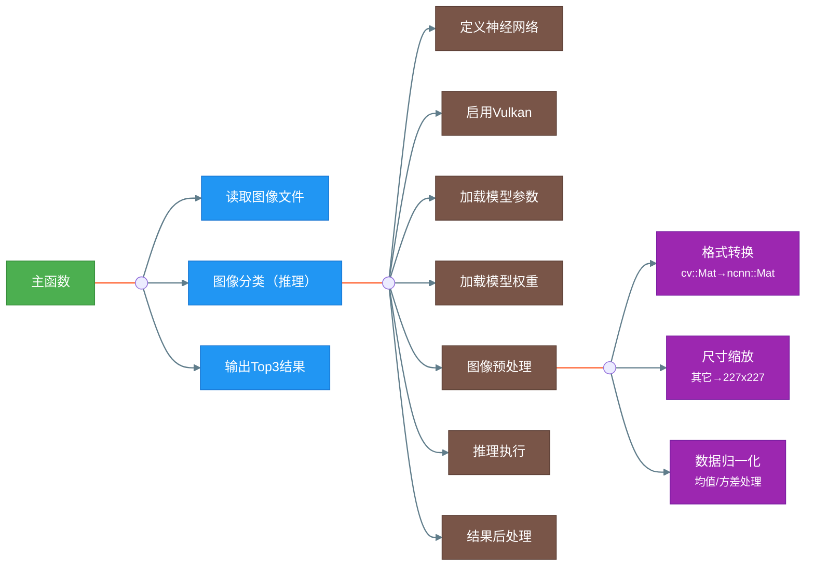

# AI for Raspberry Pi


## 一、ncnn
官方简介：ncnn是一个为手机端极致优化的高性能神经网络前向计算框架。ncnn从设计之初深刻考虑手机端的部署和使用。无第三方依赖，跨平台，手机端cpu的速度快于目前所有已知的开源框架。基于ncnn，开发者能够将深度学习算法轻松移植到手机端高效执行，开发出人工智能APP，将AI带到你的指尖。

[官方源码](https://github.com/Tencent/ncnn)

接下来我先在x86平台ubuntu20.04的虚拟机上编译安装ncnn，然后尝试运行其中的几个example，接着分析这几个example程序的源码，了解基于ncnn开发AI应用程序的流程，最后深入学习ncnn的软件架构，尤其是其性能优化方面的设计。


### 1.1 编译安装
参考文档：[《how to build》](https://github.com/Tencent/ncnn/blob/master/docs/how-to-build/how-to-build.md)

- 克隆源码：
```shell
git clone https://github.com/Tencent/ncnn.git
cd ncnn
git submodule update --init
```

- 安装依赖
```shell
sudo apt install build-essential git cmake libprotobuf-dev \
                 protobuf-compiler libomp-dev libopencv-dev
sudo apt install vulkan-utils
```
不同的机器上这块可能有所不一样，因为有些库之前可能已经安装过了。接下来执行下面命令来确认机器上是否能用VULKAN：

备注：后续的操作均在ncnn目录下执行。
```shell
vulkaninfo        # 确认是否支持VULKAN
vulkaninfo --html # 生成html格式的VULKAN信息，方便查看
```

- 编译安装
```shell
mkdir build
cd build
cmake -DCMAKE_BUILD_TYPE=Release -DNCNN_VULKAN=ON -DNCNN_BUILD_EXAMPLES=ON ..
N=$(grep -c "^processor" /proc/cpuinfo)   # 查看CPU核心数
N=$((N-1)) # 防止机器性能不足，预留一个核心给系统用
make -j${N}
cd ..
```
编译生成的文件位于build目录中，其中如下的几个文件是关键：
- src/libncnn.a：静态链接库，用于开发基于ncnn的AI应用程序
- examples下的二进制：可执行的示例程序，用于测试各种算法模型
- tools下的二进制：用于将各种模型转成ncnn模型以及模型量化工具，详情如下：
  | 工具 | 功能 | 位置 | 备注 |
  |--|--|--|--|
  |ncnn2mem    |转换为二进制描述文件和内存模型，生成<br>alexnet.param.bin和两个静态数组的代码文件|build/tools|
  |ncnnmerge   |
  |ncnnoptimize|
  |caffe2ncnn  |将Caffe模型（*.prototxt+*.caffemodel）转换为<br>ncnn模型（*.param+*.bin）|build/tools/caffe|ncnn的工具只认新版caffe模型|
  |onnx2ncnn   |将ONNX模型（*.onnx）转换为ncnn模型<br>（*.param+*.bin）|build/tools/onnx|deprecated，后续将不再维护<br>推荐使用PNNX|
  |mxnet2ncnn  |
  |darknet2ncnn|
  |ncnn2int8   |
  |ncnn2table  |
为方便使用这些工具，可以将它们所在的目录添加到PATH环境变量中，进入ncnn目录执行下面命令：
```shell
if [ -d "$(pwd)/build/tools" ]; then
    export PATH=$(pwd)/build/tools:$(pwd)/build/tools/caffe:$(pwd)/build/tools/onnx:$(pwd)/build/tools/mxnet:$(pwd)/build/tools/darknet:$(pwd)/build/quantize:$PATH
fi
```
或将下面语句添加到~/.bashrc文件中，然后执行source ~/.bashrc，这样可以一劳永逸：
```shell
export NCNN_ROOT=/home/qy/work/afw4ai/3rd/ncnn
export PATH=$NCNN_ROOT/build/tools:$NCNN_ROOT/build/tools/caffe:$NCNN_ROOT/build/tools/onnx:$NCNN_ROOT/build/tools/mxnet:$NCNN_ROOT/build/tools/darknet:$NCNN_ROOT/build/quantize:$PATH
```

### 1.2 运行示例squeezenet
- squeezenet是什么？
  
  SqueezeNet 是一种轻量级卷积神经网络模型，主要用于图像分类任务（1000类，通imagenet），其核心设计目标是在保证精度的前提下大幅减少模型参数和计算量，使其适用于移动端、嵌入式设备等资源受限场景。在 ImageNet数据集上达到与AlexNet相近的准确率（Top-1准确率约57%），但参数量仅为AlexNet的1/50，模型体积缩小510倍（结合 Deep Compression 压缩技术）。

- 运行squeezenet
```shell
cd examples
../build/examples/squeezenet ../images/256-ncnn.png
532 = 0.165951
920 = 0.094098
716 = 0.062193
cd ..
```
<br>
256-ncnn.png图片

- 1000分类标签
  
  - nihui上的[synset_words.txt](https://github.com/nihui/ncnn-android-squeezenet/blob/master/app/src/main/assets/synset_words.txt)
  - onnx上的[synset.txt](https://github.com/onnx/models/blob/main/validated/vision/classification/synset.txt)

- 模型参数和权重
  - 模型权重：examples/squeezenet_v1.1.bin
  - 模型参数：examples/squeezenet_v1.1.param


### 1.3 分析squeezenet源码
源码文件：[squeezenet.cpp](https://github.com/Tencent/ncnn/blob/master/examples/squeezenet.cpp)

- 基于ncnn的AI应用squeezenet的流程图


- detect_squeezenet函数源码分析

1. **函数定义**:
   - `static int detect_squeezenet(const cv::Mat& bgr, std::vector<float>& cls_scores)`:
     - 该函数是一个静态函数，它接受一个`cv::Mat`类型的图像（BGR格式）数据作为输入参数，一个`std::vector<float>`类型向量的引用作为输出参数。`cv::Mat`是OpenCV中用于存储图像的类。
     - 该静态函数返回一个整数，但在这个实现中，它始终返回0，用于表示成功地执行了图像分类（核心功能：推理）。

2. **定义一个神经网络并初始化**:
   - `ncnn::Net squeezenet;`: 定义一个`ncnn::Net`类对象，即一个（ncnn格式）神经网络。
   - `squeezenet.opt.use_vulkan_compute = true;`: 设置神经网络属性以使用Vulkan进行计算，这样可以提高在支持Vulkan的设备上的推理性能。

3. **加载模型的参数和权重**:
   - `if (squeezenet.load_param("squeezenet_v1.1.param")) exit(-1);`: 加载模型的参数（文件）。如果加载失败，则退出程序。
   - `if (squeezenet.load_model("squeezenet_v1.1.bin")) exit(-1);`: 加载模型的权重（文件）。如果加载失败，则退出程序。

4. **预处理输入的图像**:
   - `ncnn::Mat in = ncnn::Mat::from_pixels_resize(bgr.data, ncnn::Mat::PIXEL_BGR, bgr.cols, bgr.rows, 227, 227);`:
     - 将输入的`cv::Mat`中的BGR格式的图像数据转换到`ncnn::Mat`中，同时缩放到227x227大小。227x227应该是SqueezeNet模型要求的输入尺寸。
   - `const float mean_vals[3] = {104.f, 117.f, 123.f};`: 定义用于图像归一化的均值常量。
   - `in.substract_mean_normalize(mean_vals, 0);`: 将in中的图像数据减去均值以进行归一化处理，第二个参数为缩放因子，这里设置为0表示不进行缩放。

5. **创建特征提取器并输入数据**:
   - `ncnn::Extractor ex = squeezenet.create_extractor();`: 创建一个基于SqueuezeNet模型的特征提取器对象，它使用SqueuezeNet模型进行推理以从输入的图像数据中提取特征。
   - `ex.input("data", in);`: 将预处理后的图像数据输入给特征提取器，这里的"data"是模型的输入（层，blob）的名称。

6. **执行前向传播并获取输出**:
   - `ncnn::Mat out;`: 定义一个`ncnn::Mat`类对象，用来存储模型推理的输出。
   - `ex.extract("prob", out);`:由特征提取器执行模型推理，然后提取名为"prob"的输出（层，blob），这就是SqueuezeNet模型推理输出的各分类的概率。

7. **处理输出**:
   - `cls_scores.resize(out.w);`: 调整`cls_scores`向量的大小以匹配输出结果（即类别数）。
   - 遍历输出结果（所有类别的概率），并将其复制到`cls_scores`向量中。

8. **返回**:
   - 函数返回0，表示成功执行。

总结：该函数的代码展示了如何使用ncnn库和SqueezeNet模型对输入的BGR图像进行分类。包括了模型的加载、图像的预处理、模型推理以及后处理并输出结果的系列步骤。

### 1.4 生成ncnn模型参数和权重

- 模型下载

  SqueezeNet v1.1 has 2.4x less computation than v1.0, without sacrificing accuracy.
  - caffe格式模型：[deploy.prototxt + squeezenet_v1.1.caffemodel](https://github.com/forresti/SqueezeNet)
    ```shell
    cd ..
    git clone https://github.com/forresti/SqueezeNet
    cd ../ncnn
    ```
  - onnx格式模型：[squeezenet1.1-7.onnx](https://github.com/onnx/models/tree/main/validated/vision/classification/squeezenet)
    
    在浏览器中打开链接https://github.com/onnx/models/blob/main/validated/vision/classification/squeezenet/model/squeezenet1.1-7.onnx，或者使用wget命令下载：
    ```shell
    mkdir -p ../onnx-models
    cd ../onnx-models
    export http_proxy="http://127.0.0.1:44291"
    export https_proxy="http://127.0.0.1:44291"
    wget https://github.com/onnx/models/raw/refs/heads/main/validated/vision/classification/squeezenet/model/squeezenet1.1-7.onnx
    cd ../ncnn
    ```
  
- 模型转换
  - 转换caffe模型
    ```shell
    cd ../SqueezeNet/SqueezeNet_v1.1
    caffe2ncnn deploy.prototxt squeezenet_v1.1.caffemodel squeezenet_v1.1.param squeezenet_v1.1.bin
    qy@ts:###########/SqueezeNet/SqueezeNet_v1.1$ ls -l
    total 9708
    -rw-rw-r-- 1 qy qy    9678 2月  28 23:47 deploy.prototxt
    -rw-rw-r-- 1 qy qy     640 2月  28 23:47 README.md
    -rw-rw-r-- 1 qy qy     781 2月  28 23:47 solver.prototxt
    -rw-rw-r-- 1 qy qy 4942088 2月  28 23:47 squeezenet_v1.1.bin
    -rw-rw-r-- 1 qy qy 4950080 2月  28 23:47 squeezenet_v1.1.caffemodel
    -rw-rw-r-- 1 qy qy    8599 2月  28 23:47 squeezenet_v1.1.param
    -rw-rw-r-- 1 qy qy   11839 2月  28 23:47 train_val.prototxt
    cd ../../ncnn
    ```

  - 验证生成的模型
  
    修改examples/squeezenet.cpp中的模型文件名，重新编译并运行：
    ```shell
    qy@ts:###########/ncnn$ git diff
    diff --git a/examples/squeezenet.cpp b/examples/squeezenet.cpp
    index a026c131..f9fe9dbb 100644
    --- a/examples/squeezenet.cpp
    +++ b/examples/squeezenet.cpp
    @@ -31,9 +31,11 @@ static int detect_squeezenet(const cv::Mat& bgr, std::vector<float>& cls_scores)
        squeezenet.opt.use_vulkan_compute = true;
    
        // the ncnn model https://github.com/nihui/ncnn-assets/tree/master/models
    -    if (squeezenet.load_param("squeezenet_v1.1.param"))
    +    if (squeezenet.load_param("../../SqueezeNet/SqueezeNet_v1.1/squeezenet_v1.1.param"))
            exit(-1);
    -    if (squeezenet.load_model("squeezenet_v1.1.bin"))
    +    if (squeezenet.load_model("../../SqueezeNet/SqueezeNet_v1.1/squeezenet_v1.1.bin"))
            exit(-1);
    
    cd build
    make
    cd ..

    cd example
    qy@ts:###########/ncnn/examples$ ../build/examples/squeezenet ../images/256-ncnn.png
    532 = 0.287914
    920 = 0.139554
    716 = 0.080389
    cd ..
    ```
    这里打印的结果和1.2章节中打印的结果差不多，基本可以说明模型转换成功。


  - 转换onnx模型
    ```shell
    cd ../onnx-models
    qy@ts:###########/onnx2ncnn squeezenet1.1-7.onnx squeezenet1.1-7.param squeezenet1.1-7.bin
    onnx2ncnn may not fully meet your needs. For more accurate and elegant
    conversion results, please use PNNX. PyTorch Neural Network eXchange (PNNX) is
    an open standard for PyTorch model interoperability. PNNX provides an open model
    format for PyTorch. It defines computation graph as well as high level operators
    strictly matches PyTorch. You can obtain pnnx through the following ways:
    1. Install via python
    pip3 install pnnx
    2. Get the executable from https://github.com/pnnx/pnnx
    For more information, please refer to https://github.com/pnnx/pnnx
    qy@ts:###########/onnx-models$ ls -l
    total 9684
    -rw-rw-r-- 1 qy qy 4942088 3月   1 11:14 squeezenet1.1-7.bin
    -rw-rw-r-- 1 qy qy 4956208 3月   1 11:05 squeezenet1.1-7.onnx
    -rw-rw-r-- 1 qy qy    9382 3月   1 11:14 squeezenet1.1-7.param
    ```

  - 验证生成的模型
  
    需要注意的是：前面下载的onnx模型的输入为1x3x224x224，和caffe模型的1x3x227x227不一致,因此需要修改examples/squeezenet.cpp中的相关代码。此外还需要修改模型文件名，重新编译并运行：
    ```shell
    qy@ts:###########/ncnn$ git diff
    diff --git a/examples/squeezenet.cpp b/examples/squeezenet.cpp
    index a026c131..3ffc7159 100644
    --- a/examples/squeezenet.cpp
    +++ b/examples/squeezenet.cpp
    @@ -31,12 +31,16 @@ static int detect_squeezenet(const cv::Mat& bgr, std::vector<float>& cls_scores)
        squeezenet.opt.use_vulkan_compute = true;
    
        // the ncnn model https://github.com/nihui/ncnn-assets/tree/master/models
    -    if (squeezenet.load_param("squeezenet_v1.1.param"))
    +    if (squeezenet.load_param("../../onnx-models/squeezenet1.1-7.param"))
            exit(-1);
    -    if (squeezenet.load_model("squeezenet_v1.1.bin"))
    +    if (squeezenet.load_model("../../onnx-models/squeezenet1.1-7.bin"))
            exit(-1);
    
    -    ncnn::Mat in = ncnn::Mat::from_pixels_resize(bgr.data, ncnn::Mat::PIXEL_BGR, bgr.cols, bgr.rows, 227, 227);
    +    ncnn::Mat in = ncnn::Mat::from_pixels_resize(bgr.data, ncnn::Mat::PIXEL_BGR, bgr.cols, bgr.rows, 224, 224);
    
    cd build
    make
    cd ..

    cd example
    qy@ts:###########/ncnn/examples$ ../build/examples/squeezenet ../images/256-ncnn.png
    find_blob_index_by_name prob failed
    Try
        ex.extract("squeezenet0_flatten0_reshape0", out0);
    Segmentation fault (core dumped)
    cd ..
    ```
    使用netron查看onnx模型，发现输出的名字是`squeezenet0_flatten0_reshape0`而不是`prob`（通过生成的ncnn模型参数文件也可以看出——最后一行）。因此按照上述提示修改代码，重新编译并运行，结果如下：
    ```shell
    qy@ts:###########/ncnn/examples$ ../build/examples/squeezenet ../images/256-ncnn.png
    599 = 316.265503
    532 = 294.387543
    918 = 285.244476
    ```
    和之前的运行结果对比，显然第一列和第二列的数值有较大差异，对比caffe模型和onnx模型可以发现最后一个处理层不一样，前者为SoftMax后者则为Reshape。据此修改代码，以对onnx模型的推理输出进行SoftMax处理——即增加一个Softmax层，具体代码如下：
    ```cpp
    // 创建Softmax层并配置参数
    ncnn::Layer* softmax = ncnn::create_layer("Softmax");
    ncnn::ParamDict pd;
    pd.set(0, 1); // axis=1 （沿通道维度计算）
    pd.set(1, 1); // normalize=1（启用归一化）
    softmax->load_param(pd);

    // 配置计算选项
    ncnn::Option opt;
    opt.num_threads = 4; // 多线程加速
    opt.use_packing_layout = false;

    // 初始化层并执行计算
    softmax->create_pipeline(opt);
    softmax->forward_inplace(out, opt);

    // 释放资源
    delete softmax;
    ```
    重新编译并运行，结果如下：
    ```shell
    qy@ts:###########/ncnn/examples$ ../build/examples/squeezenet ../images/256-ncnn.png
    599 = 1.000000
    532 = 0.000000
    918 = 0.000000
    ```
    和之前的运行结果对比，显然还是不对，！

  - 验证onnx模型
    