# AI for Raspberry Pi


## 一、初探ncnn
ncnn是一个为手机端极致优化的高性能神经网络前向计算框架。ncnn从设计之初深刻考虑手机端的部署和使用。无第三方依赖，跨平台，手机端cpu的速度快于目前所有已知的开源框架。基于ncnn，开发者能够将深度学习算法轻松移植到手机端高效执行，开发出人工智能APP，将AI带到你的指尖。

[官方GitHub链接](https://github.com/Tencent/ncnn)

接下来的思路是：先在x86平台+ubuntu20.04系统的虚拟机上编译安装ncnn，然后尝试运行其中的几个example，接着分析这几个example的源码，了解基于ncnn（runtime库）开发AI应用程序时的接口调用流程，最后深入学习ncnn的内核源码，梳理其软件架构，尤其是性能优化方面的设计思想。


### 1.1 编译安装
参考文档：[《how to build》](https://github.com/Tencent/ncnn/blob/master/docs/how-to-build/how-to-build.md)

- 克隆源码：
```shell
git clone https://github.com/Tencent/ncnn.git
cd ncnn
git submodule update --init
或者
git clone --recursive https://github.com/Tencent/ncnn.git
cd ncnn
```

- 安装依赖
```shell
sudo apt install build-essential git cmake libprotobuf-dev protobuf-compiler libomp-dev libopencv-dev
sudo apt install vulkan-utils
```
安装完成后，请执行下面的命令来确认编译时能否启用VULKAN（即GPU加速），如果有GPU相关的信息输出，则说明可以启用VULKAN，即cmake时加上-DNCNN_VULKAN：
```shell
vulkaninfo        # 确认系统是否有GPU可用，是则可启用VULKAN
vulkaninfo --html # 生成详细的HTML格式的VULKAN信息，方便查看
```
<font color="red"><b>备注：如无特殊说明，后续的shell命令均是在ncnn目录下执行。</b></font>

- 编译安装
```shell
mkdir build
cd build
cmake -DCMAKE_BUILD_TYPE=Release -DNCNN_VULKAN=ON -DNCNN_BUILD_EXAMPLES=ON ..
N=$(grep -c "^processor" /proc/cpuinfo) # 查看系统CPU核数
N=$((N-1)) # 防止机器性能不足，预留一个核心给系统用
make -j${N}
cd ..
```

编译生成的二进制文件位于build目录下不同的子目录中，其中如下几个目录中的二进制文件比较关键：
- src/libncnn.a：静态链接库，用于开发基于ncnn的AI应用程序，<font color="red">没看到动态链接库，为啥不生成呢？</font>
- examples目录下的二进制程序：可执行的example程序，用于测试对应的算法模型；
- tools目录下的二进制程序：用于将各种格式的模型转换ncnn模型、量化和优化工具，详情如下：
  | 工具 | 功能 | 位置 | 备注 |
  |--|--|--|--|
  |ncnn2mem    |将ncnn模型文件转换为二进制描述文件和内存模型，生成*.param.bin和两个静态数组的代码文件|build/tools|避免模型参数文件明文|
  |ncnnmerge   |
  |ncnnoptimize|
  |caffe2ncnn  |将Caffe模型（\*.prototxt+\*.caffemodel）转换为ncnn模型（\*.param+\*.bin）|build/tools/caffe|只认新版的caffe模型|
  |onnx2ncnn   |将ONNX模型（\*.onnx）转换为ncnn模型（\*.param+\*.bin）|build/tools/onnx|deprecated，后续将不再维护官方推荐使用PNNX|
  |mxnet2ncnn  |
  |darknet2ncnn|
  |ncnn2int8   |
  |ncnn2table  |

为方便使用tools目录下的工具，可以将它们所在的目录添加到环境变量PATH中，进入ncnn目录执行下面命令：
```shell
if [ -d "$(pwd)/build/tools" ]; then
    export PATH=$(pwd)/build/tools:$(pwd)/build/tools/caffe:$(pwd)/build/tools/onnx:$(pwd)/build/tools/mxnet:$(pwd)/build/tools/darknet:$(pwd)/build/quantize:$PATH
fi
```
或者执行下面命令以在~/.bashrc文件尾部添加两行export，然后执行source ~/.bashrc，这样还可以一劳永逸：
```shell
echo "export NCNN_ROOT=$(pwd)
export PATH=$NCNN_ROOT/build/tools:$NCNN_ROOT/build/tools/caffe:$NCNN_ROOT/build/tools/onnx:$NCNN_ROOT/build/tools/mxnet:$NCNN_ROOT/build/tools/darknet:$NCNN_ROOT/build/quantize:$PATH" >> ~/.bashrc
```


### 1.2 运行示例squeezenet

- squeezenet是什么？  
  SqueezeNet 是一种轻量级卷积神经网络模型，主要用于图像分类任务（1000类，通imagenet），其核心设计目标是通过优化网络结构和压缩技术，在保证精度的前提下大幅减少模型参数和计算量，使其适用于移动端、嵌入式设备等资源受限场景。在 ImageNet数据集上达到与AlexNet相近的准确率（Top-1准确率约57%），但参数量仅为AlexNet的1/50，模型体积缩小510倍（结合Deep Compression压缩技术）。<br>
  [参考论文：《SqueezeNet: AlexNet-level accuracy with 50x fewer parameters and <0.5MB model size》](https://arxiv.org/abs/1602.07360)

- 运行squeezenet
  ```shell
  cd examples
  ../build/examples/squeezenet ../images/256-ncnn.png
    532 = 0.165951
    920 = 0.094098
    716 = 0.062193
  cd ..
  ```
  图片../images/256-ncnn.png如下所示，结合下面的1000分类标签，识别出来top1的是"dining table, board"，这与[《how to build》](https://github.com/Tencent/ncnn/blob/master/docs/how-to-build/how-to-build.md)中的[Verification](https://github.com/Tencent/ncnn/blob/master/docs/how-to-build/how-to-build.md#verification)一节给出的结果是一致的。<br>
  <br>

- 1000分类的标签
  - nihui上的[synset_words.txt](https://github.com/nihui/ncnn-android-squeezenet/blob/master/app/src/main/assets/synset_words.txt) 
  - onnx上的[synset.txt](https://github.com/onnx/models/blob/main/validated/vision/classification/synset.txt)
  - ncnn自带的：examples/synset_words.txt文件

  后续的程序中我们使用ncnn自带的examples/synset_words.txt文件。

- 模型的参数和权重
  - 模型参数：examples/squeezenet_v1.1.param
  - 模型权重：examples/squeezenet_v1.1.bin


### 1.3 分析squeezenet源码
squeezenet的源码：[squeezenet.cpp](https://github.com/Tencent/ncnn/blob/master/examples/squeezenet.cpp)

- 基于ncnn的AI应用squeezenet的流程图
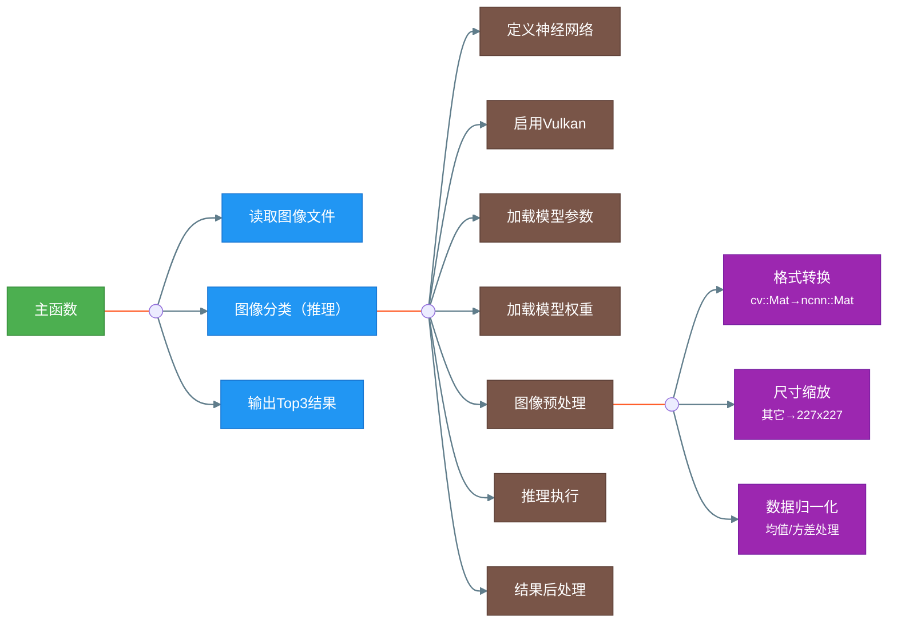

- 核心函数detect_squeezenet的源码分析
1. **函数定义**:
   - `static int detect_squeezenet(const cv::Mat& bgr, std::vector<float>& cls_scores)`:
     - 该函数是一个静态函数，它接收一个`cv::Mat`类型的图像数据（BGR格式）作为输入参数，一个`std::vector<float>`类型向量的引用作为输出参数。`cv::Mat`是OpenCV中用于存储图像的类。
     - 该静态函数返回一个整数，用于表示是否成功地执行了图像分类（核心功能：推理），该函数始终返回0，表示成功地执行了图像分类。

2. **定义一个神经网络并初始化**:
   - `ncnn::Net squeezenet;`: 定义一个`ncnn::Net`类对象，即一个（基于ncnn实现）神经网络。
   - `squeezenet.opt.use_vulkan_compute = true;`: 设置神经网络属性以使用Vulkan进行加速计算，这样可以提高在支持Vulkan的设备上的推理性能。

3. **加载模型的参数和权重**:
   - `if (squeezenet.load_param("squeezenet_v1.1.param")) exit(-1);`: 加载模型的参数（文件）。如果加载失败，则退出程序。
   - `if (squeezenet.load_model("squeezenet_v1.1.bin")) exit(-1);`: 加载模型的权重（文件）。如果加载失败，则退出程序。

4. **预处理输入的图像**:
   - `ncnn::Mat in = ncnn::Mat::from_pixels_resize(bgr.data, ncnn::Mat::PIXEL_BGR, bgr.cols, bgr.rows, 227, 227);`:
     - 将输入的`cv::Mat`中的BGR格式的图像数据转换到`ncnn::Mat`中，同时缩放到227x227大小。227x227应该是该SqueezeNet模型要求的输入尺寸。
   - `const float mean_vals[3] = {104.f, 117.f, 123.f};`: 定义用于图像归一化的均值常量。
   - `in.substract_mean_normalize(mean_vals, 0);`: 将in中的图像数据减去均值常量以完成归一化处理，第二个参数为缩放因子，这里设置为0表示不进行缩放。

5. **创建特征提取器并输入数据**:
   - `ncnn::Extractor ex = squeezenet.create_extractor();`: 创建一个基于SqueuezeNet模型的特征提取器对象，它使用SqueuezeNet模型进行推理以从输入的图像数据中提取特征。
   - `ex.input("data", in);`: 将预处理后的图像数据输入给特征提取器，这里的"data"应该是模型的输入（层，blob）的名称。

6. **执行模型推理并获取输出**:
   - `ncnn::Mat out;`: 定义一个`ncnn::Mat`类对象，它用来存储模型推理的输出结果。
   - `ex.extract("prob", out);`：由特征提取器执行模型推理，然后将名为"prob"的层（层，blob）的输出保存到前面定义的out中，即输入图像为对应分类的概率。
      ```python
      def Softmax(x):
        return np.exp(x) / np.sum(np.exp(x), axis=0)
      ```

7. **处理输出**:
   - `cls_scores.resize(out.w);`: 调整向量`cls_scores`的大小，并遍历输出（对应分类的概率，Mat类型），并将其中的数据复制到向量`cls_scores`中。

8. **返回值**:
   - 函数固定返回0，以表示成功地执行了图像分类。

总结：函数代码展示了如何使用ncnn库和SqueezeNet模型对输入的BGR格式的图像进行分类。包括模型的加载、图像的预处理、模型推理、输出的后处理，并最终输出结果的系列步骤。


### 1.4 生成ncnn模型参数和权重

- 模型下载

  考虑到[SqueezeNet v1.1 has 2.4x less computation than v1.0, without sacrificing accuracy](https://github.com/forresti/SqueezeNet/tree/master/SqueezeNet_v1.1)，这里选择了v1.1版本的模型进行测试验证。

  - caffe格式模型：[deploy.prototxt + squeezenet_v1.1.caffemodel](https://github.com/forresti/SqueezeNet)
    ```shell
    cd ..
    git clone https://github.com/forresti/SqueezeNet
    cd ../ncnn
    ```
  
  - onnx格式模型：[squeezenet1.1-7.onnx](https://github.com/onnx/models/tree/main/validated/vision/classification/squeezenet)
    
    或者在浏览器中打开[链接](https://github.com/onnx/models/blob/main/validated/vision/classification/squeezenet/model/squeezenet1.1-7.onnx)手动下载，或者使用wget命令手动下载：
    ```shell
    export http_proxy="http://127.0.0.1:44291"
    export https_proxy="http://127.0.0.1:44291"
    mkdir -p ../onnx-models
    cd ../onnx-models
    wget https://github.com/onnx/models/raw/refs/heads/main/validated/vision/classification/squeezenet/model/squeezenet1.1-7.onnx
    cd ../ncnn
    ```

- 模型转换

  - 转换caffe模型
    ```shell
    cd ../SqueezeNet/SqueezeNet_v1.1
    caffe2ncnn deploy.prototxt squeezenet_v1.1.caffemodel squeezenet_v1.1.param squeezenet_v1.1.bin
    ls -l
      total 9708
      -rw-rw-r-- 1 qy qy    9678 2月  28 23:47 deploy.prototxt
      -rw-rw-r-- 1 qy qy     640 2月  28 23:47 README.md
      -rw-rw-r-- 1 qy qy     781 2月  28 23:47 solver.prototxt
      -rw-rw-r-- 1 qy qy 4942088 2月  28 23:47 squeezenet_v1.1.bin
      -rw-rw-r-- 1 qy qy 4950080 2月  28 23:47 squeezenet_v1.1.caffemodel
      -rw-rw-r-- 1 qy qy    8599 2月  28 23:47 squeezenet_v1.1.param
      -rw-rw-r-- 1 qy qy   11839 2月  28 23:47 train_val.prototxt
    cd ../../ncnn
    ```

  - 验证生成的模型
  
    修改examples/squeezenet.cpp中模型参数和模型权重的文件名，然后重新编译并运行：
    ```shell
    git diff
      diff --git a/examples/squeezenet.cpp b/examples/squeezenet.cpp
      index a026c131..f9fe9dbb 100644
      --- a/examples/squeezenet.cpp
      +++ b/examples/squeezenet.cpp
      @@ -31,9 +31,11 @@ static int detect_squeezenet(const cv::Mat& bgr, std::vector<float>& cls_scores)
          squeezenet.opt.use_vulkan_compute = true;
      
          // the ncnn model https://github.com/nihui/ncnn-assets/tree/master/models
      -    if (squeezenet.load_param("squeezenet_v1.1.param"))
      +    if (squeezenet.load_param("../../SqueezeNet/SqueezeNet_v1.1/squeezenet_v1.1.param"))
              exit(-1);
      -    if (squeezenet.load_model("squeezenet_v1.1.bin"))
      +    if (squeezenet.load_model("../../SqueezeNet/SqueezeNet_v1.1/squeezenet_v1.1.bin"))
              exit(-1);    
    cd build
    make
    cd ..

    cd example
    ../build/examples/squeezenet ../images/256-ncnn.png
      532 = 0.287914
      920 = 0.139554
      716 = 0.080389
    cd ..
    ```
    显然，这里打印输出的结果与1.2章节中打印输出的结果：分类以及先后顺序都是一样的，只是分类相应的概率有所差别，因此可以说命令caffe2ncnn成功地将caffe模型转换成了ncnn模型。

  - 转换onnx模型
    ```shell
    cd ../onnx-models
    onnx2ncnn squeezenet1.1-7.onnx squeezenet1.1-7.param squeezenet1.1-7.bin
      onnx2ncnn may not fully meet your needs. For more accurate and elegant
      conversion results, please use PNNX. PyTorch Neural Network eXchange (PNNX) is
      an open standard for PyTorch model interoperability. PNNX provides an open model
      format for PyTorch. It defines computation graph as well as high level operators
      strictly matches PyTorch. You can obtain pnnx through the following ways:
      1. Install via python
      pip3 install pnnx
      2. Get the executable from https://github.com/pnnx/pnnx
      For more information, please refer to https://github.com/pnnx/pnnx
    pip3 install pnnx
    pnnx squeezenet1.1-7.onnx inputshape=[1,3,224,224]
    ls -l
      total 24252
      -rw-rw-r-- 1 qy qy     657 3月   2 14:24 squeezenet1.1_7_ncnn.py
      -rw-rw-r-- 1 qy qy 2478984 3月   2 14:24 squeezenet1.1_7.ncnn.bin
      -rw-rw-r-- 1 qy qy    4531 3月   2 14:24 squeezenet1.1_7.ncnn.param
      -rw-rw-r-- 1 qy qy 2482609 3月   2 14:24 squeezenet1.1_7.pnnx.onnx
      -rw-rw-r-- 1 qy qy   14891 3月   2 14:24 squeezenet1.1_7_pnnx.py
      -rw-rw-r-- 1 qy qy 4950882 3月   2 14:24 squeezenet1.1_7.pnnx.bin
      -rw-rw-r-- 1 qy qy   12241 3月   2 14:24 squeezenet1.1_7.pnnx.param
      -rw-rw-r-- 1 qy qy 4952956 3月   2 14:24 squeezenet1.1-7.pnnxsim.onnx
      -rw-rw-r-- 1 qy qy 4942088 3月   1 11:14 squeezenet1.1-7.bin
      -rw-rw-r-- 1 qy qy    9382 3月   1 11:14 squeezenet1.1-7.param
      -rw-rw-r-- 1 qy qy 4956208 3月   1 11:05 squeezenet1.1-7.onnx
    cd ../ncnn
    ```

  - 验证生成的模型
  
    注意：前面下载的onnx模型的输入shape为1x3x224x224，这与ncnn自带的caffe模型的1x3x227x227不一致，因此需要修改examples/squeezenet.cpp中前处理相关的代码。此外还需要修改模型参数和模型权重的文件名，然后重新编译并运行：
    ```shell
    git diff
      diff --git a/examples/squeezenet.cpp b/examples/squeezenet.cpp
      index a026c131..3ffc7159 100644
      --- a/examples/squeezenet.cpp
      +++ b/examples/squeezenet.cpp
      @@ -31,12 +31,16 @@ static int detect_squeezenet(const cv::Mat& bgr, std::vector<float>& cls_scores)
          squeezenet.opt.use_vulkan_compute = true;
      
          // the ncnn model https://github.com/nihui/ncnn-assets/tree/master/models
      -    if (squeezenet.load_param("squeezenet_v1.1.param"))
      +    if (squeezenet.load_param("../../onnx-models/squeezenet1.1-7.param"))
              exit(-1);
      -    if (squeezenet.load_model("squeezenet_v1.1.bin"))
      +    if (squeezenet.load_model("../../onnx-models/squeezenet1.1-7.bin"))
              exit(-1);
      
      -    ncnn::Mat in = ncnn::Mat::from_pixels_resize(bgr.data, ncnn::Mat::PIXEL_BGR, bgr.cols, bgr.rows, 227, 227);
      +    ncnn::Mat in = ncnn::Mat::from_pixels_resize(bgr.data, ncnn::Mat::PIXEL_BGR, bgr.cols, bgr.rows, 224, 224);
      
    cd build
    make
    cd ..

    cd example
    ../build/examples/squeezenet ../images/256-ncnn.png
      find_blob_index_by_name prob failed
      Try
          ex.extract("squeezenet0_flatten0_reshape0", out0);
      Segmentation fault (core dumped)
    cd ..
    ```
    使用netron查看squeezenet1.1-7.onnx模型，发现其输出的名字是`squeezenet0_flatten0_reshape0`而不是`prob`，而且从模型转换生成的模型参数文件也可以看出（最后一行）。因此按照上述提示修改代码，然后重新编译并运行：
    ```shell
    git diff examples/squeezenet.cpp
      diff --git a/examples/squeezenet.cpp b/examples/squeezenet.cpp
      index a026c131..86d31bf7 100644
      --- a/examples/squeezenet.cpp
      +++ b/examples/squeezenet.cpp
      @@ -31,12 +31,12 @@ static int detect_squeezenet(const cv::Mat& bgr, std::vector<float>& cls_scores)
          squeezenet.opt.use_vulkan_compute = true;
      
          // the ncnn model https://github.com/nihui/ncnn-assets/tree/master/models
      -    if (squeezenet.load_param("squeezenet_v1.1.param"))
      +    if (squeezenet.load_param("../../onnx-models/squeezenet1.1-7.param"))
              exit(-1);
      -    if (squeezenet.load_model("squeezenet_v1.1.bin"))
      +    if (squeezenet.load_model("../../onnx-models/squeezenet1.1-7.bin"))
              exit(-1);
      
      -    ncnn::Mat in = ncnn::Mat::from_pixels_resize(bgr.data, ncnn::Mat::PIXEL_BGR, bgr.cols, bgr.rows, 227, 227);
      +    ncnn::Mat in = ncnn::Mat::from_pixels_resize(bgr.data, ncnn::Mat::PIXEL_BGR, bgr.cols, bgr.rows, 224, 224);
      
          const float mean_vals[3] = {104.f, 117.f, 123.f};
          in.substract_mean_normalize(mean_vals, 0);
      @@ -46,7 +46,7 @@ static int detect_squeezenet(const cv::Mat& bgr, std::vector<float>& cls_scores)
          ex.input("data", in);
      
          ncnn::Mat out;
      -    ex.extract("prob", out);
      +    ex.extract("squeezenet0_flatten0_reshape0", out);

    cd build
    make
    cd ..

    cd examples
    ../build/examples/squeezenet ../images/256-ncnn.png
      599 = 316.265503
      532 = 294.387543
      918 = 285.244476
    cd ..
    ```
    显然，这里打印输出的结果与1.2章节中打印输出的结果差异较大：分类只有一个一样，且输出的并不是各类别的概率。使用netron对比caffe模型和onnx模型发现：模型的最后一个处理节点不一样，caffe模型的最后一个节点为SoftMax，而onnx模型的最后一个节点为Reshape。因此这里输出的第二列数值应该为各类别的分值而不是概率。至于为什么top3的分类不一样，初步怀疑是模型训练细节不一致导致的，而不是模型转换导致的。下面我们先验证onnx模型。

  - 验证onnx模型

    阅读[官方文档](https://github.com/onnx/models/blob/main/validated/vision/classification/squeezenet/README.md)，先使用其中提到的网页版SqueezeNet 1.0对图片256-ncnn.png进行分类，结果如下图所示：
    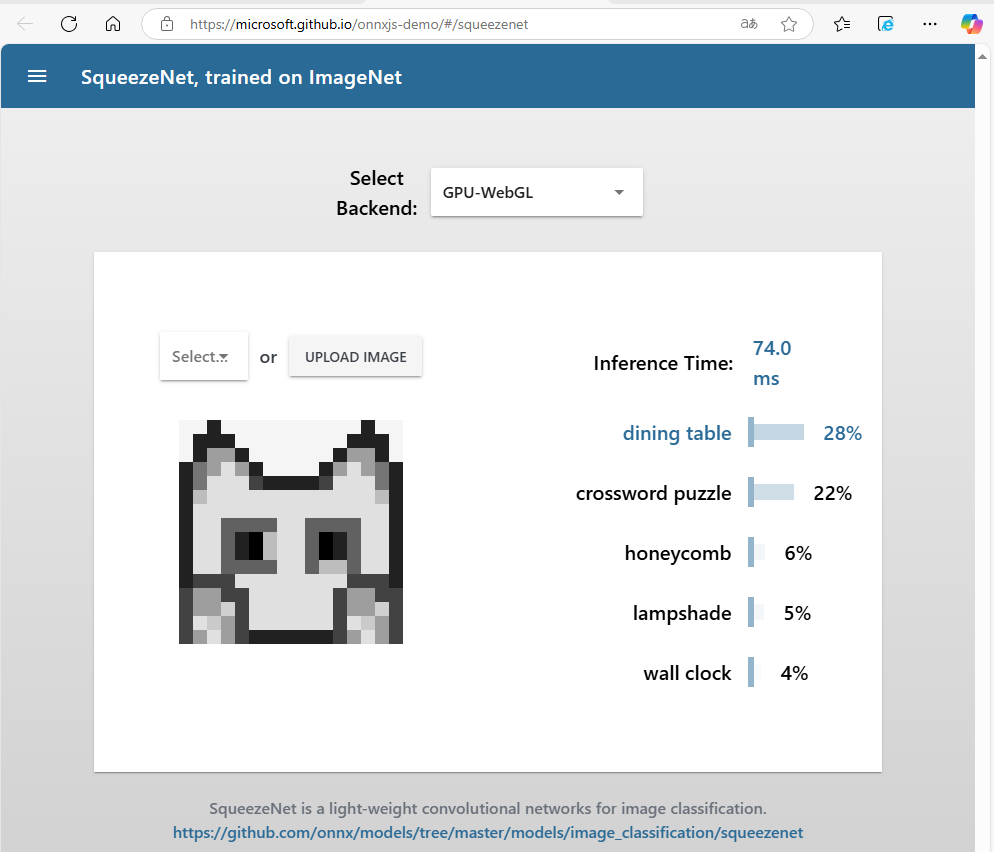
    然后参考[imagenet_preprocess.py](https://github.com/onnx/models/blob/main/validated/vision/classification/imagenet_preprocess.py)中的预处理，编写python程序（exmples/squeezenet.py）对图片256-ncnn.png进行分类：
    ```python
    import onnxruntime as ort
    from   PIL import Image
    import numpy as np

    # 计算概率
    def softmax(x, axis=-1):
        x_max = np.max(x, axis=axis, keepdims=True)
        exp_x = np.exp(x - x_max)
        return exp_x * 100 / np.sum(exp_x, axis=axis, keepdims=True) 

    # 读取标签文件
    def read_labels(label_file="synset_words.txt"):
        labels = []
        with open(label_file, "r") as f:
            for line in f:
                stripped_line = line.strip()
                if stripped_line:
                    label = stripped_line.split(' ', 1)
                    if len(label) > 1:
                        labels.append(label[1])
        return labels

    # 图像预处理
    def preprocess_image(image_path):
        img_image = Image.open(image_path).convert("RGB") # HCW
        img_image = img_image.resize((224, 224), Image.Resampling.BILINEAR)
        mean_vec  = np.array([0.485, 0.456, 0.406]).astype(np.float32)
        norm_vec  = np.array([0.229, 0.224, 0.225]).astype(np.float32)
        img_array = np.array(img_image).astype(np.float32)
        img_array = (img_array / 255.0 - mean_vec) / norm_vec
        img_array = img_array.transpose(2, 0, 1)
        return np.expand_dims(img_array, axis=0) # 添加batch维度

    # 加载模型并进行推理
    def classify_image(image_path, model_path, label_file):
        labels      = read_labels(label_file)
        input_data  = preprocess_image(image_path)
        session     = ort.InferenceSession(model_path)
        input_name  = session.get_inputs ()[0].name
        output_name = session.get_outputs()[0].name
        outputs = session.run([output_name], {input_name: input_data})
        probabilities = softmax(outputs[0][0])
        top5_indices  = np.argsort(probabilities)[::-1][:5]
        return [(i, labels[i], probabilities[i]) for i in top5_indices]

    # 程序入口
    if __name__ == "__main__":
        image_path = "../images/256-ncnn.png"
        model_path = "../../onnx-models/squeezenet1.1-7.onnx"
        label_file = "./synset_words.txt"
        results = classify_image(image_path, model_path, label_file)
        print("Top5 of probabilities：")
        for i, label, prob in results:
            print(f"{i}. {label:30}: {prob:.2f}%")
    ```
    激活python环境并运行该python程序，输出结果如下所示：
    ```shell
    conda activate py3.8-dl
    cd examples
    python squeezenet.py 
      Top5 of probabilities：
      532. dining table, board           : 24.26%
      918. crossword puzzle, crossword   : 20.17%
      599. honeycomb                     : 10.64%
      646. maze, labyrinth               : 4.07%
      619. lampshade, lamp shade         : 3.03%
    cd ..
    ```
    显然，这里打印输出的结果和网页上分类的结果比较接近，之所以有些差别，猜测是与模型的版本有关。同时也可以看出python脚本中的预处理与examples/squeezenet.cpp中的预处理不完全一样，对其进行修改，然后重新编译并运行：
    ```shell
    git diff
      diff --git a/examples/squeezenet.cpp b/examples/squeezenet.cpp
      index a026c131..c4415028 100644
      --- a/examples/squeezenet.cpp
      +++ b/examples/squeezenet.cpp
      @@ -31,22 +31,28 @@ static int detect_squeezenet(const cv::Mat& bgr, std::vector<float>& cls_scores)
          squeezenet.opt.use_vulkan_compute = true;
      
          // the ncnn model https://github.com/nihui/ncnn-assets/tree/master/models
      -    if (squeezenet.load_param("squeezenet_v1.1.param"))
      +    if (squeezenet.load_param("../../onnx-models/squeezenet1.1-7.param"))
              exit(-1);
      -    if (squeezenet.load_model("squeezenet_v1.1.bin"))
      +    if (squeezenet.load_model("../../onnx-models/squeezenet1.1-7.bin"))
              exit(-1);
      
      -    ncnn::Mat in = ncnn::Mat::from_pixels_resize(bgr.data, ncnn::Mat::PIXEL_BGR, bgr.cols, bgr.rows, 227, 227);
      +    ncnn::Mat in = ncnn::Mat::from_pixels_resize(bgr.data, ncnn::Mat::PIXEL_BGR2RGB, bgr.cols, bgr.rows, 224, 224);
      
      -    const float mean_vals[3] = {104.f, 117.f, 123.f};
      -    in.substract_mean_normalize(mean_vals, 0);
      +    const float mean_vals[3] = {0.485 * 255.0, 0.456 * 255.0, 0.406 * 255.0};
      +    const float norm_vals[3] = {0.229 * 255.0, 0.224 * 255.0, 0.225 * 255.0};
      +    in.substract_mean_normalize(mean_vals, norm_vals);
      
          ncnn::Extractor ex = squeezenet.create_extractor();
      
          ex.input("data", in);
      
          ncnn::Mat out;
      -    ex.extract("prob", out);
      +    ex.extract("squeezenet0_flatten0_reshape0", out);

    cd build
    make
    cd ..

    cd examples
    ../build/examples/squeezenet ../images/256-ncnn.png
      918 = 18125.111328
      599 = 17349.384766
      646 = 15991.737305
    cd ..
    ```
    显然和python程序打印输出的结果只是比较接近，并不完全一致的，具体原因待查。
    |图片|c/c++程序<br>的打印输出|python程序<br>的打印输出|备注|
    |---|---|---|---|
    ||918<br>599<br>646|532<br>918<br>599<br>646<br>619|除去第一个，后续一致|
    ||94<br>92<br>16|94<br>92<br>95<br>12<br>14|top2一致|
    ||780<br>914<br>484|914<br>780<br>484<br>871<br>724|top3一致，但顺序不一致|
    ||947<br>985<br>340|947<br>992<br>985<br>996<br>840|top1一致|


## 二、深入ncnn
ncnn是基于C++的轻量级神经网络框架，主要用于嵌入式设备上的高性能推理。它支持多种模型格式，包括ONNX、TensorFlow Lite等，并提供了丰富的算子支持和优化技术，以实现高效的计算和低延迟的推断。接下来的学习思路是从几个典型算子切入，研究算子的具体实现、性能优化和跨平台实现，然后逐步上升到图等，直到完成ncnn软件架构的梳理。

[优Tech分享：ncnn的设计理念和软件工程](https://news.qq.com/rain/a/20210201A09MJV00)<br>
[ncnn：int8量化推理大幅优化超500％](https://news.qq.com/rain/a/20210511A0BDI100)<br>
[开源推理框架TNN模型部署加速与优化](https://news.qq.com/rain/a/20210917A0BVQP00)


### 2.1 算子基类
ncnn实现了近百个算子，详细清单参见官方文档[《operators》](https://github.com/Tencent/ncnn/blob/master/docs/developer-guide/operators.md)。ncnn中，几乎所有的算子都是基类Layer的派生类，因此在研究某个具体的算子实现之前，需要先了解一下基类Layer的定义。

实现源码：[layer.h](https://github.com/Tencent/ncnn/blob/master/src/layer.h)、[layer.cpp](https://github.com/Tencent/ncnn/blob/master/src/layer.h)
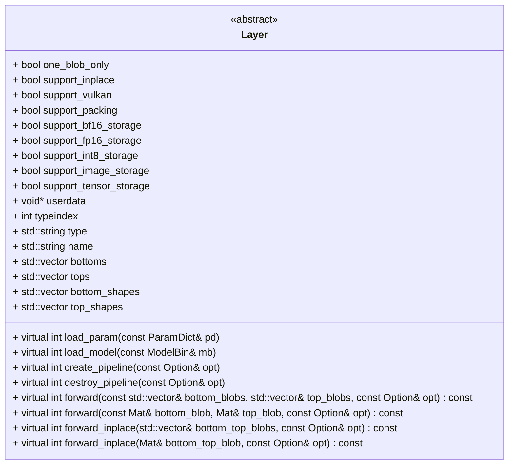
|成员|说明|备注|
|---|---|---|
|one_blob_only    | | 模型的输入和输出是否都是单个Mat对象？
|support_inplace  | | 模型是否支持原地计算，即输入输出共用一个Mat？
|support_vulkan   | | 模型是否支持Vulkan，即是否支持Vulkan加速？
|......|......|......|
|load_param       | 加载算子参数 | 非必须实现
|load_model       | 加载算子权重 | 非必须实现
|create_pipeline  | 创建计算管道 | 非必须实现，多用于复杂的算子
|destroy_pipeline | 销毁计算管道 | 非必须实现，多用于复杂的算子
|forward          | 执行前向计算 | 对于one_blob_only=false && support_inplace=false的算子，必须重载实现
|forward          | 执行前向计算 | 对于one_blob_only=true  && support_inplace=false的算子，必须重载实现
|forward_inplace  | 执行原地计算 | 对于one_blob_only=false && support_inplace=true 的算子，必须重载实现
|forward_inplace  | 执行原地计算 | 对于one_blob_only=true  && support_inplace=true 的算子，必须重载实现


#### 2.1.1 注册算子
每实现一个算子，都需要借助宏DEFINE_LAYER_CREATOR来为其定义一个该算子实例的创建函数，宏DEFINE_LAYER_CREATOR的定义如下所示：
```c++
#define DEFINE_LAYER_CREATOR(name)                          \
    ::ncnn::Layer* name##_layer_creator(void* /*userdata*/) \
    {                                                       \
        return new name;                                    \
    }
```
宏DEFINE_LAYER_CREATOR的参数name为算子的类名，例如ReLU算子的类名为ReLU。算子的创建函数集中在文件ncnn/build/src/layer_declaration.h中定义，该文件是在编译时自动生成的。每一个算子都对应一个该宏的调用，譬如ReLU算子：
```c++
...
#include "layer/relu.h"
namespace ncnn { DEFINE_LAYER_CREATOR(ReLU) }
...
```
算子是集中在文件ncnn/build/src/layer_registry.h中注册，该文件包括11个算子注册表，它们是在编译时自动生成的。每一个算子都在对应的注册表中有一个对应的注册项，譬如ReLU算子：
```c++
static const layer_registry_entry layer_registry[] = {
...
#if NCNN_STRING
{"ReLU", ReLU_layer_creator},
#else
{ReLU_layer_creator},
#endif
...
```
此外，ncnn还为每一个算子分配了一个唯一的索引，算子的索引集中在文件ncnn/build/src/layer_type_enum.h中定义，该文件也是在编译时自动生成的。譬如ReLU算子的索引为26：
```c++
...
ReLU = 26,
...
```
layer_declaration.h、layer_registry.h、layer_type_enum.h文件是怎么生成的呢？文件[ncnn_add_layer.cmake](https://github.com/Tencent/ncnn/blob/master/cmake/ncnn_add_layer.cmake)中定义的cmake宏ncnn_add_layer是关键，该cmake宏会为指定的算子定义变量：layer_declaration、layer_registry、layer_registry_arch、layer_registry_vulkan、layer_type_enum，从而和模板文件layer_declaration.h.in、layer_registry.h.in、layer_type_enum.h.in匹配生成对应的.h文件。


#### 2.1.2 创建算子
算子的创建由下面的一组函数负责，既可以通过算子的名字（下面函数中名为type的参数）来创建指定的算子，也可以通过算子的索引（下面函数中名为index的参数）来创建指定的算子：
```c++
#if NCNN_STRING
NCNN_EXPORT Layer* create_layer(const char* type);
NCNN_EXPORT Layer* create_layer_naive(const char* type);
NCNN_EXPORT Layer* create_layer_cpu(const char* type);
#if NCNN_VULKAN
NCNN_EXPORT Layer* create_layer_vulkan(const char* type);
#endif // NCNN_VULKAN
#endif // NCNN_STRING
NCNN_EXPORT Layer* create_layer(int index);
NCNN_EXPORT Layer* create_layer_naive(int index);
NCNN_EXPORT Layer* create_layer_cpu(int index);
#if NCNN_VULKAN
NCNN_EXPORT Layer* create_layer_vulkan(int index);
#endif // NCNN_VULKAN
```
它们之间的调用关系以及其与算子注册表之间的如下所示:
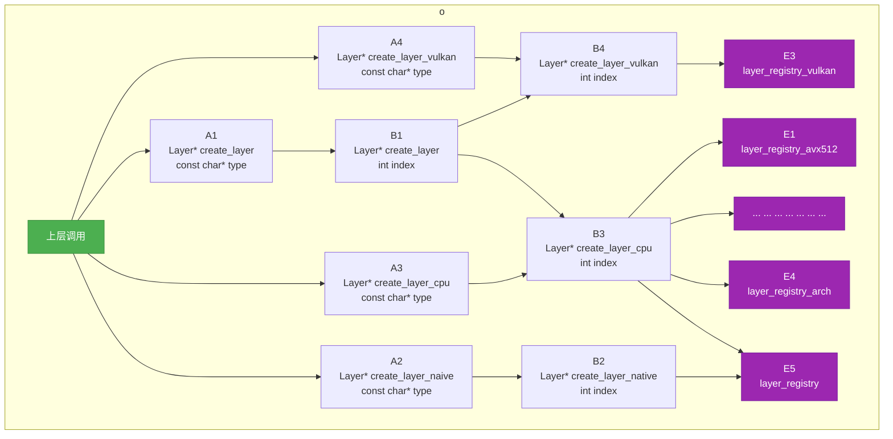
譬如创建ReLU算子的方法如下所示，其中前者为常用的方法：
```c++
Layer* relu = create_layer("ReLU");
或
Layer* relu = create_layer(ReLU);
```


### 2.2 典型算子
典型的算子有Input、Convolution、Pooling、ReLU、Sigmoid、Softmax等。


#### 2.2.1 ReLU
ReLU（Rectified Linear Unit，修正线性单元）是深度学习中最常用的激活函数之一，其数学表达式为：f(x) = max(0, x)，即当输入值大于0时输出原值，否则输出0。其函数图像如下所示：<br>
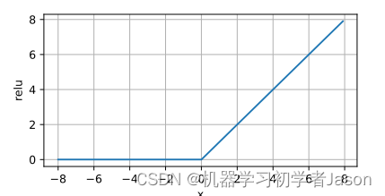

实现源码：[relu.h](https://github.com/Tencent/ncnn/blob/master/src/layer/relu.h)、[relu.cpp](https://github.com/Tencent/ncnn/blob/master/src/layer/relu.cpp)

- ReLU算子支持原地计算，即输入、输出共用一个Mat对象，因为support_inplace被设置为true了；
- ReLU算子仅支持一个参数：斜率slope，默认值为0，但并未在构造函数中显示地将其初始化为0；
- 如果参数slope的值为0，则Mat中所有小于0的元素将被设置为0，其它的保持不变；
- 如果参数slope的值不为0，则Mat中所有小于0的元素都被乘以slope，其它的保持不变。猜测这是为了解决神经元死亡（Dead ReLU，神经元失去活力）问题；
- ReLU算子没有权重，因此它没有重载load_model；它有一个参数，所以它重载了load_param；
- 从ReLU算子的实现可以看出，Mat中各通道中的数据是连续的。<font color="red">CHWD/CDHW格式?有待确认。</font>
- 使用了OpenMP技术，对计算内核进行多线程并行化优化，适用于循环次数多、总耗时长的计算任务；

参考资料：<br>
 - [《神经网络中的激活函数——ReLU函数》](https://blog.csdn.net/Seu_Jason/article/details/138906388)


#### 2.2.2 ReLU_x86
ReLU_x86，顾名思义，该类是ReLU算子针对x86平台的优化实现，从其实现可以看出它在使用OpenMP技术优化的同时，还使用了x86平台支持的SSE2、AVX、AVX512F指令集对循环内核进行了优化。此外，还支持int8类型的输入数据，输入数据的默认类型为float32。

实现源码：[relu_x86.h](https://github.com/Tencent/ncnn/blob/master/src/layer/x86/relu_x86.h)、[relu_x86.cpp](https://github.com/Tencent/ncnn/blob/master/src/layer/x86/relu_x86.cpp)

- SSE2、AVX、AVX512F能处理的向量宽度依次为128位、256位和512位，因此处理时，先尽量使用AVX512指令处理，剩下的不够512b时，再尽量使用AVX指令来处理，剩下的不够256b时，再尽量使用SSE2指令来处理，身下不够128b时，再使用CPU指令来处理，直到全部处理完成为止；
- __m512：AVX512指令集中表示单精度浮点数向量的数据类型，对应512位寄存器，可存储16个32位浮点数（共16×32=512位）。它是AVX512指令（一种SIMD指令[单指令多数据]）能操作的最大颗粒度，通过它AVX512指令可以同时对其中的16个浮点数执行并行处理；
- [_mm512_setzero_ps](https://www.intel.com/content/www/us/en/docs/intrinsics-guide/index.html#text=_mm512_setzero_ps&ig_expand=5868,4103,5868)：构建一个包含16个全0单精度浮点数的512位的向量；该操作对应汇编指令vpxorq；
- [_mm512_loadu_ps](https://www.intel.com/content/www/us/en/docs/intrinsics-guide/index.html#text=_mm512_loadu_ps&ig_expand=5868,4103)：从指定地址的内存中加载16个单精度浮点数构建一个512位的向量。其中的u（unaligned）表示支持未对齐的内存地址。该操作对应汇编指令vmovups；
- [_mm512_max_ps](https://www.intel.com/content/www/us/en/docs/intrinsics-guide/index.html#text=_mm512_max_ps&ig_expand=5868,4103,5868,4103,4363)：对两个512位的向量进行逐元素比较，返回每个位置的较大者。该操作对应汇编指令vmaxps；
- [_mm512_storeu_ps](https://www.intel.com/content/www/us/en/docs/intrinsics-guide/index.html#text=_mm512_storeu_ps&ig_expand=5868,4103,5868,4103,4363,6545)：将一个512位的向量保存到指定地址的内存中。其中的u（unaligned）表示支持未对齐的内存地址。该操作对应汇编指令vmovups；
- 其它指令类似，只是并行处理的位数不一样，就不在此一一赘述了；


#### 2.2.2 ReLU_arm
ReLU_arm，顾名思义，该类是ReLU算子针对arm平台的优化实现，从其实现可以看出它在使用OpenMP技术优化的同时，还采用内联汇编代码或ARM NEON指令集对循环内核进行了优化。此外，还支持int8、fp16、bf16这三种类型的输入数据，输入数据的默认类型为float32。
|数据类型|数值范围|精度（尾数位）|主要特点|
|---|---|---|---|
|int8|[-128,127]或[0,255]|无尾数位|仅表示离散整数，无小数精度|
|fp16|±65504|1位符号位<br>5位指数位<br>10位尾数位|高精度但范围小，易出现溢出问题|
|bf16|±6.55×10^38|1位符号位<br>8位指数位<br>7位尾数位|大范围但低精度，适合梯度计算|

实现源码：[relu_arm.h](https://github.com/Tencent/ncnn/blob/master/src/layer/arm/relu_arm.h)、[relu_arm.cpp](https://github.com/Tencent/ncnn/blob/master/src/layer/arm/relu_arm.cpp)

- float32x4_t：Neon指令集中表示单精度浮点数向量的数据类型，对应128位寄存器，可存储4个32位浮点数（共4x32=128位）。它是Neon指令（一种SIMD指令[单指令多数据]）能操作的最大颗粒度，通过它Neon指令可以同时对其中的4个浮点数执行并行处理；
- [vdupq_n_f32](https://developer.arm.com/architectures/instruction-sets/intrinsics/#f:@navigationhierarchiessimdisa=[Neon]&q=vdupq_n_f32)：构建一个包含4个全0单精度浮点数的128位的向量，并将其写入到一个SIMD&FP寄存器中。该操作对应汇编指令dup；
- [vld1q_f32](https://developer.arm.com/architectures/instruction-sets/intrinsics/#f:@navigationhierarchiessimdisa=[Neon]&q=vld1q_f32)：从指定地址的内存中加载4个单精度浮点数构建一个128位的向量，并将其写入到一个SIMD&FP寄存器中。该操作对应汇编指令ld1；另外还有一条指令vld1q_f32_x4，可以一次性加载512位的向量；
- [vmaxq_f32](https://developer.arm.com/architectures/instruction-sets/intrinsics/#f:@navigationhierarchiessimdisa=[Neon]&q=vmaxq_f32)：对两个128位向量中的4个单精度浮点数进行逐元素比较，返回每个位置的较大者。该操作对应汇编指令fmax；
- [vst1q_f32](https://developer.arm.com/architectures/instruction-sets/intrinsics/#f:@navigationhierarchiessimdisa=[Neon]&q=vst1q_f32)：将一个SIMD&FP寄存器中包含4个单精度浮点数的128位向量写入到指定地址的内存中。该操作对应汇编指令st1；另外还有一条指令vst1q_f32_x4，可以一次性保存512位的向量；


#### 2.2.3 ReLU_vulkan
待补充。


### 2.3 模型参数
ncnn模型参数文件的格式详见官方文档：[《param and model file structure》](https://github.com/Tencent/ncnn/blob/master/docs/developer-guide/param-and-model-file-structure.md)，模型参数的加载由文件[net.h](https://github.com/Tencent/ncnn/blob/master/src/net.h)、[net.cpp](https://github.com/Tencent/ncnn/blob/master/src/net.cpp)中定义的接口实现，它们之间的调用关系如下所示:
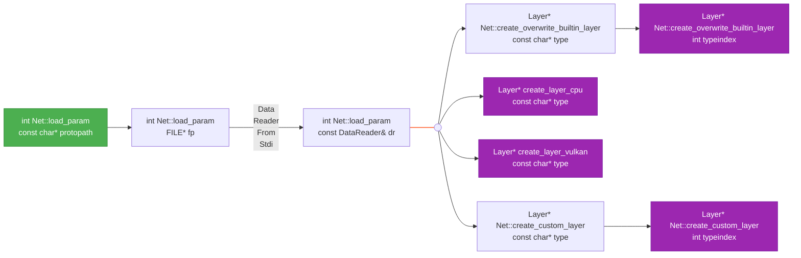
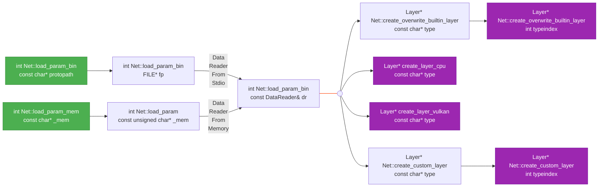
其中，接口create_overwrite_builtin_layer和create_custom_layer用于创建用户自定义的算子，用户自定义的算子由接口Net::register_custom_layer负责注册。注册时，如果算子已经存在于全局注册表layer_registry中，则将该算子注册到专属于本模型的注册表overwrite_builtin_layer_registry中，其优先级最高。如果算子没存在于全局注册表layer_registry中，则将该算子注册到专属于本模型的注册表custom_layer_registry中，其优先级最低。

另外，接口int Net::load_param(const char* protopath)加载的参数文件A与接口int Net::load_param_bin(const char* protopath)加载的参数文件B之间是什么关系呢？还有int Net::load_param(const unsigned char* _mem)接口加载的内存数据C又与它们之间又是什么关系呢？结论：文件A和内存数据C是文件B经过命令ncnn2mem转换/生成出来的：
```shell
ls -l
  total 4840
  -rw-rw-r-- 1 qy qy 4942088 3月   4 23:21 squeezenet_v1.1.bin
  -rw-rw-r-- 1 qy qy    8881 3月   4 23:21 squeezenet_v1.1.param
ncnn2mem squeezenet_v1.1.param squeezenet_v1.1.bin squeezenet_v1.1.param.id.h squeezenet_v1.1.param.mem.h
ls -l
  total 29308
  -rw-rw-r-- 1 qy qy  4942088 3月   4 23:21 squeezenet_v1.1.bin
  -rw-rw-r-- 1 qy qy     8881 3月   4 23:21 squeezenet_v1.1.param
  -rw-rw-r-- 1 qy qy     3792 3月   4 23:22 squeezenet_v1.1.param.bin
  -rw-rw-r-- 1 qy qy     7114 3月   4 23:22 squeezenet_v1.1.param.id.h
  -rw-rw-r-- 1 qy qy 25038960 3月   4 23:22 squeezenet_v1.1.param.mem.h
```

下面是接口int Net::load_param(const DataReader& dr)解析模型参数文件的详细流程：
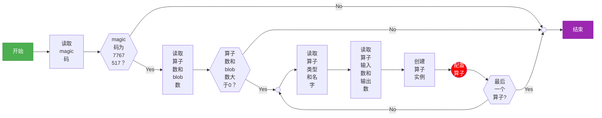
从上图可以看出，解析出模型中的算子数和blob数后，先resize Net类的两个std::vector类型的成员变量layers（算子列表）和blobs（blob列表），然后进入for循环来初始化算子列表和blob列表。初始化的核心工作是创建算子、配置算子（设置算子的type和name、输入blob的索引列表、输出blob的索引列表，解析算子的参数，设置算子的输入和输出的shape hints，最后加载算子参数等）和配置blob（设置blob的name、producer和consumer，设置算子的输入blob的shape hints等）。
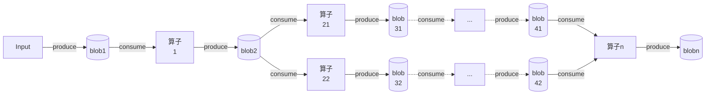


### 2.4 模型权重
ncnn模型权重文件的格式详见官方文档：[《param and model file structure》](https://github.com/Tencent/ncnn/blob/master/docs/developer-guide/param-and-model-file-structure.md)，模型权重的加载由文件[net.h](https://github.com/Tencent/ncnn/blob/master/src/net.h)、[net.cpp](https://github.com/Tencent/ncnn/blob/master/src/net.cpp)中定义的接口实现，它们之间的调用关系如下图所示:

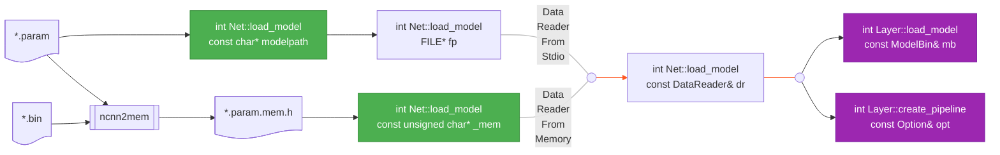
另外，接口int Net::load_model(const char* modelpath)加载的权重文件A与接口int Net::load_model(const unsigned char* _mem)加载的内存数据B之间是什么关系呢？结论：内存数据B是文件A经过命令ncnn2mem转换/生成出来的，详见2.3章节。


### 2.5 模型推理
从ncnn的具体实现来看，模型推理的本质就是输入数据依次经过模型参数中所描述的每个算子并按照模型权重中所指定的参数进行运算处理的过程，这个过程会依次调用每个算子的forward/forward_inplace接口对输入数据进行处理。下图为模型推理的流程以及与此相关的关键数据结构：
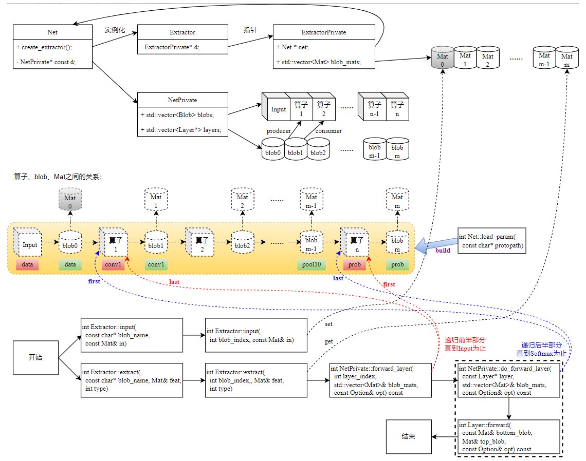
上图中，类Net是一个通用的神经网络类，其通过接口load_param加载ncnn模型参数，通过接口load_model加载ncnn模型权重。加载完模型参数后，其内部便创建了两个列表：算子列表（layers）以及blob列表(blobs)。算子列表中的算子通过blob列表中blob的信息构建出了一个pipeline：每个blob都会指向一个producer和/或一个consumer，同时还会指向一个Mat，该Mat既是proudcer（上一个算子）的输出，即其生成的数据，同时也是consumer（下一个算子）的输入，即其要处理的数据。我理解类Extractor是一个辅助类，它一方面维护了一次推理过程中要用的一组Mat（它们与blob列表一一对应），另一方面提供了extract接口用于执行一次推理（即启动一次数据处理pipeline）。

经过实测发现，每次推理都需要重新创建一个Extractor类对象并调用其接口extract来完成该次推理，否则在连续推理时，第二次以及其后面的所有推理都会无效，这是因为Extractor类中维护的Mat列表中的最后一个Mat的dims在推理结束后就被设置为非0，并且没有调用release来清理，从而导致第二次以及其后面的推理实际并没有进行，具体细节参见下面代码中的那个if条件判断：
```c++
int Extractor::extract(int blob_index, Mat& feat, int type)
{
  ...
  if (d->blob_mats[blob_index].dims == 0)
  {
    int layer_index = d->net->blobs()[blob_index].producer;
    ...
    ret = d->net->d->forward_layer(layer_index, d->blob_mats, d->opt);
  }
  feat = d->blob_mats[blob_index];
}
```
这中设计会导致：每次创建一个新的Extractor类对象进行推理时，都需要重新构建一次Mat列表，即每个Mat都需要重新分配一次内存，这会增加额外CPU开销（当然，也可以通过内存池等技术来降低这个开销）。但其在opt.lightmode被设置为true时，会使得基于ncnn的AI应用对内存的需求就会比较小。opt.lightmode被设置为true时，用于两个算子之间交互数据的Mat会在consumer使用完时被释放掉。这种设计比较适合于非实时推理的应用场景。<font color="red"><b>如何修改使其适用于实时应用场景呢？即第一次推理把Mat列表中所有的Mat分配好，后续的推理直接使用Mat列表中Mat!</b></font>


### 2.8 优化技术

#### 2.8.1 OpenMP
[OpenMP(Open Multi-Processing)](https://www.openmp.org/specifications/)是由OpenMP Architecture Review Board牵头提出的、并已经被广泛接受的、用于共享内存并行系统的、多处理器程序设计的一套指导性编译处理方案。OpenMP支持的编程语言包括C、C++和Fortran，而支持OpenMP的编译器包括Sun Compiler，GNU Compiler和Intel Compiler等。OpenMP提供了对并行算法的高层抽象，程序员通过在源代码中加入专用的pragma来表述自己的意图，据此编译器可以自动将程序进行并行化，并在必要之处加入同步、互斥以及通信。当选择忽略这些pragma（不加-fopenmp），或者编译器不支持OpenMP时，程序可退化为通常的程序(串行运行)，代码仍然可以正常运行，只是不能利用多线程来并行加速而已。

参考资料：<br>
[《Parallel Programming with OpenMP》](https://github.com/NCI900-Training-Organisation/intro-to-OpenMP)<br>
[《OpenMP并行编程（一）》](./openmp/OpenMP并行编程（一）.pdf)<br>
[《OpenMP并行编程（二）》](./openmp/OpenMP并行编程（二）.pdf)<br>
[《OpenMP并行编程（三）》](./openmp/OpenMP并行编程（三）.pdf)<br>
[《An Overview of OpenMP》](./openmp/An%20Overview%20of%20OpenMP.pdf)<br>
[《OpenMP Examples V6.0》](./openmp/OpenMP%20Examples%20V6.0.pdf)<br>
[《OpenMP Reference Guide V6.0》](./openmp/OpenMP%20RefGuide%20V6.0.pdf)


##### 2.8.1.1 OpenMP在ncnn中的应用
ncnn源码中使用到了下面的omp指令，通过它们提升了ncnn框架的推理性能：
- <b>#pragma omp parallel sections<br>
  #pragma omp section</b>

  非迭代任务的并行执行，即使用#pragma omp section将#pragma omp parallel sections后面的代码块划分为多个独立section，并为每个section启动一个独立的线程来执行它，并根据需要选择（是否加nowait）是否在#pragma omp parallel sections代码块后面进行同步。譬如下面的代码，它会启动两个线程，一个线程执行代码块1，另一个线程执行代码块2，并在代码块3执行前进行同步直到它们都执行完：
  ```c++
  #pragma omp parallel sections
  {
      #pragma omp section
      {
          代码块1
      }
      #pragma omp section
      {
          代码块2
      }
  }
  代码块3
  ```

- <b>#pragma omp parallel for num_threads(N)<br>
  #pragma omp parallel for</b>

  迭代任务的并行执行，即将for循环拆分成N个子任务，并为每个子任务启动一个独立的线程来执行它。譬如下面的代码，会将for循环拆分成4个子任务：0~[n/4]、[n/4]+1~[n/4]*2、[n/4]*2+1~[n/4]*3、[n/4]*3+1~n，并启动4个独立的线程来分别执行它们：
  ```c++
  #pragma omp parallel for num_threads(4)
  for(int i = 0; i < n; i++) {
    循环内核
  }
  ```
  上面的代码等效于下面的代码：
  ```c++
  omp_set_num_threads(4);
  #pragma omp parallel for
  for(int i = 0; i < n; i++) {
    循环内核
  }
  ```
  如果没有通过num_threads指令显示地指定要启动的线程数，则由环境变量OMP_NUM_THREADS的值来决定要启动的线程数。如果该环境变量未设置，则由CPU内核的数量来决定要启动的线程数。可以使用接口omp_get_num_procs()获取CPU内核的数量。

- <b>#pragma omp parallel for collapse(M)</b>

  将M层嵌套循环合并为单层循环，从而形成一个迭代次数多的循环，从而增加并行化的粒度。譬如下面的代码，两层嵌套循环会合并成单层循环，从而使得迭代次数达到2*100=200，随后可以统一地将这200次迭代分配给指定数量的线程：
  ```c++
  #pragma omp parallel for collapse(2) 
  for (int i = 0; i < 2; i++) {
    for (int j = 0; j < 100; j++) {
      循环内核
    }
  }
  ```
  如果没有使用collapse指令，则迭代次数仅为2，这样最多只需要启动两个线程来执行两次迭代（一个线程执行一次迭代）。这样一来，对于CPU内核数高于2的平台，就不能充分挖掘出CPU的性能。

- #pragma omp parallel for schedule(static, M)

  静态调度策略，即将循环迭代按指定大小（chunk_size=M）依次分配给4个线程，即迭代0~M-1分配给线程0、迭代M~M\*2-1分配给线程1、迭代M\*2~M\*3-1分配给线程2、迭代M\*3~M\*4-1分配给线程3、迭代M\*4~M\*5-1分配给线程0、……，直到所有的迭代被分配完为止。
  ```c++
  #pragma omp parallel for num_threads(4) schedule(static, 2)
  for (int i = 0; i < 100; i++) {
    循环内核
  }
  ```
  |线程|迭代序号|
  |----|-------|
  |线程0|0、1、 8、 9、16、17、24、25、32、33、40、41、……
  |线程1|2、3、10、11、18、19、26、27、34、35、42、43、……
  |线程2|4、5、12、13、20、21、28、29、36、37、44、45、……
  |线程3|6、7、14、15、22、23、30、31、38、39、46、47、……

  除静态调度策略外，还支持动态调度策略（dynamic）——即先到先得的动态分配方式，线程执行完当前块后立即请求新块，直到所有的块被执行完为止；指导性调度策略（guided）——即初始分配较大的迭代块，后续块大小按指数级递减，直至减到chunk_size（默认为1）。

- <b>#pragma omp critical</b>

  临界区定义指令，其作用是确保同一时刻最多只有一个线程在执行该区域内的代码，从而避免多线程并发访问共享资源时可能引发的数据竞争，从而达到保护共享变量或资源的访问，确保多线程环境下对共享数据的操作具备原子性和一致性的目的。譬如下面的代码，多个线程中某一时刻只有一个线程能够操作变量max，从而确保结果的正确性：
  ```c++
  int max = -1;
  #pragma omp parallel for
  for(int i = 0; i < 100; i++) {
    循环内核
    #pragma omp critical
    {
      操作变量max
    }
  }
  ```

- <b>#pragma omp barrier</b>

  线程同步指令，其核心功能是强制所有线程在某个指定的执行点相互等待，直到所有线程都到达该同步点后，各线程才继续执行。譬如下面的代码，所有线程在执行完代码块1后需要等待其它线程执行完代码块1，当所有的线程都执行完代码块1后，才开始执行代码块2：
  ```c++
  #pragma omp parallel 
  {
    代码块1
    #pragma omp barrier
    代码块2
  }
  ```


##### 2.8.1.2 OpenMP的其它特性
接下来除了看openmp目录下的PDF文档来提升对OpenMP的理解外，还可以通过分析和实践[《Parallel Programming with OpenMP》](https://github.com/NCI900-Training-Organisation/intro-to-OpenMP)中的源码来体会OpenMP的特性。
```shell
sudo apt-get install libpapi-dev papi-tools
git clone https://github.com/NCI900-Training-Organisation/intro-to-OpenMP
cd intro-to-OpenMP
make
cd src
```

- [openmp_parallel_region.c](https://github.com/NCI900-Training-Organisation/intro-to-OpenMP/blob/main/src/openmp_parallel_region.c)
```c++
#include <omp.h>
#include <stdio.h>

int main(void) 
{
  printf("Total number of threads allocated in the serial section %d \n", omp_get_num_threads() );
  #pragma omp parallel
  {
    printf("This is run by thread %d, Total threads in the parallel section %d\n", omp_get_thread_num(), omp_get_num_threads());
  }
  
  return 0;
}
```
接口omp_get_num_threads()用于获取当前串行域或并行域中线程的个数，接口omp_get_thread_num()用于获取当前线程的ID，#pragma omp parallel指令创建了一个并行域，其线程数由环境变量OMP_NUM_THREADS的值来决定要启动的线程数。如果该环境变量未设置，则由CPU内核的数量来决定要启动的线程数。该程序的运行结果如下所示：
```shell
./openmp_parallel_region 
  Total number of threads allocated in the serial section 1 
  This is run by thread 2, Total threads in the parallel section 4
  This is run by thread 1, Total threads in the parallel section 4
  This is run by thread 3, Total threads in the parallel section 4
  This is run by thread 0, Total threads in the parallel section 4
```
对该程序略作修改，修改后的代码如下所示：
```c++
#include <omp.h>
#include <stdio.h>
#include <unistd.h>

int main(void) 
{
  printf("This is run by thread %d, Total threads in the serial section %d \n", omp_get_thread_num(), omp_get_num_threads() );
  sleep(15);

  #pragma omp parallel
  {
    printf("This is run by thread %d, Total threads in the parallel section %d\n", omp_get_thread_num(), omp_get_num_threads());
    sleep(15);
  }
  
  return 0;
}
```
该程序的运行结果如下所示：
```shell
./openmp_parallel_region &
  This is run by thread 0, Total threads in the serial section 1 
  This is run by thread 2, Total threads in the parallel section 4
  This is run by thread 1, Total threads in the parallel section 4
  This is run by thread 0, Total threads in the parallel section 4
  This is run by thread 3, Total threads in the parallel section 4
while true; do ps -T -p `ps aux | grep openmp | grep -v grep | awk -F " " '{print $2}'`; sleep 1; done
    PID    SPID TTY          TIME CMD
  18853   18853 pts/2    00:00:00 openmp_parallel
    PID    SPID TTY          TIME CMD
  18853   18853 pts/2    00:00:00 openmp_parallel
  18853   18972 pts/2    00:00:00 openmp_parallel
  18853   18973 pts/2    00:00:00 openmp_parallel
  18853   18974 pts/2    00:00:00 openmp_parallel
```
可见串行域的线程（主线程）被并行域复用了！

- [openmp_parallel_for.c](https://github.com/NCI900-Training-Organisation/intro-to-OpenMP/blob/main/src/openmp_parallel_for.c)
```c++
#include <omp.h>
#include <stdio.h>

int main() 
{
  int i = 0;
  omp_set_num_threads(4);

  printf("Total number of threads allocated in the serial section %d \n", omp_get_num_threads() );
  #pragma omp parallel 
  {
    #pragma omp for
    for(i = 0; i < omp_get_num_threads(); i++) {
      printf("This is run by thread %d, Total threads in the parallel section %d\n", omp_get_thread_num(), omp_get_num_threads());
    }
  }
  
  return 0;
}
```
接口omp_set_num_threads()指定了后面并行区域的最大线程数量，#pragma omp for指令后面循环迭代的次数决定了最终会启动几个线程，如果循环迭代的次数小于线程最大数量，那么启动的线程数就等于循环迭代的次数。该程序的运行结果如下所示：
```shell
./openmp_parallel_for 
  Total number of threads allocated in the serial section 1 
  This is run by thread 0, Total threads in the parallel section 4
  This is run by thread 3, Total threads in the parallel section 4
  This is run by thread 1, Total threads in the parallel section 4
  This is run by thread 2, Total threads in the parallel section 4
```
对该程序略作修改(将#pragma omp parallel和#pragma omp for合并为#pragma omp parallel for，以减少线程组创建开销)，修改后的代码如下所示：
```c++
#include <omp.h>
#include <stdio.h>

int main() 
{
  int i = 0;
  omp_set_num_threads(4);

  printf("Total number of threads allocated in the serial section %d \n", omp_get_num_threads() );
  #pragma omp parallel for
  for(i = 0; i < 2; i++) {
    printf("This is run by thread %d, Total threads in the parallel section %d\n", omp_get_thread_num(), omp_get_num_threads());
  }
  
  return 0;
}
```
该程序的运行结果如下所示：
```shell
./openmp_parallel_for 
  Total number of threads allocated in the serial section 1 
  This is run by thread 1, Total threads in the parallel section 4
  This is run by thread 0, Total threads in the parallel section 4
```

- [openmp_reduction.c](https://github.com/NCI900-Training-Organisation/intro-to-OpenMP/blob/main/src/openmp_reduction.c)
```c++
#include <omp.h>
#include <stdio.h>

int main(void) {
  int tnumber;
  int i = 10, j = 10, k = 10;

  printf("Before parallel region: i=%i, j=%i, k=%i\n", i, j, k);

  #pragma omp parallel default(none) private(tnumber) reduction(+:i) \
    reduction(*:j) reduction(^:k)
  {
    tnumber = omp_get_thread_num() + 1;
    i = tnumber;
    j = tnumber;
    k = tnumber;
    printf("Thread %i: i=%i, j=%i, k=%i\n", tnumber, i, j, k);
  }

  printf("After parallel region: i=%d, j=%d, k=%d\n", i, j, k);
  return 0;
}
```
default(none)指令表明所有变量必须显示地指定是私有变量还是共享变量。private(tnumber)显示地指定了变量tnumber为私有变量，且没有初始值。reduction(+:i)：隐式地指定了变量i为私有变量，且初始化为0，并在并行结束后对它执行求和操作。reduction(*:j)、reduction(^:k)类似，只是分别初始化为1、0执行就求积、求异或操作。该程序的运行结果如下所示：
```shell
./openmp_reduction 
  Before parallel region: i=10, j=10, k=10
  Thread 4: i=4, j=4, k=4
  Thread 2: i=2, j=2, k=2
  Thread 3: i=3, j=3, k=3
  Thread 1: i=1, j=1, k=1
  After parallel region: i=20, j=240, k=14
```
手工计算：i=10+4+2+3+1=20，j=10\*4\*2\*3\*1=240，k=10^4^2^3^1=(1010)^(0100)^(0010)^(0011)^(0001)=(1110)=14，式子中的10为它们的初始值，可见程序输出结果是正确的。
|运算符|变量初始值|适用数据类型|功能|
|----|---|---|---|
| +  | 0 |整数、浮点数|求和|
| -  | 0 |整数、浮点数|求差|
| *  | 1 |整数、浮点数|求积|
| &  |全1位|整数|按位与|
|\|  | 0 |整数|按位或|
| ^  | 0 |整数|按位异或|
|\|\|| 0 |整数|逻辑或|
| && | 1 |整数|逻辑与|
| max|最小可能值|整数、浮点数|求最大值|
| min|最大可能值|整数、浮点数|求最小值|

- [openmp_max_threads.c](https://github.com/NCI900-Training-Organisation/intro-to-OpenMP/blob/main/src/openmp_max_threads.c)
```c++
#include <omp.h>
#include <stdio.h>

int main(int argc, char* argv[]) {
  int np, t_id, num_threads, max_threads;

  if (argc != 2) {
    printf(" %s Number_of_threads \n", argv[0]);
    return -1;
  } else {
    np = atoi(argv[1]);
    if (np < 1) {
      printf("Error: Number_of_threads (%i) < 1 \n", np);
      return -1;
    }
  }

  omp_set_num_threads(np);
  max_threads = omp_get_max_threads();
  omp_set_num_threads(max_threads/2);
  num_threads = omp_get_num_threads();

  printf("Before Parallel: num_threads=%i max_threads %i\n", num_threads,
         max_threads);
  #pragma omp parallel default(none) private(num_threads, t_id)
  {
    num_threads = omp_get_num_threads();
    t_id = omp_get_thread_num();
    printf("In Parallel: num_threads=%i t_id=%i \n", num_threads, t_id);
  }
  num_threads = omp_get_num_threads();
  printf("After Parallel: num_threads=%i \n", num_threads);

  return 0;
}
```
接口omp_set_num_threads()用于设置后续并行区域中最大线程数量，该接口只能在串行区域调用。接口omp_get_max_threads()用于获取在不使用num_threads指令时后续并行区域中最大线程数量，该值由接口omp_set_num_threads()、环境变量OMP_NUM_THREADS、CPU核心数量一起决定（优先级递减）。
```shell
./openmp_max_threads 8
  Before Parallel: num_threads=1 max_threads 8
  In Parallel: num_threads=4 t_id=3 
  In Parallel: num_threads=4 t_id=0 
  In Parallel: num_threads=4 t_id=1 
  In Parallel: num_threads=4 t_id=2 
  After Parallel: num_threads=1 
./openmp_max_threads 4
  Before Parallel: num_threads=1 max_threads 4
  In Parallel: num_threads=2 t_id=1 
  In Parallel: num_threads=2 t_id=0 
  After Parallel: num_threads=1 
./openmp_max_threads 2
  Before Parallel: num_threads=1 max_threads 2
  In Parallel: num_threads=1 t_id=0 
  After Parallel: num_threads=1 
```

- [openmp_datasharing.c](https://github.com/NCI900-Training-Organisation/intro-to-OpenMP/blob/main/src/openmp_datasharing.c)
```c++
#include <omp.h>
#include <stdlib.h>
#include <stdio.h>
 
int main()
{
	omp_set_num_threads(30);
	int i, x=10;
	printf("******* private Clause ******* \n \n");
	printf("Value of x before parallel section:  %d\n", x);

	#pragma omp parallel for private(x)
	for(i=0; i < 5; i++) {
		int x_initial = x;
		x = i;
		printf("Thread number %d: initial Value of x %d New value of x: %d\n",omp_get_thread_num(), x_initial, x);
	}

	printf("\n******* firstprivate Clause ******* \n \n");
	printf("Value of x after parallel section:  %d\n", x);

	#pragma omp parallel for firstprivate(x)
	for(i=0; i < 5; i++) {
		int x_initial = x;
		x = i;
		printf("Thread number %d: initial Value of x %d New value of x: %d\n",omp_get_thread_num(), x_initial, x);
	}

	printf("\n******* lastprivate Clause ******* \n \n");
  printf("Value of x after parallel section:  %d\n", x);

	#pragma omp parallel for lastprivate(x)
	for(i=0 ; i < 5 ;i++) {
		int x_initial = x;
		x = i + 10;
		printf("Thread number %d: initial Value of x %d New value of x: %d\n",omp_get_thread_num(), x_initial, x);
	}

	printf("\nValue if x after parallel section:  %d\n", x);
}
```
```shell
./openmp_datasharing 
  ******* private Clause ******* 
  
  Value of x before parallel section:  10
  Thread number 3: initial Value of x 0 New value of x: 3
  Thread number 0: initial Value of x 0 New value of x: 0
  Thread number 1: initial Value of x 0 New value of x: 1
  Thread number 4: initial Value of x 0 New value of x: 4
  Thread number 2: initial Value of x 0 New value of x: 2

  ******* firstprivate Clause ******* 
  
  Value of x after parallel section:  10
  Thread number 1: initial Value of x 10 New value of x: 1
  Thread number 2: initial Value of x 10 New value of x: 2
  Thread number 0: initial Value of x 10 New value of x: 0
  Thread number 3: initial Value of x 10 New value of x: 3
  Thread number 4: initial Value of x 10 New value of x: 4

  ******* lastprivate Clause ******* 
  
  Value of x after parallel section:  10
  Thread number 4: initial Value of x -1081522048 New value of x: 14
  Thread number 2: initial Value of x -1081522048 New value of x: 12
  Thread number 3: initial Value of x -1081522048 New value of x: 13
  Thread number 1: initial Value of x -1081522048 New value of x: 11
  Thread number 0: initial Value of x 0 New value of x: 10

  Value if x after parallel section:  14
```
private(x)显示地指定了变量x为私有变量，且没有初始值。firstprivate(x)显示地指定了变量x为私有变量，其初始值为主线程变量x的值。lastprivate(x)显示地指定了变量x为私有变量，且没有初始值，并将最后一次迭代时x的值赋给主线程变量x。

|子句|初始化行为|主线程变量更新|线程私有变量初始值|
|---|---|---|---|
|private(x)     |不初始化，值为未定义|不影响主线程的x|垃圾值（可能为0，但不可靠）|
|firstprivate(x)|初始化为主线程的x   |不影响主线程的x|主线程的x值（如 10）|
|lastprivate(x) |不初始化，值为未定义|更新为主线程的x|垃圾值（如随机数）|

- [openmp_schedule.c](https://github.com/NCI900-Training-Organisation/intro-to-OpenMP/blob/main/src/openmp_schedule.c)
```c++
#include <omp.h>
#include <stdio.h>
#include <string.h>
#include <unistd.h>

int main(void) 
{
  int i = 0;
  int N = 4;

  omp_set_num_threads(N);

  int count[N];

  memset(count, 0, sizeof(int) * N);
  printf("**** Static Schedule **** \n \n" );
  
  #pragma omp parallel for schedule(static, 2)
  for( i  = 0; i < 13; i++) {

    #pragma atomic
    count[omp_get_thread_num()]++;
    sleep(1);
  }

  for(i = 0; i < N ; i++) {
    printf("Loop indexes handled by thread %d = %d \n", i, count[i]);
  }

  memset(count, 0, sizeof(int) * N);
  printf("**** Dynamic Schedule **** \n \n" );
  
  #pragma omp parallel for schedule(dynamic, 2)
  for( i  = 0; i < 13; i++) {

    #pragma atomic
    count[omp_get_thread_num()]++;
    sleep(1);
  }

  for(i = 0; i < N ; i++) {
    printf("Loop indexes handled by thread %d = %d \n", i, count[i]);
  }

  return 0;
}
```
schedule(static, 2)指定了静态调度的任务分配策略，迭代空间（0~12）按块大小2划分，依次连续地分配给线程。总块数为 ceil(13/2)=7，线程按轮询顺序（0→1→2→3→0→1→2）分配块。schedule(dynamic, 2)指定了动态调度的任务分配策略，线程按需动态请求块，块分配顺序不确定，但每个块大小仍为2（最后一个块可能为1）。#pragma atomic指令确保了计数器count的访问安全。
```shell
./openmp_schedule 
  **** Static Schedule **** 
  Loop indexes handled by thread 0 = 4 
  Loop indexes handled by thread 1 = 4 
  Loop indexes handled by thread 2 = 3 
  Loop indexes handled by thread 3 = 2 
  **** Dynamic Schedule **** 
  Loop indexes handled by thread 0 = 4 
  Loop indexes handled by thread 1 = 2 
  Loop indexes handled by thread 2 = 3 
  Loop indexes handled by thread 3 = 4 
```
静态调度适合负载均衡场景（如均匀计算任务），可尝试不同块大小（如 schedule(static, 3)）。动态调度适合负载不均衡任务，可结合guided调度（块大小逐渐减小）。
|调度类型|分配方式|适用场景|性能特点|
|---|---|---|---|
|static	|固定块轮询分配|负载均衡任务（如均匀循环）|低开销，可预测性高|
|dynamic|动态地按需分配|负载不均衡任务（如递归算法）|灵活性高，调度开销稍大|

- [openmp_single.c](https://github.com/NCI900-Training-Organisation/intro-to-OpenMP/blob/main/src/openmp_single.c)
```c++
#include <omp.h>
#include <stdio.h>
#include <string.h>
#include <stdlib.h>
#include <time.h>

int main(void) 
{
  int i = 0, N = 8;
  omp_set_num_threads(N);

  int *a;
  int *b;
  int *c;

  #pragma omp parallel
  {
    #pragma omp single
    {
      a = malloc(N * sizeof(int));
      b = malloc(N * sizeof(int));
      c = malloc(N * sizeof(int));

      srand(time(NULL));
    }

    #pragma omp for
    for( i  = 0; i < N; i++) {
      a[i] = rand() % 10;  
      b[i] = rand() % 10;
    }

    #pragma omp for
    for( i  = 0; i < N; i++) {
        c[i] = a[i] * b[i];
    }

    #pragma omp for
    for( i = 0; i < N ; i++) {
      printf("A[%d] * B[%d] = %d * %d = %d \n", i, a[i], i, a[i], c[i]);
    }
  }

  free(a);
  free(b);
  free(c);

  return 0;
}
```
#pragma omp single指令让主线程负责分配a、b、c的内存，其它线程等待主线程分配完之后继续执行（隐式同步），以确保a、b、c内存的安全访问。#pragma omp for指令将循环迭代分配给不同的线程执行，每个线程执行一部分，在循环结束时，所有线程会隐式同步，确保前一个循环的所有迭代被执行完后，才会开始下一个循环迭代的执行。
```shell
./openmp_single 
  A[2] * B[2] = 6 * 6 = 36 
  A[4] * B[4] = 4 * 1 = 4 
  A[0] * B[0] = 5 * 6 = 30 
  A[5] * B[5] = 1 * 6 = 6 
  A[7] * B[7] = 9 * 4 = 36 
  A[3] * B[3] = 3 * 1 = 3 
  A[1] * B[1] = 5 * 5 = 25 
  A[6] * B[6] = 0 * 8 = 0 
```

- [openmp_master.c](https://github.com/NCI900-Training-Organisation/intro-to-OpenMP/blob/main/src/openmp_master.c)
```c++
#include <omp.h>
#include <stdio.h>
#include <string.h>
#include <stdlib.h>
#include <time.h>

int main(void) 
{
  int i = 0, N = 8;
  omp_set_num_threads(N);

  int *a;
  int *b;
  int *c;

  #pragma omp parallel
  {
    #pragma omp master
    {
      a = malloc(N * sizeof(int));
      b = malloc(N * sizeof(int));
      c = malloc(N * sizeof(int));

      srand(time(NULL));
    }

    #pragma omp for
    for( i  = 0; i < N; i++) {
      a[i] = rand() % 10;  
      b[i] = rand() % 10;
    }

    #pragma omp for
    for( i  = 0; i < N; i++) {
        c[i] = a[i] * b[i];
    }

    #pragma omp for
    for( i = 0; i < N ; i++) {
      printf("A[%d] * B[%d] = %d \n", i, i, c[i]);
    }
  }

  free(a);
  free(b);
  free(c);
  
  return 0;
}
```
#pragma omp master指令让主线程负责分配a、b、c的内存，其它线程不等待主线程分配完就开始执行，这会引发段错误（Segmentation Fault）。
```shell
./openmp_master 
  Segmentation fault (core dumped)
```

- [openmp_tasks.c](https://github.com/NCI900-Training-Organisation/intro-to-OpenMP/blob/main/src/openmp_tasks.c)
```c++
#include <omp.h>
#include <stdio.h>
#include <stdlib.h>
#include <string.h>

int fib(int n)
{
	int r = 0, l = 0;

	if (n < 2) return n;

	#pragma omp task shared(l) firstprivate(n) 
	l = fib(n-1);

	#pragma omp task shared(r) firstprivate(n)
	r = fib(n-2);

	#pragma omp taskwait
	return l+r;
}

int main(int argc, char* argv[])
{
	int n = 5;

	if(argc > 1) n = atoi(argv[1]);

	#pragma omp parallel shared(n)
  {
    #pragma omp single
    printf ("fib(%d) = %d\n", n, fib(n));
  }
}
```
#pragma omp task指令用来创建一个显示任务，由线程池中的空闲线程动态调度执行。shared(list)指令用来指定一个或多个变量为共享变量，相关的线程都可以访问这些共享变量。#pragma omp taskwait指令配合#pragma omp task指令，用来等待其创建的显示任务完成后再继续执行。
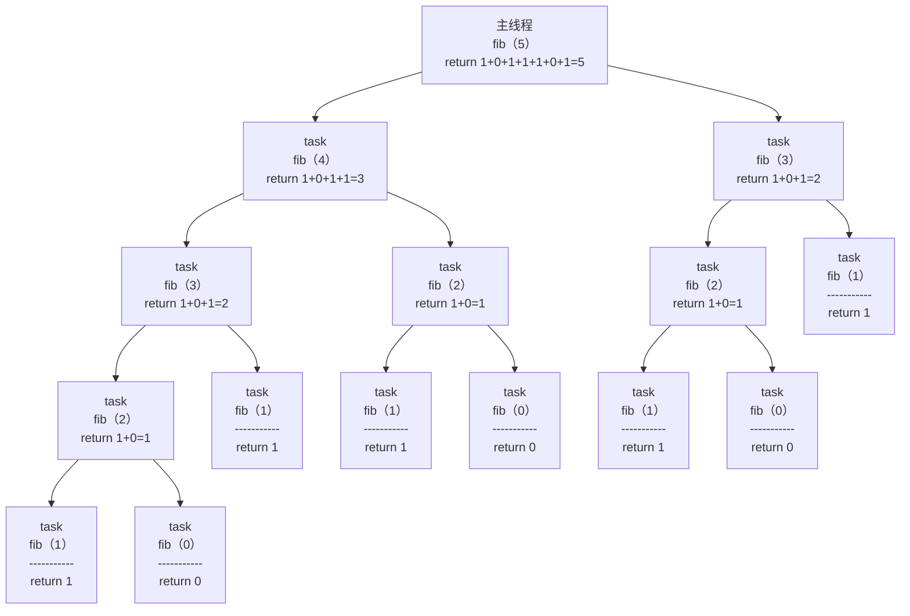

- [openmp_depend.c](https://github.com/NCI900-Training-Organisation/intro-to-OpenMP/blob/main/src/openmp_depend.c)
```c++
#include <omp.h>
#include <stdio.h>
#include <stdlib.h>
#include <string.h>

int write_val(int *var, int value)
{
	*var = value;
}

int read_val(int *var)
{
	return *var;
}

int main ( int argc, char *argv[] )
{
	int x = 10;
	int y = 20;
	int z = 0;

  #pragma omp parallel
  #pragma omp single
  {

		#pragma omp task shared(x) depend(out: x)
		write_val(&x, 10);

		#pragma omp task shared(y) depend(out: y)
		write_val(&y, 10);

		#pragma omp task shared(x, y) depend(in: x, y)
		{
			z = read_val(&x) + read_val(&y);
			printf("Sum = %d \n", z);
		}
	}

	return 0;
}
```
depend(out: x)指令用来在任务执行完后标记变量x为已更新。depend(out: y)指令用来在任务执行完后标记变量y为已更新。depend(in: x, y)指令用来等待变量x，y被更新，当它们都被更新后才开始执行任务。显示任务是由线程池中的空闲任务调度执行的，这里说的线程池是指并行域创建的线程池，由#pragma omp parallel指令创建，线程池中线程的数量取决于接口omp_set_num_threads()、num_threads指令、环境变量OMP_NUM_THREADS、CPU核心数量一起决定（优先级递减）。该程序的运行结果如下所示：
```shell
./openmp_depend 
  Sum = 20 
```
对上面的代码进行修改，修改后的代码如下所示：
```c++
#include <omp.h>
#include <stdio.h>
#include <stdlib.h>
#include <string.h>
#include <unistd.h>

int write_val(int *var, int value)
{
	printf("thread id = %d for write_val\n", omp_get_thread_num());
	*var = value;
	sleep(3);
}

int read_val(int *var)
{
	return *var;
}

int main ( int argc, char *argv[] )
{
	int x = 10;
	int y = 20;
	int z = 0;
	printf("thread id = %d for main\n", omp_get_thread_num());
	sleep(3);

  #pragma omp parallel num_threads(2)
  #pragma omp single
  {

		#pragma omp task shared(x) depend(out: x)
		write_val(&x, 10);

		#pragma omp task shared(y) depend(out: y)
		write_val(&y, 10);

		#pragma omp task shared(x, y) depend(in: x, y)
		{
			printf("thread id = %d for task\n", omp_get_thread_num());
			z = read_val(&x) + read_val(&y);
			printf("Sum = %d \n", z);
			sleep(3);
		}
	}

	printf("thread id = %d for main\n", omp_get_thread_num());
	sleep(3);
	return 0;
}
```
该程序的运行结果如下所示：
```shell
./openmp_depend 
  thread id = 0 for main
  thread id = 1 for write_val
  thread id = 0 for write_val
  thread id = 1 for task
  Sum = 20 
  thread id = 0 for main
while true; do ps -T -p `ps aux | grep openmp | grep -v grep | awk -F " " '{print $2}'`; sleep 1; done
    PID    SPID TTY          TIME CMD
  32892   32892 pts/2    00:00:00 openmp_depend
    PID    SPID TTY          TIME CMD
  32892   32892 pts/2    00:00:00 openmp_depend
  32892   32929 pts/2    00:00:00 openmp_depend
```

#### 2.8.2 SIMD
##### 2.8.2.1 x86平台
x86平台上，通过扩展SIMD(Single Instruction Multiple Data，单指令多数据)指令集来实现并行计算能力的提升：
1. SSE2（Streaming SIMD Extensions 2）
    - 向量宽度：128位，支持双精度浮点和整数运算。
    - 指令规模：144条指令，首次实现64位双精度浮点并行计算。
    - 应用优化：通过缓存控制指令提升多媒体编解码效率（如H.264视频处理）。
    - 兼容性：兼容MMX和早期SSE指令，确保软件平滑过渡。
2. AVX（Advanced Vector Extensions）
    - 向量宽度：256位，单指令处理8个单精度或4个双精度浮点数。
    - 寄存器复用：16个YMM寄存器向下兼容XMM，减少数据搬运开销。
    - 指令改进：引入三操作数指令（如vaddps ymm0, ymm1, ymm2），提升代码密度。
    - FMA（融合乘加）：在AVX2中支持单指令完成乘法和加法，提升计算密度。
1. AVX-512F（AVX-512基础指令集）
    - 向量宽度：512位，单指令处理16个单精度或8个双精度浮点数。
    - 寄存器扩展：32个ZMM寄存器，支持掩码操作和冲突检测（AVX-512CD）。
    - 性能优势：相比AVX2，理论峰值性能翻倍，适用于AI训练（如TensorFlow优化）。
    - 挑战：高功耗和混合架构（如Alder Lake的P核/E核）导致消费级CPU限制其使用。

|特性|SSE2|AVX|AVX-512F|
|---|---|---|---|
|向量宽度|128位|256位|512位|
|寄存器数|8（XMM）|16（YMM）|32（ZMM）|
|峰值加速比|2-4倍（标量对比）|4-8倍（SSE2对比）|8-16倍（AVX对比）
|典型功耗|低|中|高|


##### 2.8.2.2 arm平台
arm平台上，也是通过扩展SIMD(Single Instruction Multiple Data，单指令多数据)指令集来实现并行计算能力的提升：
1. NEON：固定长度的SIMD指令集
   - 固定矢量长度：使用128位寄存器（如float32x4_t），支持分割为不同数据宽度的通道（如4个float32、8个int16）。
   - 应用场景：多媒体处理（图像/音频编解码）、传统机器学习推理等低复杂度并行计算。
2. SVE（Scalable Vector Extension）：可变长度矢量指令集
   - 灵活矢量长度：支持128-2048位（以128位为步长），同一代码可适配不同硬件。
   - 动态执行模式：运行时通过指令获取矢量长度（VL），避免手动配置，提升代码可移植性。
   - 高级功能：支持掩码运算（8个Predicate寄存器）、非对齐内存访问，优化不规则数据操作。
3. SVE2：SVE的功能扩展与增强
   - 功能扩展：新增指令支持计算机视觉、5G信号处理、矩阵运算等场景。
   - 矩阵运算支持：集成矩阵乘加操作（如SME2扩展），为AI推理提供硬件加速。
   - SVE2通过矩阵扩展（SME2）和KleidiAI软件栈，成为ARM在AI推理和通用计算的核心竞争力

|特性|NEON|SVE|SVE2|
|---|---|---|---|
|向量长度|固定128位|可变（128-2048位）|同SVE，支持更多功能|
|指令复杂度|简单，直接编码数据类型|复杂，需动态配置长度和掩码|更复杂，新增矩阵运算指令|
|兼容性|独立指令集|覆盖NEON，复用低128位寄存器|全面覆盖NEON和SVE|
|应用场景|多媒体、轻量级ML|HPC、大规模ML训练|AI、计算机视觉、5G、通用计算|
|代码移植成本|高（固定长度限制扩展）|低（同一代码适配不同硬件）|低（继承SVE特性）|
|硬件案例|主流ARM芯片（如Cortex-A系列）|富士通A64FX（超算富岳）|ARMv9设备（如Cortex-X925）|


[ARM® Development Documentation](https://developer.arm.com/documentation)<br>
[ARM® Neon® Intrinsics](https://developer.arm.com/architectures/instruction-sets/intrinsics/#f:@navigationhierarchiessimdisa=[Neon])<br>
[Intel® Intrinsics Guide](https://www.intel.com/content/www/us/en/docs/intrinsics-guide/index.html)<br>
[SMID加速：AVX512指令集实战](https://www.cnblogs.com/ai168/p/18713383)


## 三、硬件平台

### 3.1 树莓派
1.[树莓派官网](https://www.raspberrypi.com/) 2.[树莓派文档](https://github.com/raspberrypi/documentation/tree/develop/documentation)

树莓派4：

树莓派5：
  - 处理器：BCM2712，四核Cortex-A76核心，频率2.4GHz
  - 内存：2GB、4GB、8GB、16GB LPDDR4-4267 SDRAM 
  - 存储：0GB、16GB、32GB、64GB eMMC FLASH
  - GPU：VideoCore7 GPU，支持OpenGL ES 3.1和Vulkan 1.2
  - NPU：无

#### 3.1.1 树莓派5相关资料
  - [Getting started documentation](https://www.raspberrypi.com/documentation/computers/raspberry-pi.html)
  - [Raspberry Pi 5 product brief](https://datasheets.raspberrypi.com/rpi5/raspberry-pi-5-product-brief.pdf)
  - [Raspberry Pi Compute Module 5 product brief](https://datasheets.raspberrypi.com/cm5/cm5-product-brief.pdf)
  - [Raspberry Pi Compute Module 5 datasheet](https://datasheets.raspberrypi.com/cm5/cm5-datasheet.pdf)
  - [RP1 peripherals documentation](https://datasheets.raspberrypi.com/rp1/rp1-peripherals.pdf)


### 3.2 Rockchip


### 参考文档
1.[RK3568 vs 树莓派4: 嵌入式计算的巅峰之争](https://zhuanlan.zhihu.com/p/637505045)
- RK3568：ARM Cortex-A55架构的四核心CPU(主频最高2.0GHz)+Mali-G52 GPU(800MHz);
- 树莓派4：BCM2711芯片，四核Cortex-A72 CPU(主频1.5GHz)+VideoCore6 GPU(500MHz);

