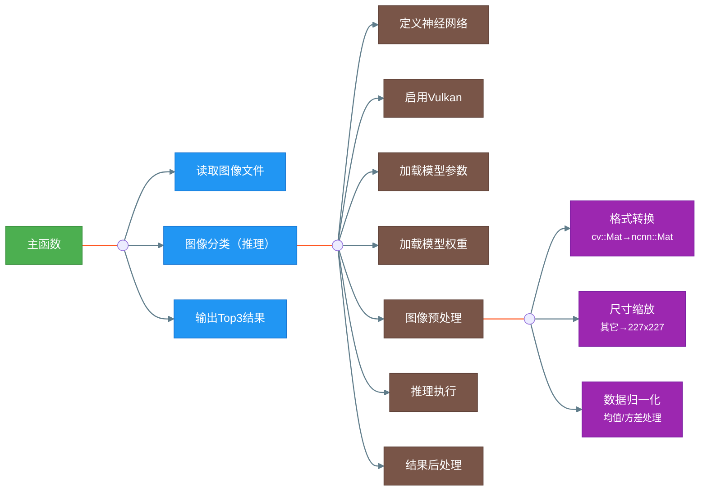
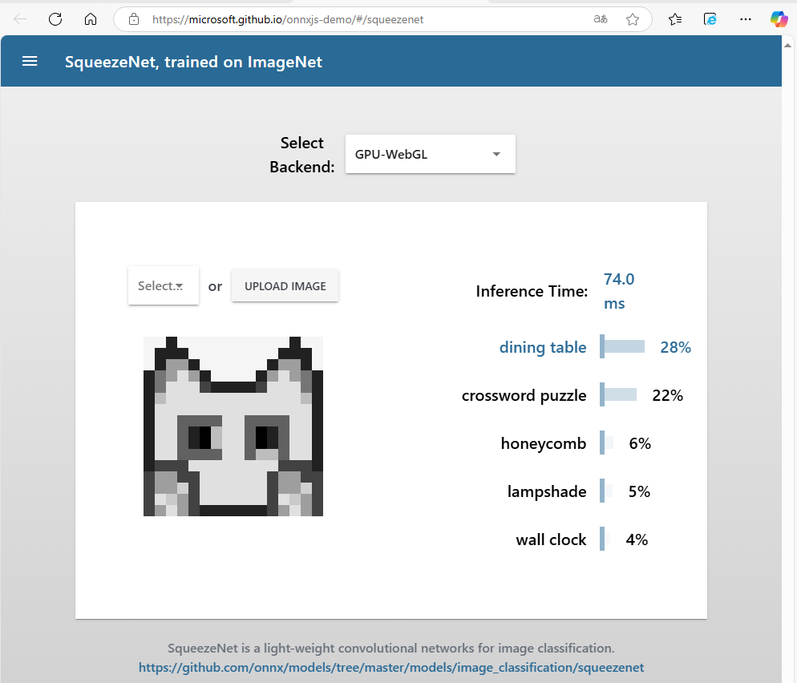

# AI for Raspberry Pi


## 一、ncnn
ncnn是一个为手机端极致优化的高性能神经网络前向计算框架。ncnn从设计之初深刻考虑手机端的部署和使用。无第三方依赖，跨平台，手机端cpu的速度快于目前所有已知的开源框架。基于ncnn，开发者能够将深度学习算法轻松移植到手机端高效执行，开发出人工智能APP，将AI带到你的指尖。

[官方GitHub链接](https://github.com/Tencent/ncnn)

接下来的思路是：先在x86+ubuntu20.04的虚拟机上编译安装ncnn，然后尝试运行其中的几个example，接着分析这几个example的程序源码，了解基于ncnn开发AI应用程序的流程，最后深入学习ncnn的核心源码，梳理其软件架构，尤其是性能优化方面的设计思想。


### 1.1 编译安装
参考文档：[《how to build》](https://github.com/Tencent/ncnn/blob/master/docs/how-to-build/how-to-build.md)

- 克隆源码：
```shell
git clone https://github.com/Tencent/ncnn.git
cd ncnn
git submodule update --init
```

- 安装依赖
```shell
sudo apt install build-essential git cmake libprotobuf-dev protobuf-compiler libomp-dev libopencv-dev
sudo apt install vulkan-utils
```
安装完成后，执行下面的命令来确认编译时能否启用VULKAN（GPU加速），如果有相关的信息输出，则说明可以使能VULKAN，即cmake时加上-DNCNN_VULKAN：
```shell
vulkaninfo        # 确认是否支持VULKAN
vulkaninfo --html # 生成html格式的VULKAN信息，方便查看
```
<font color="red"><b>备注：如无特殊说明，后续的shell命令均在ncnn目录下执行。</b></font>

- 编译安装
```shell
mkdir build
cd build
cmake -DCMAKE_BUILD_TYPE=Release -DNCNN_VULKAN=ON -DNCNN_BUILD_EXAMPLES=ON ..
N=$(grep -c "^processor" /proc/cpuinfo) # 查看系统CPU核数
N=$((N-1)) # 防止机器性能不足，预留一个核心给系统用
make -j${N}
cd ..
```

编译生成的二进制文件位于build目录下不同的子目录中，其中如下几个目录中的文件比较关键：
- src/libncnn.a：静态链接库，用于开发基于ncnn的AI应用程序（没看到动态链接库）；
- examples目录下的二进制：可执行的example程序，用于测试对应的算法模型；
- tools目录下的二进制：用于将各种格式的模型转换ncnn模型、量化工具等，详情如下：
  | 工具 | 功能 | 位置 | 备注 |
  |--|--|--|--|
  |ncnn2mem    |将ncnn模型文件转换为二进制描述文件和内存模型，<br>生成*.param.bin和两个静态数组的代码文件|build/tools|避免模型参数文件明文|
  |ncnnmerge   |
  |ncnnoptimize|
  |caffe2ncnn  |将Caffe模型（\*.prototxt+\*.caffemodel）转换为<br>ncnn模型（\*.param+\*.bin）|build/tools/caffe|只认新版的caffe模型|
  |onnx2ncnn   |将ONNX模型（\*.onnx）转换为ncnn模型<br>（\*.param+\*.bin）|build/tools/onnx|deprecated，后续将不再维护<br>官方推荐使用PNNX|
  |mxnet2ncnn  |
  |darknet2ncnn|
  |ncnn2int8   |
  |ncnn2table  |

为方便执行tools目录下的命令，可以将它们所在的目录添加到PATH环境变量中，进入ncnn目录执行下面命令：
```shell
if [ -d "$(pwd)/build/tools" ]; then
    export PATH=$(pwd)/build/tools:$(pwd)/build/tools/caffe:$(pwd)/build/tools/onnx:$(pwd)/build/tools/mxnet:$(pwd)/build/tools/darknet:$(pwd)/build/quantize:$PATH
fi
```
执行下面命令在~/.bashrc文件尾部添加两行，然后执行source ~/.bashrc命令也可以，而且可以一劳永逸：
```shell
echo "export NCNN_ROOT=$(pwd)
export PATH=$NCNN_ROOT/build/tools:$NCNN_ROOT/build/tools/caffe:$NCNN_ROOT/build/tools/onnx:$NCNN_ROOT/build/tools/mxnet:$NCNN_ROOT/build/tools/darknet:$NCNN_ROOT/build/quantize:$PATH" >> ~/.bashrc
```


### 1.2 运行示例squeezenet
- squeezenet是什么？
  
  SqueezeNet 是一种轻量级卷积神经网络模型，主要用于图像分类任务（1000类，通imagenet），其核心设计目标是通过优化网络结构和压缩技术，在保证精度的前提下大幅减少模型参数和计算量，使其适用于移动端、嵌入式设备等资源受限场景。在 ImageNet数据集上达到与AlexNet相近的准确率（Top-1准确率约57%），但参数量仅为AlexNet的1/50，模型体积缩小510倍（结合Deep Compression压缩技术）。
  [SqueezeNet: AlexNet-level accuracy with 50x fewer parameters and <0.5MB model size](https://arxiv.org/abs/1602.07360)

- 运行squeezenet
```shell
cd examples
../build/examples/squeezenet ../images/256-ncnn.png
  532 = 0.165951
  920 = 0.094098
  716 = 0.062193
cd ..
```
图片../images/256-ncnn.png如下所示，结合下面的1000分类标签，识别出来top1的是"dining table, board"，与[《how to build》](https://github.com/Tencent/ncnn/blob/master/docs/how-to-build/how-to-build.md)中的[Verification](https://github.com/Tencent/ncnn/blob/master/docs/how-to-build/how-to-build.md#verification)给出的一致。

<br>

- 1000分类的标签
  
  - nihui上的[synset_words.txt](https://github.com/nihui/ncnn-android-squeezenet/blob/master/app/src/main/assets/synset_words.txt) 
  - onnx上的[synset.txt](https://github.com/onnx/models/blob/main/validated/vision/classification/synset.txt)
  - ncnn自带的：examples/synset_words.txt
  
  后续的程序中我们使用ncnn自带的examples/synset_words.txt文件。

- 模型参数和权重
  - 模型权重：examples/squeezenet_v1.1.bin
  - 模型参数：examples/squeezenet_v1.1.param


### 1.3 分析squeezenet源码
示例squeezenet的源码：[squeezenet.cpp](https://github.com/Tencent/ncnn/blob/master/examples/squeezenet.cpp)

- 基于ncnn的AI应用squeezenet的流程图


- 核心函数detect_squeezenet源码分析

1. **函数定义**:
   - `static int detect_squeezenet(const cv::Mat& bgr, std::vector<float>& cls_scores)`:
     - 该函数是一个静态函数，它接收一个`cv::Mat`类型的图像数据（BGR格式）作为输入参数，一个`std::vector<float>`类型向量的引用作为输出参数。`cv::Mat`是OpenCV中用于存储图像的类。
     - 该静态函数返回一个整数，用于表示是否成功地执行了图像分类（核心功能：推理），该函数始终返回0，表示成功地执行了图像分类。

2. **定义一个神经网络并初始化**:
   - `ncnn::Net squeezenet;`: 定义一个`ncnn::Net`类对象，即一个（基于ncnn实现）神经网络。
   - `squeezenet.opt.use_vulkan_compute = true;`: 设置神经网络属性以使用Vulkan进行加速计算，这样可以提高在支持Vulkan的设备上的推理性能。

3. **加载模型的参数和权重**:
   - `if (squeezenet.load_param("squeezenet_v1.1.param")) exit(-1);`: 加载模型的参数（文件）。如果加载失败，则退出程序。
   - `if (squeezenet.load_model("squeezenet_v1.1.bin")) exit(-1);`: 加载模型的权重（文件）。如果加载失败，则退出程序。

4. **预处理输入的图像**:
   - `ncnn::Mat in = ncnn::Mat::from_pixels_resize(bgr.data, ncnn::Mat::PIXEL_BGR, bgr.cols, bgr.rows, 227, 227);`:
     - 将输入的`cv::Mat`中的BGR格式的图像数据转换到`ncnn::Mat`中，同时缩放到227x227大小。227x227应该是该SqueezeNet模型要求的输入尺寸。
   - `const float mean_vals[3] = {104.f, 117.f, 123.f};`: 定义用于图像归一化的均值常量。
   - `in.substract_mean_normalize(mean_vals, 0);`: 将in中的图像数据减去均值常量以完成归一化处理，第二个参数为缩放因子，这里设置为0表示不进行缩放。

5. **创建特征提取器并输入数据**:
   - `ncnn::Extractor ex = squeezenet.create_extractor();`: 创建一个基于SqueuezeNet模型的特征提取器对象，它使用SqueuezeNet模型进行推理以从输入的图像数据中提取特征。
   - `ex.input("data", in);`: 将预处理后的图像数据输入给特征提取器，这里的"data"应该是模型的输入（层，blob）的名称。

6. **执行前向传播并获取输出**:
   - `ncnn::Mat out;`: 定义一个`ncnn::Mat`类对象，它用来存储模型推理的输出结果。
   - `ex.extract("prob", out);`：由特征提取器执行模型推理，然后将名为"prob"的层（层，blob）的输出保存到前面定义的out中，即输入图像为对应分类的概率。
      ```python
      def Softmax(x):
        return np.exp(x) / np.sum(np.exp(x), axis=0)
      ```

7. **处理输出**:
   - `cls_scores.resize(out.w);`: 调整向量`cls_scores`的大小以匹配输出结果（即类别数）。
   - 遍历输出（对应分类的概率），并将其复制到向量`cls_scores`中。

8. **返回**:
   - 函数返回0，表示成功执行图像分类。

总结：该函数的代码展示了如何使用ncnn库和SqueezeNet模型对输入的BGR图像进行分类处理。包括了模型的加载、图像的预处理、模型推理、输出后处理，并最终输出结果的系列步骤。


### 1.4 生成ncnn模型参数和权重

- 模型下载

  考虑到[SqueezeNet v1.1 has 2.4x less computation than v1.0, without sacrificing accuracy](https://github.com/forresti/SqueezeNet/tree/master/SqueezeNet_v1.1)，因此这里选择v1.1版本的模型进行测试验证。

  - caffe格式模型：[deploy.prototxt + squeezenet_v1.1.caffemodel](https://github.com/forresti/SqueezeNet)
    ```shell
    cd ..
    git clone https://github.com/forresti/SqueezeNet
    cd ../ncnn
    ```
  
  - onnx格式模型：[squeezenet1.1-7.onnx](https://github.com/onnx/models/tree/main/validated/vision/classification/squeezenet)
    
    或者在浏览器中打开[链接](https://github.com/onnx/models/blob/main/validated/vision/classification/squeezenet/model/squeezenet1.1-7.onnx)手动下载，或者使用wget命令下载：
    ```shell
    export http_proxy="http://127.0.0.1:44291"
    export https_proxy="http://127.0.0.1:44291"
    mkdir -p ../onnx-models
    cd ../onnx-models
    wget https://github.com/onnx/models/raw/refs/heads/main/validated/vision/classification/squeezenet/model/squeezenet1.1-7.onnx
    cd ../ncnn
    ```
  
- 模型转换
  - 转换caffe模型
    ```shell
    cd ../SqueezeNet/SqueezeNet_v1.1
    caffe2ncnn deploy.prototxt squeezenet_v1.1.caffemodel squeezenet_v1.1.param squeezenet_v1.1.bin
    ls -l
      total 9708
      -rw-rw-r-- 1 qy qy    9678 2月  28 23:47 deploy.prototxt
      -rw-rw-r-- 1 qy qy     640 2月  28 23:47 README.md
      -rw-rw-r-- 1 qy qy     781 2月  28 23:47 solver.prototxt
      -rw-rw-r-- 1 qy qy 4942088 2月  28 23:47 squeezenet_v1.1.bin
      -rw-rw-r-- 1 qy qy 4950080 2月  28 23:47 squeezenet_v1.1.caffemodel
      -rw-rw-r-- 1 qy qy    8599 2月  28 23:47 squeezenet_v1.1.param
      -rw-rw-r-- 1 qy qy   11839 2月  28 23:47 train_val.prototxt
    cd ../../ncnn
    ```

  - 验证生成的模型
  
    修改examples/squeezenet.cpp中的模型文件名，重新编译并运行：
    ```shell
    git diff
      diff --git a/examples/squeezenet.cpp b/examples/squeezenet.cpp
      index a026c131..f9fe9dbb 100644
      --- a/examples/squeezenet.cpp
      +++ b/examples/squeezenet.cpp
      @@ -31,9 +31,11 @@ static int detect_squeezenet(const cv::Mat& bgr, std::vector<float>& cls_scores)
          squeezenet.opt.use_vulkan_compute = true;
      
          // the ncnn model https://github.com/nihui/ncnn-assets/tree/master/models
      -    if (squeezenet.load_param("squeezenet_v1.1.param"))
      +    if (squeezenet.load_param("../../SqueezeNet/SqueezeNet_v1.1/squeezenet_v1.1.param"))
              exit(-1);
      -    if (squeezenet.load_model("squeezenet_v1.1.bin"))
      +    if (squeezenet.load_model("../../SqueezeNet/SqueezeNet_v1.1/squeezenet_v1.1.bin"))
              exit(-1);    
    cd build
    make
    cd ..

    cd example
    ../build/examples/squeezenet ../images/256-ncnn.png
      532 = 0.287914
      920 = 0.139554
      716 = 0.080389
    cd ..
    ```
    显然，这里打印输出的结果与1.2章节中打印输出的结果：分类及其顺序是一样的，只是分类相应的概率有所差别，因此可以说命令caffe2ncnn成功地将caffe模型转换成了ncnn模型。


  - 转换onnx模型
    ```shell
    cd ../onnx-models
    onnx2ncnn squeezenet1.1-7.onnx squeezenet1.1-7.param squeezenet1.1-7.bin
      onnx2ncnn may not fully meet your needs. For more accurate and elegant
      conversion results, please use PNNX. PyTorch Neural Network eXchange (PNNX) is
      an open standard for PyTorch model interoperability. PNNX provides an open model
      format for PyTorch. It defines computation graph as well as high level operators
      strictly matches PyTorch. You can obtain pnnx through the following ways:
      1. Install via python
      pip3 install pnnx
      2. Get the executable from https://github.com/pnnx/pnnx
      For more information, please refer to https://github.com/pnnx/pnnx
    pip3 install pnnx
    pnnx squeezenet1.1-7.onnx inputshape=[1,3,224,224]
    ls -l
      total 24252
      -rw-rw-r-- 1 qy qy     657 3月   2 14:24 squeezenet1.1_7_ncnn.py
      -rw-rw-r-- 1 qy qy 2478984 3月   2 14:24 squeezenet1.1_7.ncnn.bin
      -rw-rw-r-- 1 qy qy    4531 3月   2 14:24 squeezenet1.1_7.ncnn.param
      -rw-rw-r-- 1 qy qy 2482609 3月   2 14:24 squeezenet1.1_7.pnnx.onnx
      -rw-rw-r-- 1 qy qy   14891 3月   2 14:24 squeezenet1.1_7_pnnx.py
      -rw-rw-r-- 1 qy qy 4950882 3月   2 14:24 squeezenet1.1_7.pnnx.bin
      -rw-rw-r-- 1 qy qy   12241 3月   2 14:24 squeezenet1.1_7.pnnx.param
      -rw-rw-r-- 1 qy qy 4952956 3月   2 14:24 squeezenet1.1-7.pnnxsim.onnx
      -rw-rw-r-- 1 qy qy 4942088 3月   1 11:14 squeezenet1.1-7.bin
      -rw-rw-r-- 1 qy qy    9382 3月   1 11:14 squeezenet1.1-7.param
      -rw-rw-r-- 1 qy qy 4956208 3月   1 11:05 squeezenet1.1-7.onnx
    cd ../ncnn
    ```

  - 验证生成的模型
  
    注意：前面下载的onnx模型的输入shape为1x3x224x224，这与和caffe模型的1x3x227x227不一致,因此需要修改examples/squeezenet.cpp中的相关代码。此外还需要修改其中的模型文件名，并重新编译并运行：
    ```shell
    git diff
      diff --git a/examples/squeezenet.cpp b/examples/squeezenet.cpp
      index a026c131..3ffc7159 100644
      --- a/examples/squeezenet.cpp
      +++ b/examples/squeezenet.cpp
      @@ -31,12 +31,16 @@ static int detect_squeezenet(const cv::Mat& bgr, std::vector<float>& cls_scores)
          squeezenet.opt.use_vulkan_compute = true;
      
          // the ncnn model https://github.com/nihui/ncnn-assets/tree/master/models
      -    if (squeezenet.load_param("squeezenet_v1.1.param"))
      +    if (squeezenet.load_param("../../onnx-models/squeezenet1.1-7.param"))
              exit(-1);
      -    if (squeezenet.load_model("squeezenet_v1.1.bin"))
      +    if (squeezenet.load_model("../../onnx-models/squeezenet1.1-7.bin"))
              exit(-1);
      
      -    ncnn::Mat in = ncnn::Mat::from_pixels_resize(bgr.data, ncnn::Mat::PIXEL_BGR, bgr.cols, bgr.rows, 227, 227);
      +    ncnn::Mat in = ncnn::Mat::from_pixels_resize(bgr.data, ncnn::Mat::PIXEL_BGR, bgr.cols, bgr.rows, 224, 224);    
    cd build
    make
    cd ..
    cd example
    ../build/examples/squeezenet ../images/256-ncnn.png
      find_blob_index_by_name prob failed
      Try
          ex.extract("squeezenet0_flatten0_reshape0", out0);
      Segmentation fault (core dumped)
    cd ..
    ```
    使用netron查看squeezenet1.1-7.onnx模型，发现输出的名字是`squeezenet0_flatten0_reshape0`而不是`prob`，而且从模型转换时生成的模型参数文件也可以看出（—最后一行）。因此按照上述提示修改代码，并重新编译并运行：
    ```shell
    git diff examples/squeezenet.cpp
      diff --git a/examples/squeezenet.cpp b/examples/squeezenet.cpp
      index a026c131..86d31bf7 100644
      --- a/examples/squeezenet.cpp
      +++ b/examples/squeezenet.cpp
      @@ -31,12 +31,12 @@ static int detect_squeezenet(const cv::Mat& bgr, std::vector<float>& cls_scores)
          squeezenet.opt.use_vulkan_compute = true;
      
          // the ncnn model https://github.com/nihui/ncnn-assets/tree/master/models
      -    if (squeezenet.load_param("squeezenet_v1.1.param"))
      +    if (squeezenet.load_param("../../onnx-models/squeezenet1.1-7.param"))
              exit(-1);
      -    if (squeezenet.load_model("squeezenet_v1.1.bin"))
      +    if (squeezenet.load_model("../../onnx-models/squeezenet1.1-7.bin"))
              exit(-1);
      
      -    ncnn::Mat in = ncnn::Mat::from_pixels_resize(bgr.data, ncnn::Mat::PIXEL_BGR, bgr.cols, bgr.rows, 227, 227);
      +    ncnn::Mat in = ncnn::Mat::from_pixels_resize(bgr.data, ncnn::Mat::PIXEL_BGR, bgr.cols, bgr.rows, 224, 224);
      
          const float mean_vals[3] = {104.f, 117.f, 123.f};
          in.substract_mean_normalize(mean_vals, 0);
      @@ -46,7 +46,7 @@ static int detect_squeezenet(const cv::Mat& bgr, std::vector<float>& cls_scores)
          ex.input("data", in);
      
          ncnn::Mat out;
      -    ex.extract("prob", out);
      +    ex.extract("squeezenet0_flatten0_reshape0", out);
    cd build
    make
    cd ..
    cd examples
    ../build/examples/squeezenet ../images/256-ncnn.png
      599 = 316.265503
      532 = 294.387543
      918 = 285.244476
    cd ..
    ```
    显然，这里打印输出的结果与1.2章节中打印输出的结果差异较大：分类只有一个一样，且输出的并不是概率。使用netron对比caffe模型和onnx模型发现最后一个处理节点不一样：caffe模型为SoftMax，而onnx模型为Reshape。因此这里输出的第二列数值应该为分值而不是概率。至于为什么top3的分类不一样，初步怀疑是模型的训练细节不一致，下面我们先验证onnx模型。


  - 验证onnx模型
    
    阅读[官方文档](https://github.com/onnx/models/blob/main/validated/vision/classification/squeezenet/README.md),先使用其中提到的网页版SqueezeNet 1.0对图片256-ncnn.png进行分类，结果如下图所示：
    
    然后参考[imagenet_preprocess.py](https://github.com/onnx/models/blob/main/validated/vision/classification/imagenet_preprocess.py)中的预处理，编写python程序（exmples/squeezenet.py）对图片256-ncnn.png进行分类：
    ```python
    import onnxruntime as ort
    from   PIL import Image
    import numpy as np

    # 计算概率
    def softmax(x, axis=-1):
        x_max = np.max(x, axis=axis, keepdims=True)
        exp_x = np.exp(x - x_max)
        return exp_x * 100 / np.sum(exp_x, axis=axis, keepdims=True) 

    # 读取标签文件
    def read_labels(label_file="synset_words.txt"):
        labels = []
        with open(label_file, "r") as f:
            for line in f:
                stripped_line = line.strip()
                if stripped_line:
                    label = stripped_line.split(' ', 1)
                    if len(label) > 1:
                        labels.append(label[1])
        return labels

    # 图像预处理
    def preprocess_image(image_path):
        img_image = Image.open(image_path).convert("RGB") # HCW
        img_image = img_image.resize((224, 224), Image.Resampling.BILINEAR)
        mean_vec  = np.array([0.485, 0.456, 0.406]).astype(np.float32)
        norm_vec  = np.array([0.229, 0.224, 0.225]).astype(np.float32)
        img_array = np.array(img_image).astype(np.float32)
        img_array = (img_array / 255.0 - mean_vec) / norm_vec
        img_array = img_array.transpose(2, 0, 1)
        return np.expand_dims(img_array, axis=0) # 添加batch维度

    # 加载模型并进行推理
    def classify_image(image_path, model_path, label_file):
        labels      = read_labels(label_file)
        input_data  = preprocess_image(image_path)
        session     = ort.InferenceSession(model_path)
        input_name  = session.get_inputs ()[0].name
        output_name = session.get_outputs()[0].name
        outputs = session.run([output_name], {input_name: input_data})
        probabilities = softmax(outputs[0][0])
        top5_indices  = np.argsort(probabilities)[::-1][:5]
        return [(i, labels[i], probabilities[i]) for i in top5_indices]

    # 程序入口
    if __name__ == "__main__":
        image_path = "../images/256-ncnn.png"
        model_path = "../../onnx-models/squeezenet1.1-7.onnx"
        label_file = "./synset_words.txt"
        results = classify_image(image_path, model_path, label_file)
        print("Top5 of probabilities：")
        for i, label, prob in results:
            print(f"{i}. {label:30}: {prob:.2f}%")
    ```
    运行该python程序，输出结果如下：
    ```shell
    conda activate py3.8-dl
    cd examples
    python squeezenet.py 
      Top5 of probabilities：
      532. dining table, board           : 24.26%
      918. crossword puzzle, crossword   : 20.17%
      599. honeycomb                     : 10.64%
      646. maze, labyrinth               : 4.07%
      619. lampshade, lamp shade         : 3.03%
    cd ..
    ```
    显然，这里打印输出的结果和网页上分类的结果比较接近，之所以有些差别，是与模型的版本有关。同时也可以看出python脚本中的预处理与squeezenet.cpp中图像的预处理不完全一样，对其进行修改，并重新编译并运行：
    ```shell
    git diff
      diff --git a/examples/squeezenet.cpp b/examples/squeezenet.cpp
      index a026c131..c4415028 100644
      --- a/examples/squeezenet.cpp
      +++ b/examples/squeezenet.cpp
      @@ -31,22 +31,28 @@ static int detect_squeezenet(const cv::Mat& bgr, std::vector<float>& cls_scores)
          squeezenet.opt.use_vulkan_compute = true;
      
          // the ncnn model https://github.com/nihui/ncnn-assets/tree/master/models
      -    if (squeezenet.load_param("squeezenet_v1.1.param"))
      +    if (squeezenet.load_param("../../onnx-models/squeezenet1.1-7.param"))
              exit(-1);
      -    if (squeezenet.load_model("squeezenet_v1.1.bin"))
      +    if (squeezenet.load_model("../../onnx-models/squeezenet1.1-7.bin"))
              exit(-1);
      
      -    ncnn::Mat in = ncnn::Mat::from_pixels_resize(bgr.data, ncnn::Mat::PIXEL_BGR, bgr.cols, bgr.rows, 227, 227);
      +    ncnn::Mat in = ncnn::Mat::from_pixels_resize(bgr.data, ncnn::Mat::PIXEL_BGR2RGB, bgr.cols, bgr.rows, 224, 224);
      
      -    const float mean_vals[3] = {104.f, 117.f, 123.f};
      -    in.substract_mean_normalize(mean_vals, 0);
      +    const float mean_vals[3] = {0.485 * 255.0, 0.456 * 255.0, 0.406 * 255.0};
      +    const float norm_vals[3] = {0.229 * 255.0, 0.224 * 255.0, 0.225 * 255.0};
      +    in.substract_mean_normalize(mean_vals, norm_vals);
      
          ncnn::Extractor ex = squeezenet.create_extractor();
      
          ex.input("data", in);
      
          ncnn::Mat out;
      -    ex.extract("prob", out);
      +    ex.extract("squeezenet0_flatten0_reshape0", out);
    cd build
    make
    cd ..
    cd examples
    ../build/examples/squeezenet ../images/256-ncnn.png
      918 = 18125.111328
      599 = 17349.384766
      646 = 15991.737305
    cd ..
    ```
    显然和python程序打印输出的结果只是比较接近，而不完全一致的。
    |图片|c/c++程序|python程序|备注|
    |---|---|---|---|
    ||918<br>599<br>646|532<br>918<br>599<br>646<br>619|
    ||94<br>92<br>16|94<br>92<br>95<br>12<br>14|
    ||780<br>914<br>484|914<br>780<br>484<br>871<br>724|
    ||947<br>985<br>340|947<br>992<br>985<br>996<br>840|
