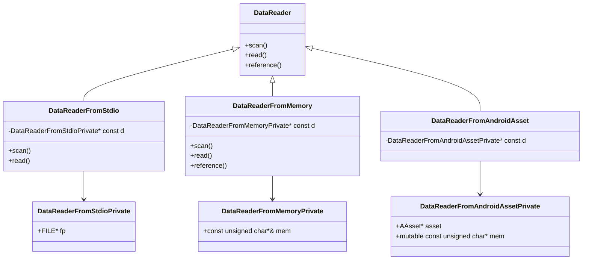
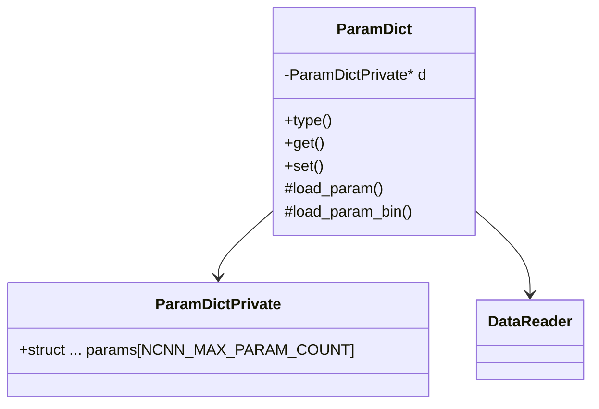
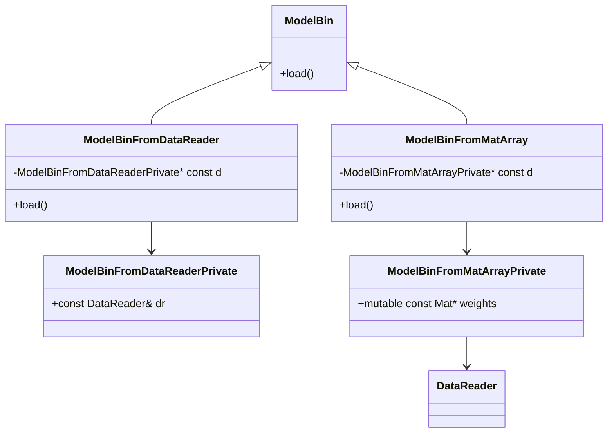
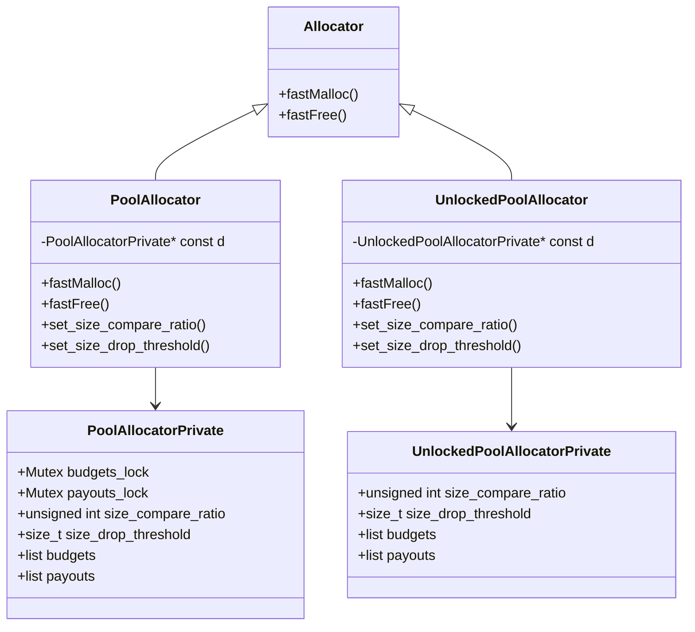

# nccn源码分析

## 1. 基础源码

### 1.1 DataReader & DataReaderFromStdio & DataReaderFromMemory
类DataReader是一个基类，它主要定义了三个virtual接口：scan、read、reference，主要用来从某个数据源读取/获取指定格式或指定长度的数据，并且简单实现了这三个接口——都直接返回0，这样可以创建类DataReader的实例/对象。

类DataReaderFromStdio是类DataReader的一个派生类，它指定文件句柄fp作为数据源，并据此实现了接口scan、read，其中接口scan调用fscanf函数实现，接口read调用fread函数实现。另外，文件句柄fp由上层维护。

类DataReaderFromMemory是类DataReader的一个派生类，它指定一块内存作为数据源，并据此实现了接口scan、read、reference，其中接口scan调用sscanf函数实现，该函数中%n是一个特殊的格式说明符，用于记录到当前位置为止已成功读取的字符数。接口read直接使用memcpy从内存中拷贝数据，而接口reference则是直接返回内存指针，无内存拷贝操作。

类DataReaderFromAndroidAsset也是类DataReader的一个派生类，具体细节待分析。


### 1.2 ParamDict
类ParamDict是个工具类，用来存放其他模块的参数，以方便和统一其他模块加载参数。类ParamDict中预分配了32个参数的存储空间，它们一起组成了一个数组，每个参数在数组中的索引即为该参数的ID。参数支持如下8种类型的参数。其中null类型实际上未用上，当一个参数的类型为null时，表明该参数未设置值。
```c++
// 0 = null
// 1 = int/float
// 2 = int
// 3 = float
// 4 = array of int/float
// 5 = array of int
// 6 = array of float
// 7 = string
```
接口type用来获取指定参数的类型；接口set用来设置指定ID的参数的类型和值；接口get用来获取指定ID的参数的值，如果为未设置参数，则返回默认值。<font color=red>感觉这里有个问题，就是接口get中，未对参数类型进行判断，如果参数设置的类型与接口get中的类型不一致，则获取的参数值可能就有问题。</font>

目前支持通过前述的类DataReaderFromStdio和类DataReaderFromMemory中加载参数。


### 1.3 ModelBin & ModelBinFromDataReader & ModelBinFromMatArray
类ModelBin是一个基类，它主要定义了四个virtual load接口，分别用来加载不同维度的Mat数据。其中后三个接口都是基于第一个接口实现了，因此派生类只需要重新实现第一个接口即可。第一个接口直接返回一个空的Mat，这样可以创建类DataReader的实例/对象。

类ModelBinFromDataReader是类ModelBin的一个派生类，它指定一个DataReader实例作为数据源，既可以是DataReaderFromStdio实例，也可以是DataReaderFromMemory实例，通过它们按照约定的格式从文件或内存中读取权重数据。

类ModelBinFromMatArray也是类ModelBin的一个派生类，它指定一个Mat数组作为数据源。每次调用其load接口加载权重数据时，都是直接返回Mat数组中的一个Mat。<font color=red>感觉这个实现有点不安全，没有考虑到数组的越界访问等，使用的时候需要保证其安全。</font>


### 1.4 Allocator & PoolAllocator & UnlockedPoolAllocator
默认分配器是由下面两个函数组成：ncnn::fastMalloc和ncnn::fastFree，它们是基于实时库中的malloc和free实现的——增加了对齐的处理。类Allocator是一个基类，它主要定义了两个纯virtual接口：fastMalloc和fastFree，分别用来分配内存和释放内存。

类PoolAllocator是类Allocator的一个派生类，它在底层调用ncnn::fastMalloc和ncnn::fastFree来分配内存和释放内存。它主要实现了一个内存池，其接口fastMalloc先查看空闲列表budgets中是否有满足尺寸要求的内存块，如果有则直接用它，同时将其从空闲列表中移出并将其放入使用中列表payouts中，如果没有则调用ncnn::fastMalloc分配新的内存块，并将其放入使用中列表payouts中，同时为了避免内存不断增长，在内存块数量超过指定阈值时释放掉特定的内存块。

类UnlockedPoolAllocator是类Allocator的一个派生类。它和PollAllocator基本一致，唯一的差别是：类PollAllocator中的操作是在加锁的情况下进行的，而类UnlockedPollAllocator中的操作是在没加锁的情况下进行的，后者需要使用者保证其安全性。


### 1.5 Option
类Option是个工具类，它为类Net（神经网络的抽象）定义了运行参数。注意是运行参数而不是模型参数（模型参数是用来描述神经网络的结构——即由哪些算子组成以及如何组成、以及各个算子的参数），运行参数则是指基于神经网络的推理过程中使用到的一些基础性的、策略性的全局配置参数。类Net中定义了一个名为opt的Option成员，用户在使用类Net推理之前甚至加载模型参数和权重之前，要先设置其opt成员，如果不设置那就是使用其默认值。
|参数名|类型|默认值|说明|
|---|---|---|---|
|lightmode|bool|true|是否启用轻量模式。<br>轻量模式下，某个算子在执行完后立即释放它刚刚消费的Mat|
|num_threads|int|实际CPU核心数|算子在使用OpenMP进行优化时的最大并发线程数|
|use_local_pool_allocator|bool|true|如果blob_allocator和/或workspace_allocator未设置，是否使用PoolAllocator作为分配器|
|blob_allocator|Allocator*|0|used to allocate memory for all named blobs, which you could retrieve by Extractor::extract()<br>用于分配算子之间交换数据的Mat的分配器|
|workspace_allocator|Allocator*|0|used to allocate memory for internal temporary use in layer implementation, such as the temp blob after padding in convolution<br>算子内部实现时分配临时使用的Mat的分配器|

## 2. 算子源码

## 3. 文档阅读

### 3.1 [FAQ](https://github.com/Tencent/ncnn/blob/master/docs/faq.md)


### 3.2 [custom allocator](https://github.com/Tencent/ncnn/blob/master/docs/developer-guide/custom-allocator.md)
如果运行参数Option中blob_allocator和/或workspace_allocator未设置：如果use_local_pool_allocator设置为true，则使用PoolAllocator作为分配器，如果use_local_pool_allocator设置为false，则使用fastMalloc、fastFree作为分配器。如果运行参数中blob_allocator和/或workspace_allocator设置了，则直接使用设置的分配器。

如前所述，ncnn实现了两个Allocator：加锁的PoolAllocator和不加锁的UnlockedPoolAllocator。那么如何合理恰当地使用它们呢？遵循下面规则即可，这是因为一个Extractor是在一个线程中按顺序地执行算子的，但是算子本身则可能会多线程并发执行的：
- 如果AI应用中集成了一个模型，并且一次只进行一次推理，则所有的Extrator共享一个不加锁的UnlockedPoolAllocator作为blob_allocator，共享一个加锁的PoolAllocator作为workspace_allocator。
- 如果AI应用中集成了一个模型，并进行并发推理，则每个线程内的Extrator共享一个不加锁的UnlockedPoolAllocator作为blob_allocator，所有线程的Extrator共享一个加锁的PoolAllocator作为workspace_allocator。
- 如果AI应用中集成了多个模型，并且一次只进行一次推理，则每个网络的的Extrator共享一个不加锁的UnlockedPoolAllocator作为blob_allocator，所有网络的Extrator共享一个加锁的PoolAllocator作为workspace_allocator。
- 如果AI应用中集成了多个模型，并进行并发推理，则每个网络在每个线程内的Extrator共享一个不加锁的UnlockedPoolAllocator作为blob_allocator，所有网络所有线程的Extrator共享一个加锁的PoolAllocator作为workspace_allocator。

### 3.2 