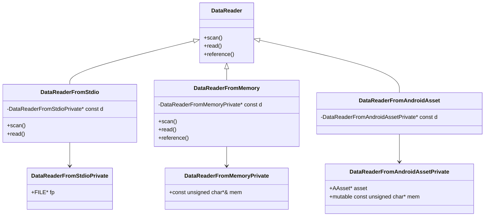
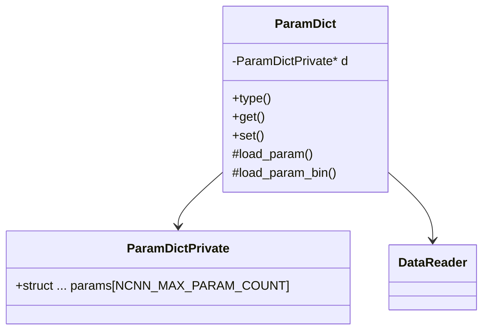
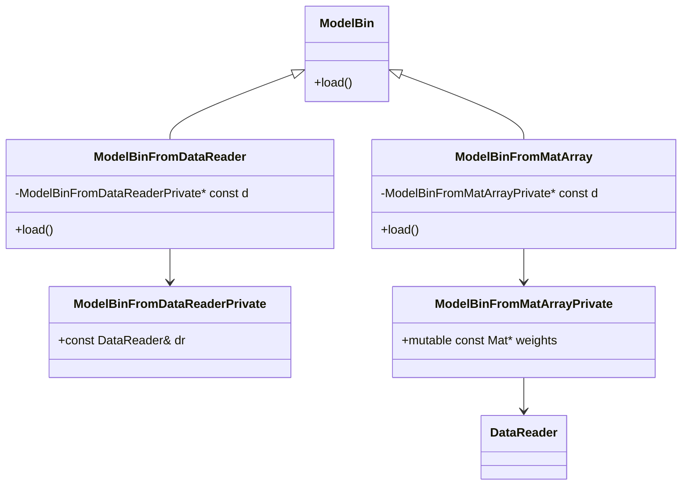
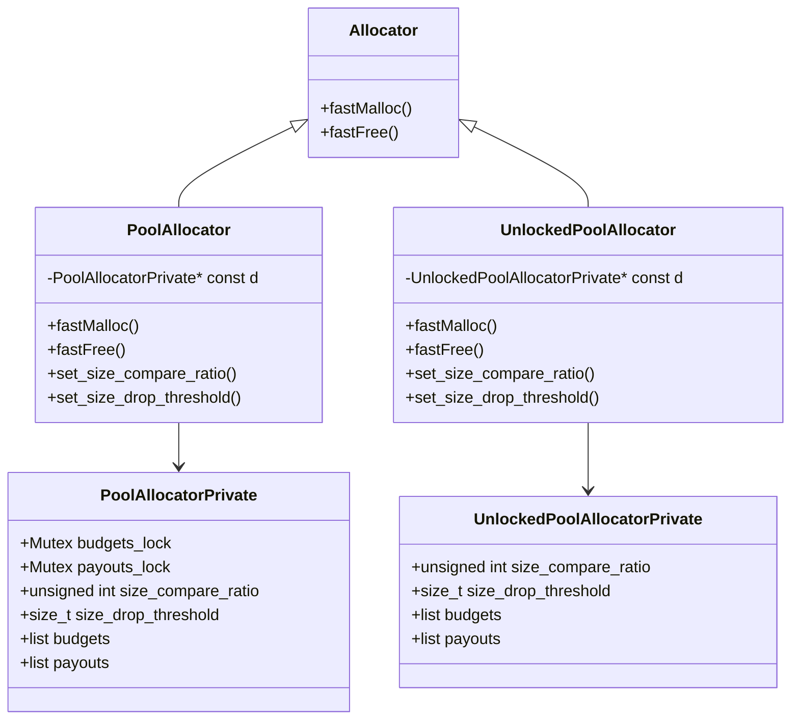
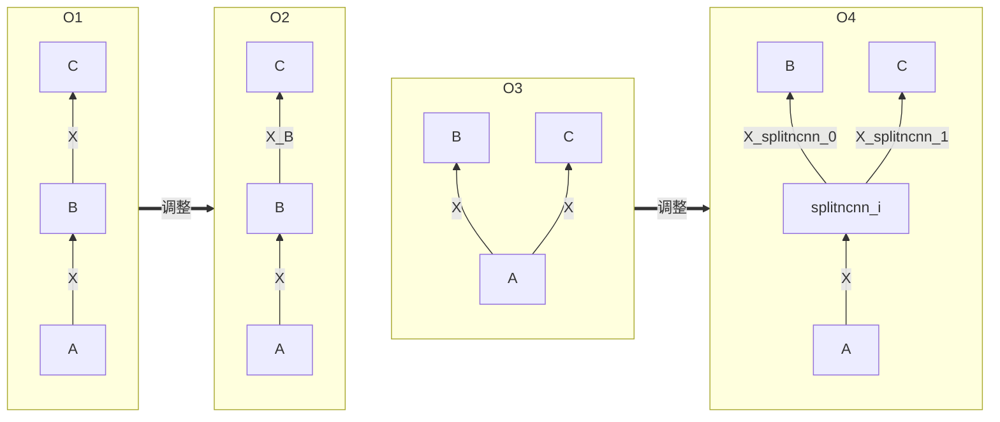
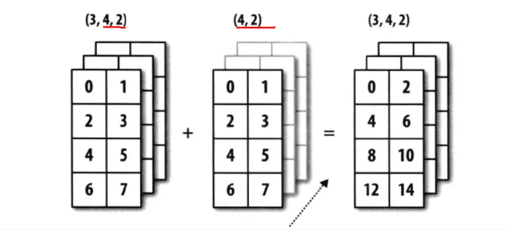

# nccn源码分析

## 1. 基础源码

### 1.1 DataReader & DataReaderFromStdio & DataReaderFromMemory
类DataReader是一个基类，它主要定义了三个virtual接口：scan、read、reference，主要用来从某个数据源读取/获取指定格式或指定长度的数据，并且简单实现了这三个接口——都直接返回0，这样可以创建类DataReader的实例/对象。

类DataReaderFromStdio是类DataReader的一个派生类，它指定文件句柄fp作为数据源，并据此实现了接口scan、read，其中接口scan调用fscanf函数实现，接口read调用fread函数实现。另外，文件句柄fp由上层维护。

类DataReaderFromMemory是类DataReader的一个派生类，它指定一块内存作为数据源，并据此实现了接口scan、read、reference，其中接口scan调用sscanf函数实现，该函数中%n是一个特殊的格式说明符，用于记录到当前位置为止已成功读取的字符数。接口read直接使用memcpy从内存中拷贝数据，而接口reference则是直接返回内存指针，无内存拷贝操作。

类DataReaderFromAndroidAsset也是类DataReader的一个派生类，具体细节待分析。

```mermaid
classDiagram
    DataReader:+scan()
    DataReader:+read()
    DataReader:+reference()
    DataReaderFromStdio:+scan()
    DataReaderFromStdio:+read()
    DataReaderFromStdio:-DataReaderFromStdioPrivate* const d
    DataReaderFromStdioPrivate:+FILE* fp
    DataReaderFromStdio-->DataReaderFromStdioPrivate
    DataReaderFromMemory:+scan()
    DataReaderFromMemory:+read()
    DataReaderFromMemory:+reference()
    DataReaderFromMemory:-DataReaderFromMemoryPrivate* const d
    DataReaderFromMemoryPrivate:+const unsigned char*& mem
    DataReaderFromMemory-->DataReaderFromMemoryPrivate
    DataReaderFromAndroidAsset:-DataReaderFromAndroidAssetPrivate* const d
    DataReaderFromAndroidAssetPrivate:+AAsset* asset
    DataReaderFromAndroidAssetPrivate:+mutable const unsigned char* mem
    DataReaderFromAndroidAsset-->DataReaderFromAndroidAssetPrivate
    DataReader <|-- DataReaderFromStdio
    DataReader <|-- DataReaderFromMemory
    DataReader <|-- DataReaderFromAndroidAsset
```

### 1.2 ParamDict
类ParamDict是个工具类，用来存放其他模块的参数，以方便和统一其他模块加载参数。类ParamDict中预分配了32个参数的存储空间，它们一起组成了一个数组，每个参数在数组中的索引即为该参数的ID。参数支持如下8种类型的参数。其中null类型实际上未用上，当一个参数的类型为null时，表明该参数未设置值。
```c++
// 0 = null
// 1 = int/float
// 2 = int
// 3 = float
// 4 = array of int/float
// 5 = array of int
// 6 = array of float
// 7 = string
```
接口type用来获取指定参数的类型；接口set用来设置指定ID的参数的类型和值；接口get用来获取指定ID的参数的值，如果为未设置参数，则返回默认值。<font color=red>感觉这里有个问题，就是接口get中，未对参数类型进行判断，如果参数设置的类型与接口get中的类型不一致，则获取的参数值可能就有问题。</font>

目前支持通过前述的类DataReaderFromStdio和类DataReaderFromMemory中加载参数。

```mermaid
classDiagram
    ParamDict:+type()
    ParamDict:+get()
    ParamDict:+set()
    ParamDict:#load_param()
    ParamDict:#load_param_bin()
    ParamDict:-ParamDictPrivate* d
    ParamDictPrivate
    ParamDictPrivate:+struct ... params[NCNN_MAX_PARAM_COUNT]
    ParamDict-->ParamDictPrivate
    ParamDict-->DataReader
```

### 1.3 ModelBin & ModelBinFromDataReader & ModelBinFromMatArray
类ModelBin是一个基类，它主要定义了四个virtual load接口，分别用来加载不同维度的Mat数据。其中后三个接口都是基于第一个接口实现了，因此派生类只需要重新实现第一个接口即可。第一个接口直接返回一个空的Mat，这样可以创建类DataReader的实例/对象。

类ModelBinFromDataReader是类ModelBin的一个派生类，它指定一个DataReader实例作为数据源，既可以是DataReaderFromStdio实例，也可以是DataReaderFromMemory实例，通过它们按照约定的格式从文件或内存中读取权重数据。

类ModelBinFromMatArray也是类ModelBin的一个派生类，它指定一个Mat数组作为数据源。每次调用其load接口加载权重数据时，都是直接返回Mat数组中的一个Mat。<font color=red>感觉这个实现有点不安全，没有考虑到数组的越界访问等，使用的时候需要保证其安全。</font>

```mermaid
classDiagram
    ModelBin:+load()
    ModelBinFromDataReader:+load()
    ModelBinFromDataReader:-ModelBinFromDataReaderPrivate* const d
    ModelBinFromDataReaderPrivate:+const DataReader& dr
    ModelBinFromMatArray:+load()
    ModelBinFromMatArray:-ModelBinFromMatArrayPrivate* const d
    ModelBinFromMatArrayPrivate:+mutable const Mat* weights
    ModelBinFromDataReader --> ModelBinFromDataReaderPrivate
    ModelBinFromMatArray --> ModelBinFromMatArrayPrivate
    ModelBinFromMatArrayPrivate --> DataReader
    ModelBin <|-- ModelBinFromDataReader
    ModelBin <|-- ModelBinFromMatArray
```

### 1.4 Allocator & PoolAllocator & UnlockedPoolAllocator
默认分配器是由下面两个函数组成：ncnn::fastMalloc和ncnn::fastFree，它们是基于实时库中的malloc和free实现的——增加了对齐的处理。类Allocator是一个基类，它主要定义了两个纯virtual接口：fastMalloc和fastFree，分别用来分配内存和释放内存。

类PoolAllocator是类Allocator的一个派生类，它在底层调用ncnn::fastMalloc和ncnn::fastFree来分配内存和释放内存。它主要实现了一个内存池，其接口fastMalloc先查看空闲列表budgets中是否有满足尺寸要求的内存块，如果有则直接用它，同时将其从空闲列表中移出并将其放入使用中列表payouts中，如果没有则调用ncnn::fastMalloc分配新的内存块，并将其放入使用中列表payouts中，同时为了避免内存不断增长，在内存块数量超过指定阈值时释放掉特定的内存块。

类UnlockedPoolAllocator是类Allocator的一个派生类。它和PollAllocator基本一致，唯一的差别是：类PollAllocator中的操作是在加锁的情况下进行的，而类UnlockedPollAllocator中的操作是在没加锁的情况下进行的，后者需要使用者保证其安全性。

```mermaid
classDiagram
    Allocator:+fastMalloc()
    Allocator:+fastFree()
    PoolAllocator:+fastMalloc()
    PoolAllocator:+fastFree()
    PoolAllocator:+set_size_compare_ratio()
    PoolAllocator:+set_size_drop_threshold()
    PoolAllocator:-PoolAllocatorPrivate* const d
    PoolAllocatorPrivate:+Mutex budgets_lock
    PoolAllocatorPrivate:+Mutex payouts_lock
    PoolAllocatorPrivate:+unsigned int size_compare_ratio
    PoolAllocatorPrivate:+size_t size_drop_threshold
    PoolAllocatorPrivate:+list budgets
    PoolAllocatorPrivate:+list payouts
    UnlockedPoolAllocator:+fastMalloc()
    UnlockedPoolAllocator:+fastFree()
    UnlockedPoolAllocator:+set_size_compare_ratio()
    UnlockedPoolAllocator:+set_size_drop_threshold()
    UnlockedPoolAllocator:-UnlockedPoolAllocatorPrivate* const d
    UnlockedPoolAllocatorPrivate:+unsigned int size_compare_ratio
    UnlockedPoolAllocatorPrivate:+size_t size_drop_threshold
    UnlockedPoolAllocatorPrivate:+list budgets
    UnlockedPoolAllocatorPrivate:+list payouts
    Allocator <|-- PoolAllocator
    Allocator <|-- UnlockedPoolAllocator
    PoolAllocator --> PoolAllocatorPrivate
    UnlockedPoolAllocator --> UnlockedPoolAllocatorPrivate
```

### 1.5 Option
类Option是个工具类，它为类Net（神经网络的抽象）定义了运行参数。注意是运行参数而不是模型参数（模型参数是用来描述神经网络的结构——即由哪些算子组成以及如何组成、以及各个算子的参数），运行参数则是指基于神经网络的推理过程中使用到的一些基础性的、策略性的全局配置参数。类Net中定义了一个名为opt的Option成员，用户在使用类Net推理之前甚至加载模型参数和权重之前，要先设置其opt成员，如果不设置那就是使用其默认值。
|参数名|类型|默认值|说明|
|---|---|---|---|
|lightmode|bool|true|是否启用轻量模式。<br>轻量模式下，某个算子在执行完后立即释放它刚刚消费的Mat|
|num_threads|int|实际CPU核心数|算子在使用OpenMP进行优化时的最大并发线程数|
|use_local_pool_allocator|bool|true|如果blob_allocator和/或workspace_allocator未设置，是否使用PoolAllocator作为分配器|
|blob_allocator|Allocator*|0|used to allocate memory for all named blobs, which you could retrieve by Extractor::extract()<br>用于分配算子之间交换数据的Mat的分配器|
|workspace_allocator|Allocator*|0|used to allocate memory for internal temporary use in layer implementation, such as the temp blob after padding in convolution<br>算子内部实现时分配临时使用的Mat的分配器|


## 2. 算子源码


## 3. 工具源码


### 3.1 [caffe2ncnn](https://github.com/Tencent/ncnn/tree/master/tools/caffe)
该工具用法：caffe2ncnn [caffeproto] [caffemodel] [ncnnparam] [ncnnbin]。在分析其实现源码之前，我们需要先了解一下文件[caffe.proto](https://github.com/Tencent/ncnn/blob/master/tools/caffe/caffe.proto)中的内容。caffe.proto文件定义了.prototxt和.caffemodel文件的格式，其中定义了一个名为NetParameter的结构，包含了optional string类型的name项和repeated LayerParameter类型的layer项，name为模型的名字，layer便是模型中的层。.prototxt文件是文本格式的配置文件，用于描述神经网络的结构，包括层类型、连接方式、参数配置等，而.caffemodel文件时二进制格式的权重文件，用于存放神经网络的权重（weights）和偏置（biases），它们都遵循caffe.proto文件定义的格式。

源码中定义了两个函数分别用来解析.prototxt文件和.caffemodel文件：read_proto_from_text()、read_proto_from_binary()——将它们解析成caffe.proto文件中定义的NetParameter对象。随后遍历每一个layer以及它们的输入（bottom）输出（top），以统计layer的数量以及blob的数量。统计的过程中有两点需要注意：1）如果某个算子的某个输出与两个算子相连，则要插入一个Split算子，插入的Split算子以及其输出blob要统计进去；2）如果某个算子只有一个输入和一个输出且它们同名，则需要修改其输出的名字。

```mermaid
graph LR
    subgraph O1
        direction BT
        A1[A] -->|X| B1[B] -->|X| C1[C]
    end
    subgraph O2
        direction BT
        A2[A] -->|X| B2[B] -->|X_B| C2[C]
    end
    subgraph O3
        direction BT
        A3[A] -->|X| B31[B]
        A3    -->|X| B32[C]
    end
    subgraph O4
        direction BT
        A4[A] -->|X| B4[splitncnn_i]
        B4    -->|X_splitncnn_0| B41[B]
        B4    -->|X_splitncnn_1| B42[C]
    end
    O1 ==>|调整| O2
    O3 ==>|调整| O4
    O2 ~~~ O3
```
此外，caffe模型和ncnn模型中算子的名称不完全一样，它们之间的对应关系如下表所示：
|caffe模型中的算子|ncnn模型中的算子|备注|
|---|---|---|
|BN|Scale|
|Convolution|
|ConvolutionDepthwise|
|DepthwiseConvolution|
|Deconvolution|
|MemoryData|Input|
|Python:ProposalLayer|Proposal|
|Python:其它|同名|
|ReLU6|Clip|ReLU6是一种改进的激活函数，其公式为ReLU6(x)=min(max(0,x),6)，通过限制其输出的最大值为6来增强模型在特定场景下的性能，其在移动端模型和量化部署中展现了独特的优势。Clip增加了最大值和最小值两个参数。|
|Silence|Noop|Silence算子实现简单，在复杂的网络调试、日志管理以及模型优化中具有重要作用。其核心价值在于控制数据流的可见性与梯度的传播，适用于需要精细化网络管理的场景。Noop为空算子，其forward接口直接返回0。|
|其它|其它|


## 4. 文档阅读

### 4.1 [FAQ](https://github.com/Tencent/ncnn/blob/master/docs/faq.md)


### 4.2 [custom allocator](https://github.com/Tencent/ncnn/blob/master/docs/developer-guide/custom-allocator.md)
如果运行参数Option中blob_allocator和/或workspace_allocator未设置：如果use_local_pool_allocator设置为true，则使用PoolAllocator作为分配器，如果use_local_pool_allocator设置为false，则使用fastMalloc、fastFree作为分配器。如果运行参数中blob_allocator和/或workspace_allocator设置了，则直接使用设置的分配器。

如前所述，ncnn实现了两个Allocator：加锁的PoolAllocator和不加锁的UnlockedPoolAllocator。那么如何合理恰当地使用它们呢？遵循下面规则即可，这是因为一个Extractor是在一个线程中按顺序地执行算子的，但是算子本身则可能会多线程并发执行的：
- 如果AI应用中集成了一个模型，并且一次只进行一次推理，则所有的Extrator共享一个不加锁的UnlockedPoolAllocator作为blob_allocator，共享一个加锁的PoolAllocator作为workspace_allocator。
- 如果AI应用中集成了一个模型，并进行并发推理，则每个线程内的Extrator共享一个不加锁的UnlockedPoolAllocator作为blob_allocator，所有线程的Extrator共享一个加锁的PoolAllocator作为workspace_allocator。
- 如果AI应用中集成了多个模型，并且一次只进行一次推理，则每个网络的的Extrator共享一个不加锁的UnlockedPoolAllocator作为blob_allocator，所有网络的Extrator共享一个加锁的PoolAllocator作为workspace_allocator。
- 如果AI应用中集成了多个模型，并进行并发推理，则每个网络在每个线程内的Extrator共享一个不加锁的UnlockedPoolAllocator作为blob_allocator，所有网络所有线程的Extrator共享一个加锁的PoolAllocator作为workspace_allocator。

### 4.3 [how to implement custom layer step by step](https://github.com/Tencent/ncnn/blob/master/docs/developer-guide/how-to-implement-custom-layer-step-by-step.md)、[add custom layer](https://github.com/Tencent/ncnn/blob/master/docs/developer-guide/add-custom-layer.zh.md)
ncnn支持用户自定义算子。用户需要自定义算子的情况有：1）原始模型中有ncnn中没有的算子；2）原始模型中的算子ncnn中都有，但某个算子需要针对性地修改（譬如优化），而且又不想影响系统中其它的AI应用；3）因某种原因需要修改原始模型——在原始模型的某个环节增加处理，而该处理ncnn中没有算子与其对应。

AI应用中，加载模型参数时会根据模型的架构顺序地实例化其中的算子，在此之前我们需要将自定义的算子添加到算子注册表中。ncnn中除了全局算子注册表外，类Net中还定义了两个临时算子注册表：custom_layer_registry和overwrite_builtin_layer_registry，其中前者优先级最低，后者优先级最高。在创建算子的实例时，ncnn会先去优先级高的算子注册表中查看该算子是否注册到其中，如果注册到了则使用注册的creator创建该算子的实例，如果没有注册到则继续搜索优先级低的算子注册表。

那用户自定义的算子，到底是注册到全局算子注册表中呢，还是注册到类Net中的临时算子注册表中呢？这个取决于自定义算子的性质：通用性高且常用的算子建议注册到全局算子注册表中，而某个模型专用的或某个项目定制的算子，则建议注册到临时算子注册表中。注册到全局算子注册表中的流程和注册到临时算子注册表中的流程略有不一样：前者需要修改cmake文件，后者需要调用类Net的接口手工注册。

自定义算子实现好并注册到算子注册表中后，可能还需要修改模型转换工具，以能够将算子的参数和权重写入到模型的参数文件（.param）和权重文件（.bin）中。但某些情形下可以通过下面方法避免：针对自定义算子情形1），必须修改模型转换工具，否则转换模型时会报错。针对自定义算子情形2）和情形3），可以先转模型以及实现自定义算子，然后将其注册到临时算子注册表中，再手动修改模型参数文件将自定义算子加进去，并在算子参数中增加独立的权重文件，这样在加载完原模型权重文件中的权重数据后，再加载独立权重文件中的权重数据。

### 4.4 [binaryop broadcasting](https://github.com/Tencent/ncnn/blob/master/docs/developer-guide/binaryop-broadcasting.md)
下左图中，arr1的shape为(3,4,2)，arr2的shape为(4,2)，它们的后缘轴长度都为(4,2)，所以可以在0轴进行广播，也就是arr2在0轴上复制三份，这样arr2的shape就变为(3,4,2)，然后就可以和arr1进行计算了。




不只是0轴可以广播，1轴和2轴也可以进行广播，但形状必须满足一定的条件。举个例子来说，上右图中，arr1的shape为(8,5,3)，要想在0轴上进行广播，arr2的shape必须是(1,5,3)或者(5,3)，要想在1轴上进行广播，arr2的shape必须是(8,1,3)，要想在2轴上进行广播，arr2的shape必须是(8,5,1)。

ncnn中，源码文件[binaryop.h](https://github.com/Tencent/ncnn/blob/master/src/layer/binaryop.h)、[binaryop.cpp](https://github.com/Tencent/ncnn/blob/master/src/layer/binaryop.cpp)中实现了两个重载，一个是矩阵与矩阵的二元运算，一个是矩阵与标量的二元运算，都涉及到广播。

- 无广播
    |A|B|C|
    |---------|---------------------------------------|---------|
    |[2]|[2]|[2]|
    |[2,3]|[2,3]|[2,3]|
    |[2,3,4]|[2,3,4]|[2,3,4]|
    |[2,3,4,5]|[2,3,4,5]|[2,3,4,5]|
    |---------|---------------------------------------|---------|
- 标量与标量类广播
    |A|B|C|
    |---------|---------------------------------------|---------|
    |[2]|scalar / [1]|[2]|
    |[2,3]|scalar / [1] / [1,1]|[2,3]|
    |[2,3,4]|scalar / [1] / [1,1] / [1,1,1]|[2,3,4]|
    |[2,3,4,5]|scalar / [1] / [1,1] / [1,1,1] / [1,1,1,1]|[2,3,4,5]|
    |---------|---------------------------------------|---------|
- 显示广播
    |A|B|C|
    |---------|---------------------------------------|---------|
    |[2,3]|[1,3]|[2,3]|
    |[2,3]|[2,1]|[2,3]|
    |[2,3,4]|[1,3,4]|[2,3,4]|
    |[2,3,4]|[2,1,4]|[2,3,4]|
    |[2,3,4]|[2,3,1]|[2,3,4]|
    |[2,3,4]|[1,1,4]|[2,3,4]|
    |[2,3,4]|[1,3,1]|[2,3,4]|
    |[2,3,4]|[2,1,1]|[2,3,4]|
    |[2,3,4,5]|[1,3,4,5]|[2,3,4,5]|
    |[2,3,4,5]|[2,1,4,5]|[2,3,4,5]|
    |[2,3,4,5]|[2,3,1,5]|[2,3,4,5]|
    |[2,3,4,5]|[2,3,4,1]|[2,3,4,5]|
    |[2,3,4,5]|[1,1,4,5]|[2,3,4,5]|
    |[2,3,4,5]|[1,3,1,5]|[2,3,4,5]|
    |[2,3,4,5]|[1,3,4,1]|[2,3,4,5]|
    |[2,3,4,5]|[2,1,1,5]|[2,3,4,5]|
    |[2,3,4,5]|[2,1,4,1]|[2,3,4,5]|
    |[2,3,4,5]|[2,3,1,1]|[2,3,4,5]|
    |[2,3,4,5]|[1,1,1,5]|[2,3,4,5]|
    |[2,3,4,5]|[1,1,4,1]|[2,3,4,5]|
    |[2,3,4,5]|[1,3,1,1]|[2,3,4,5]|
    |[2,3,4,5]|[2,1,1,1]|[2,3,4,5]|
    |---------|---------------------------------------|---------|
- 隐式广播（）
    |A|B|C|
    |---------|---------------------------------------|---------|
    |[2,3]|[3]->[1,3]->[2,3]|[2,3]|
    |[2,3,4]|[4]->[1,1,4]->[2,3,4]|[2,3,4]|
    |[2,3,4]|[3,4]->[1,3,4]->[2,3,4]|[2,3,4]|
    |[2,3,4,5]|[5]->[1,1,1,5]->[2,3,4,5]|[2,3,4,5]|
    |[2,3,4,5]|[4,5]->[1,1,4,5]->[2,3,4,5]|[2,3,4,5]|
    |[2,3,4,5]|[3,4,5]->[1,3,4,5]->[2,3,4,5]|[2,3,4,5]|
    |---------|---------------------------------------|---------|
- 隐式广播（） 
    |A|B|C|
    |---------|---------------------------------------|---------|
    |[2,3]|[2]->[2,1]->[2,3]|[2,3]|
    |[2,3,4]|[2]->[2,1,1]->[2,3,4]|[2,3,4]|
    |[2,3,4,5]|[2]->[2,1,1,1]->[2,3,4,5]|[2,3,4,5]|
    |---------|---------------------------------------|---------|

参考文章：[ncnn op解读之binaryop](https://www.jianshu.com/p/632e615f1861)

### 4.5 [what is packing and why](https://github.com/Tencent/ncnn/blob/master/docs/developer-guide/element-packing.md)
所谓的打包（packing）就是将几个尺寸小的数据类型打包成一个尺寸大的数据类型。下表中elemsize表示该数据类型的字节数，elempack表示该数据类型打包了几个子类型数据，elemtype为尺寸大的数据类型，datatype为尺寸小的数据类型：
|elemtype|elemsize|elempack|datatype|
|---|---|---|---|
|double|8|1|double|
|float|4|1|float|
|int|4|1|int|
|short|2|1|short|
|signed char|1|1|signed char|
|float64x2_t|16|2|float64|
|float32x4_t|16|4|float32|
|int32x4_t|16|4|int32|
|float16x4_t|8|4|float16|
|int8x8_t|8|8|int8|

ncnn中，不同维数的Mat要按照c->h->w从高到低的优先级进行该维度上的数据打包操作，如下所示：
|维数|打包的维度|打包前的shape|打包后的shape|
|---|---|---|---|
|1|w|w|w/elempack|
|2|h|w, h|w, h/elempack|
|3|c|w, h, c|w, h, c/elempack|

ncnn中，实现了一个名为Packing的算子（源码位置：[packing.h](https://github.com/Tencent/ncnn/blob/master/src/layer/packing.cpp)、[packing.cpp](https://github.com/Tencent/ncnn/blob/master/src/layer/packing.cpp)），并将其封装成了一个通用的接口convert_packing，该接口定义如下：
```c++
void convert_packing(const Mat& src, Mat& dst, int elempack, const Option& opt = Option());
```
接口convert_packing的实现也可以作为一个应用层如何调用算子的示例：
```c++
 void convert_packing(const Mat& src, Mat& dst, int elempack, const Option& opt) {
    Layer* packing = create_layer(LayerType::Packing);
    ParamDict pd;
    pd.set(0, elempack);
    packing->load_param(pd);
    packing->create_pipeline(opt);
    packing->forward(src, dst, opt);
    packing->destroy_pipeline(opt);
    delete packing;
}
```

### 4.5 []()
