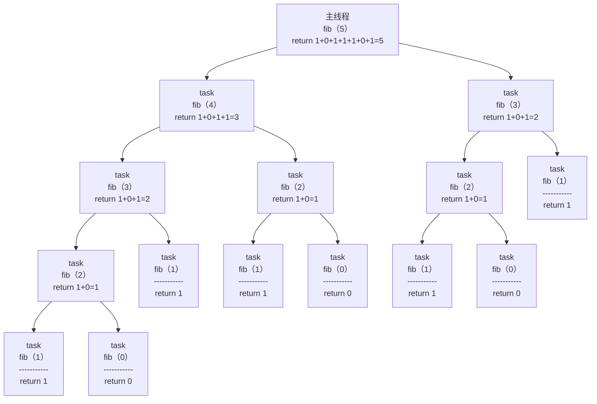

# OpenMP
[OpenMP(Open Multi-Processing)](https://www.openmp.org/specifications/)是由OpenMP Architecture Review Board牵头提出的、并已经被广泛接受的、用于共享内存并行系统的、多处理器程序设计的一套指导性编译处理方案。OpenMP支持的编程语言包括C、C++和Fortran，而支持OpenMP的编译器包括Sun Compiler，GNU Compiler和Intel Compiler等。OpenMP提供了对并行算法的高层抽象，程序员通过在源代码中加入专用的pragma来表述自己的意图，据此编译器可以自动将程序进行并行化，并在必要之处加入同步、互斥以及通信。当选择忽略这些pragma（不加-fopenmp），或者编译器不支持OpenMP时，程序可退化为通常的程序(串行运行)，代码仍然可以正常运行，只是不能利用多线程来并行加速而已。

参考资料：<br>
[《Parallel Programming with OpenMP》](https://github.com/NCI900-Training-Organisation/intro-to-OpenMP)<br>
[《OpenMP并行编程（一）》](./openmp/OpenMP并行编程（一）.pdf)<br>
[《OpenMP并行编程（二）》](./openmp/OpenMP并行编程（二）.pdf)<br>
[《OpenMP并行编程（三）》](./openmp/OpenMP并行编程（三）.pdf)<br>
[《An Overview of OpenMP》](./openmp/An%20Overview%20of%20OpenMP.pdf)<br>
[《OpenMP Examples V6.0》](./openmp/OpenMP%20Examples%20V6.0.pdf)<br>
[《OpenMP Reference Guide V6.0》](./openmp/OpenMP%20RefGuide%20V6.0.pdf)


## 1. OpenMP在ncnn中的应用
ncnn源码中使用到了下面的omp指令，通过它们提升了ncnn框架的推理性能：
- <b>#pragma omp parallel sections<br>
  #pragma omp section</b>

  非迭代任务的并行执行，即使用#pragma omp section将#pragma omp parallel sections后面的代码块划分为多个独立section，并为每个section启动一个独立的线程来执行它，并根据需要选择（是否加nowait）是否在#pragma omp parallel sections代码块后面进行同步。譬如下面的代码，它会启动两个线程，一个线程执行代码块1，另一个线程执行代码块2，并在代码块3执行前进行同步直到它们都执行完：
  ```c++
  #pragma omp parallel sections
  {
      #pragma omp section
      {
          代码块1
      }
      #pragma omp section
      {
          代码块2
      }
  }
  代码块3
  ```

- <b>#pragma omp parallel for num_threads(N)<br>
  #pragma omp parallel for</b>

  迭代任务的并行执行，即将for循环拆分成N个子任务，并为每个子任务启动一个独立的线程来执行它。譬如下面的代码，会将for循环拆分成4个子任务：0~[n/4]、[n/4]+1~[n/4]*2、[n/4]*2+1~[n/4]*3、[n/4]*3+1~n，并启动4个独立的线程来分别执行它们：
  ```c++
  #pragma omp parallel for num_threads(4)
  for(int i = 0; i < n; i++) {
    循环内核
  }
  ```
  上面的代码等效于下面的代码：
  ```c++
  omp_set_num_threads(4);
  #pragma omp parallel for
  for(int i = 0; i < n; i++) {
    循环内核
  }
  ```
  如果没有通过num_threads指令显示地指定要启动的线程数，则由环境变量OMP_NUM_THREADS的值来决定要启动的线程数。如果该环境变量未设置，则由CPU内核的数量来决定要启动的线程数。可以使用接口omp_get_num_procs()获取CPU内核的数量。

- <b>#pragma omp parallel for collapse(M)</b>

  将M层嵌套循环合并为单层循环，从而形成一个迭代次数多的循环，从而增加并行化的粒度。譬如下面的代码，两层嵌套循环会合并成单层循环，从而使得迭代次数达到2*100=200，随后可以统一地将这200次迭代分配给指定数量的线程：
  ```c++
  #pragma omp parallel for collapse(2) 
  for (int i = 0; i < 2; i++) {
    for (int j = 0; j < 100; j++) {
      循环内核
    }
  }
  ```
  如果没有使用collapse指令，则迭代次数仅为2，这样最多只需要启动两个线程来执行两次迭代（一个线程执行一次迭代）。这样一来，对于CPU内核数高于2的平台，就不能充分挖掘出CPU的性能。

- #pragma omp parallel for schedule(static, M)

  静态调度策略，即将循环迭代按指定大小（chunk_size=M）依次分配给4个线程，即迭代0~M-1分配给线程0、迭代M~M\*2-1分配给线程1、迭代M\*2~M\*3-1分配给线程2、迭代M\*3~M\*4-1分配给线程3、迭代M\*4~M\*5-1分配给线程0、……，直到所有的迭代被分配完为止。
  ```c++
  #pragma omp parallel for num_threads(4) schedule(static, 2)
  for (int i = 0; i < 100; i++) {
    循环内核
  }
  ```
  |线程|迭代序号|
  |----|-------|
  |线程0|0、1、 8、 9、16、17、24、25、32、33、40、41、……
  |线程1|2、3、10、11、18、19、26、27、34、35、42、43、……
  |线程2|4、5、12、13、20、21、28、29、36、37、44、45、……
  |线程3|6、7、14、15、22、23、30、31、38、39、46、47、……

  除静态调度策略外，还支持动态调度策略（dynamic）——即先到先得的动态分配方式，线程执行完当前块后立即请求新块，直到所有的块被执行完为止；指导性调度策略（guided）——即初始分配较大的迭代块，后续块大小按指数级递减，直至减到chunk_size（默认为1）。

- <b>#pragma omp critical</b>

  临界区定义指令，其作用是确保同一时刻最多只有一个线程在执行该区域内的代码，从而避免多线程并发访问共享资源时可能引发的数据竞争，从而达到保护共享变量或资源的访问，确保多线程环境下对共享数据的操作具备原子性和一致性的目的。譬如下面的代码，多个线程中某一时刻只有一个线程能够操作变量max，从而确保结果的正确性：
  ```c++
  int max = -1;
  #pragma omp parallel for
  for(int i = 0; i < 100; i++) {
    循环内核
    #pragma omp critical
    {
      操作变量max
    }
  }
  ```

- <b>#pragma omp barrier</b>

  线程同步指令，其核心功能是强制所有线程在某个指定的执行点相互等待，直到所有线程都到达该同步点后，各线程才继续执行。譬如下面的代码，所有线程在执行完代码块1后需要等待其它线程执行完代码块1，当所有的线程都执行完代码块1后，才开始执行代码块2：
  ```c++
  #pragma omp parallel 
  {
    代码块1
    #pragma omp barrier
    代码块2
  }
  ```


## 2.OpenMP的其它特性
接下来除了看openmp目录下的PDF文档来提升对OpenMP的理解外，还可以通过分析和实践[《Parallel Programming with OpenMP》](https://github.com/NCI900-Training-Organisation/intro-to-OpenMP)中的源码来体会OpenMP的特性。
```shell
sudo apt-get install libpapi-dev papi-tools
git clone https://github.com/NCI900-Training-Organisation/intro-to-OpenMP
cd intro-to-OpenMP
make
cd src
```

- [openmp_parallel_region.c](https://github.com/NCI900-Training-Organisation/intro-to-OpenMP/blob/main/src/openmp_parallel_region.c)
```c++
#include <omp.h>
#include <stdio.h>

int main(void) 
{
  printf("Total number of threads allocated in the serial section %d \n", omp_get_num_threads() );
  #pragma omp parallel
  {
    printf("This is run by thread %d, Total threads in the parallel section %d\n", omp_get_thread_num(), omp_get_num_threads());
  }
  
  return 0;
}
```
接口omp_get_num_threads()用于获取当前串行域或并行域中线程的个数，接口omp_get_thread_num()用于获取当前线程的ID，#pragma omp parallel指令创建了一个并行域，其线程数由环境变量OMP_NUM_THREADS的值来决定要启动的线程数。如果该环境变量未设置，则由CPU内核的数量来决定要启动的线程数。该程序的运行结果如下所示：
```shell
./openmp_parallel_region 
  Total number of threads allocated in the serial section 1 
  This is run by thread 2, Total threads in the parallel section 4
  This is run by thread 1, Total threads in the parallel section 4
  This is run by thread 3, Total threads in the parallel section 4
  This is run by thread 0, Total threads in the parallel section 4
```
对该程序略作修改，修改后的代码如下所示：
```c++
#include <omp.h>
#include <stdio.h>
#include <unistd.h>

int main(void) 
{
  printf("This is run by thread %d, Total threads in the serial section %d \n", omp_get_thread_num(), omp_get_num_threads() );
  sleep(15);

  #pragma omp parallel
  {
    printf("This is run by thread %d, Total threads in the parallel section %d\n", omp_get_thread_num(), omp_get_num_threads());
    sleep(15);
  }
  
  return 0;
}
```
该程序的运行结果如下所示：
```shell
./openmp_parallel_region &
  This is run by thread 0, Total threads in the serial section 1 
  This is run by thread 2, Total threads in the parallel section 4
  This is run by thread 1, Total threads in the parallel section 4
  This is run by thread 0, Total threads in the parallel section 4
  This is run by thread 3, Total threads in the parallel section 4
while true; do ps -T -p `ps aux | grep openmp | grep -v grep | awk -F " " '{print $2}'`; sleep 1; done
    PID    SPID TTY          TIME CMD
  18853   18853 pts/2    00:00:00 openmp_parallel
    PID    SPID TTY          TIME CMD
  18853   18853 pts/2    00:00:00 openmp_parallel
  18853   18972 pts/2    00:00:00 openmp_parallel
  18853   18973 pts/2    00:00:00 openmp_parallel
  18853   18974 pts/2    00:00:00 openmp_parallel
```
可见串行域的线程（主线程）被并行域复用了！

- [openmp_parallel_for.c](https://github.com/NCI900-Training-Organisation/intro-to-OpenMP/blob/main/src/openmp_parallel_for.c)
```c++
#include <omp.h>
#include <stdio.h>

int main() 
{
  int i = 0;
  omp_set_num_threads(4);

  printf("Total number of threads allocated in the serial section %d \n", omp_get_num_threads() );
  #pragma omp parallel 
  {
    #pragma omp for
    for(i = 0; i < omp_get_num_threads(); i++) {
      printf("This is run by thread %d, Total threads in the parallel section %d\n", omp_get_thread_num(), omp_get_num_threads());
    }
  }
  
  return 0;
}
```
接口omp_set_num_threads()指定了后面并行区域的最大线程数量，#pragma omp for指令后面循环迭代的次数决定了最终会启动几个线程，如果循环迭代的次数小于线程最大数量，那么启动的线程数就等于循环迭代的次数。该程序的运行结果如下所示：
```shell
./openmp_parallel_for 
  Total number of threads allocated in the serial section 1 
  This is run by thread 0, Total threads in the parallel section 4
  This is run by thread 3, Total threads in the parallel section 4
  This is run by thread 1, Total threads in the parallel section 4
  This is run by thread 2, Total threads in the parallel section 4
```
对该程序略作修改(将#pragma omp parallel和#pragma omp for合并为#pragma omp parallel for，以减少线程组创建开销)，修改后的代码如下所示：
```c++
#include <omp.h>
#include <stdio.h>

int main() 
{
  int i = 0;
  omp_set_num_threads(4);

  printf("Total number of threads allocated in the serial section %d \n", omp_get_num_threads() );
  #pragma omp parallel for
  for(i = 0; i < 2; i++) {
    printf("This is run by thread %d, Total threads in the parallel section %d\n", omp_get_thread_num(), omp_get_num_threads());
  }
  
  return 0;
}
```
该程序的运行结果如下所示：
```shell
./openmp_parallel_for 
  Total number of threads allocated in the serial section 1 
  This is run by thread 1, Total threads in the parallel section 4
  This is run by thread 0, Total threads in the parallel section 4
```

- [openmp_reduction.c](https://github.com/NCI900-Training-Organisation/intro-to-OpenMP/blob/main/src/openmp_reduction.c)
```c++
#include <omp.h>
#include <stdio.h>

int main(void) {
  int tnumber;
  int i = 10, j = 10, k = 10;

  printf("Before parallel region: i=%i, j=%i, k=%i\n", i, j, k);

  #pragma omp parallel default(none) private(tnumber) reduction(+:i) \
    reduction(*:j) reduction(^:k)
  {
    tnumber = omp_get_thread_num() + 1;
    i = tnumber;
    j = tnumber;
    k = tnumber;
    printf("Thread %i: i=%i, j=%i, k=%i\n", tnumber, i, j, k);
  }

  printf("After parallel region: i=%d, j=%d, k=%d\n", i, j, k);
  return 0;
}
```
default(none)指令表明所有变量必须显示地指定是私有变量还是共享变量。private(tnumber)显示地指定了变量tnumber为私有变量，且没有初始值。reduction(+:i)：隐式地指定了变量i为私有变量，且初始化为0，并在并行结束后对它执行求和操作。reduction(*:j)、reduction(^:k)类似，只是分别初始化为1、0执行就求积、求异或操作。该程序的运行结果如下所示：
```shell
./openmp_reduction 
  Before parallel region: i=10, j=10, k=10
  Thread 4: i=4, j=4, k=4
  Thread 2: i=2, j=2, k=2
  Thread 3: i=3, j=3, k=3
  Thread 1: i=1, j=1, k=1
  After parallel region: i=20, j=240, k=14
```
手工计算：i=10+4+2+3+1=20，j=10\*4\*2\*3\*1=240，k=10^4^2^3^1=(1010)^(0100)^(0010)^(0011)^(0001)=(1110)=14，式子中的10为它们的初始值，可见程序输出结果是正确的。
|运算符|变量初始值|适用数据类型|功能|
|----|---|---|---|
| +  | 0 |整数、浮点数|求和|
| -  | 0 |整数、浮点数|求差|
| *  | 1 |整数、浮点数|求积|
| &  |全1位|整数|按位与|
|\|  | 0 |整数|按位或|
| ^  | 0 |整数|按位异或|
|\|\|| 0 |整数|逻辑或|
| && | 1 |整数|逻辑与|
| max|最小可能值|整数、浮点数|求最大值|
| min|最大可能值|整数、浮点数|求最小值|

- [openmp_max_threads.c](https://github.com/NCI900-Training-Organisation/intro-to-OpenMP/blob/main/src/openmp_max_threads.c)
```c++
#include <omp.h>
#include <stdio.h>

int main(int argc, char* argv[]) {
  int np, t_id, num_threads, max_threads;

  if (argc != 2) {
    printf(" %s Number_of_threads \n", argv[0]);
    return -1;
  } else {
    np = atoi(argv[1]);
    if (np < 1) {
      printf("Error: Number_of_threads (%i) < 1 \n", np);
      return -1;
    }
  }

  omp_set_num_threads(np);
  max_threads = omp_get_max_threads();
  omp_set_num_threads(max_threads/2);
  num_threads = omp_get_num_threads();

  printf("Before Parallel: num_threads=%i max_threads %i\n", num_threads,
         max_threads);
  #pragma omp parallel default(none) private(num_threads, t_id)
  {
    num_threads = omp_get_num_threads();
    t_id = omp_get_thread_num();
    printf("In Parallel: num_threads=%i t_id=%i \n", num_threads, t_id);
  }
  num_threads = omp_get_num_threads();
  printf("After Parallel: num_threads=%i \n", num_threads);

  return 0;
}
```
接口omp_set_num_threads()用于设置后续并行区域中最大线程数量，该接口只能在串行区域调用。接口omp_get_max_threads()用于获取在不使用num_threads指令时后续并行区域中最大线程数量，该值由接口omp_set_num_threads()、环境变量OMP_NUM_THREADS、CPU核心数量一起决定（优先级递减）。
```shell
./openmp_max_threads 8
  Before Parallel: num_threads=1 max_threads 8
  In Parallel: num_threads=4 t_id=3 
  In Parallel: num_threads=4 t_id=0 
  In Parallel: num_threads=4 t_id=1 
  In Parallel: num_threads=4 t_id=2 
  After Parallel: num_threads=1 
./openmp_max_threads 4
  Before Parallel: num_threads=1 max_threads 4
  In Parallel: num_threads=2 t_id=1 
  In Parallel: num_threads=2 t_id=0 
  After Parallel: num_threads=1 
./openmp_max_threads 2
  Before Parallel: num_threads=1 max_threads 2
  In Parallel: num_threads=1 t_id=0 
  After Parallel: num_threads=1 
```

- [openmp_datasharing.c](https://github.com/NCI900-Training-Organisation/intro-to-OpenMP/blob/main/src/openmp_datasharing.c)
```c++
#include <omp.h>
#include <stdlib.h>
#include <stdio.h>
 
int main()
{
    omp_set_num_threads(30);
    int i, x=10;
    printf("******* private Clause ******* \n \n");
    printf("Value of x before parallel section:  %d\n", x);

    #pragma omp parallel for private(x)
    for(i=0; i < 5; i++) {
        int x_initial = x;
        x = i;
        printf("Thread number %d: initial Value of x %d New value of x: %d\n",omp_get_thread_num(), x_initial, x);
    }

    printf("\n******* firstprivate Clause ******* \n \n");
    printf("Value of x after parallel section:  %d\n", x);

    #pragma omp parallel for firstprivate(x)
    for(i=0; i < 5; i++) {
        int x_initial = x;
        x = i;
        printf("Thread number %d: initial Value of x %d New value of x: %d\n",omp_get_thread_num(), x_initial, x);
    }

    printf("\n******* lastprivate Clause ******* \n \n");
  printf("Value of x after parallel section:  %d\n", x);

    #pragma omp parallel for lastprivate(x)
    for(i=0 ; i < 5 ;i++) {
        int x_initial = x;
        x = i + 10;
        printf("Thread number %d: initial Value of x %d New value of x: %d\n",omp_get_thread_num(), x_initial, x);
    }

    printf("\nValue if x after parallel section:  %d\n", x);
}
```
```shell
./openmp_datasharing 
  ******* private Clause ******* 
  
  Value of x before parallel section:  10
  Thread number 3: initial Value of x 0 New value of x: 3
  Thread number 0: initial Value of x 0 New value of x: 0
  Thread number 1: initial Value of x 0 New value of x: 1
  Thread number 4: initial Value of x 0 New value of x: 4
  Thread number 2: initial Value of x 0 New value of x: 2

  ******* firstprivate Clause ******* 
  
  Value of x after parallel section:  10
  Thread number 1: initial Value of x 10 New value of x: 1
  Thread number 2: initial Value of x 10 New value of x: 2
  Thread number 0: initial Value of x 10 New value of x: 0
  Thread number 3: initial Value of x 10 New value of x: 3
  Thread number 4: initial Value of x 10 New value of x: 4

  ******* lastprivate Clause ******* 
  
  Value of x after parallel section:  10
  Thread number 4: initial Value of x -1081522048 New value of x: 14
  Thread number 2: initial Value of x -1081522048 New value of x: 12
  Thread number 3: initial Value of x -1081522048 New value of x: 13
  Thread number 1: initial Value of x -1081522048 New value of x: 11
  Thread number 0: initial Value of x 0 New value of x: 10

  Value if x after parallel section:  14
```
private(x)显示地指定了变量x为私有变量，且没有初始值。firstprivate(x)显示地指定了变量x为私有变量，其初始值为主线程变量x的值。lastprivate(x)显示地指定了变量x为私有变量，且没有初始值，并将最后一次迭代时x的值赋给主线程变量x。

|子句|初始化行为|主线程变量更新|线程私有变量初始值|
|---|---|---|---|
|private(x)     |不初始化，值为未定义|不影响主线程的x|垃圾值（可能为0，但不可靠）|
|firstprivate(x)|初始化为主线程的x   |不影响主线程的x|主线程的x值（如 10）|
|lastprivate(x) |不初始化，值为未定义|更新为主线程的x|垃圾值（如随机数）|

- [openmp_schedule.c](https://github.com/NCI900-Training-Organisation/intro-to-OpenMP/blob/main/src/openmp_schedule.c)
```c++
#include <omp.h>
#include <stdio.h>
#include <string.h>
#include <unistd.h>

int main(void) 
{
  int i = 0;
  int N = 4;

  omp_set_num_threads(N);

  int count[N];

  memset(count, 0, sizeof(int) * N);
  printf("**** Static Schedule **** \n \n" );
  
  #pragma omp parallel for schedule(static, 2)
  for( i  = 0; i < 13; i++) {

    #pragma atomic
    count[omp_get_thread_num()]++;
    sleep(1);
  }

  for(i = 0; i < N ; i++) {
    printf("Loop indexes handled by thread %d = %d \n", i, count[i]);
  }

  memset(count, 0, sizeof(int) * N);
  printf("**** Dynamic Schedule **** \n \n" );
  
  #pragma omp parallel for schedule(dynamic, 2)
  for( i  = 0; i < 13; i++) {

    #pragma atomic
    count[omp_get_thread_num()]++;
    sleep(1);
  }

  for(i = 0; i < N ; i++) {
    printf("Loop indexes handled by thread %d = %d \n", i, count[i]);
  }

  return 0;
}
```
schedule(static, 2)指定了静态调度的任务分配策略，迭代空间（0~12）按块大小2划分，依次连续地分配给线程。总块数为 ceil(13/2)=7，线程按轮询顺序（0→1→2→3→0→1→2）分配块。schedule(dynamic, 2)指定了动态调度的任务分配策略，线程按需动态请求块，块分配顺序不确定，但每个块大小仍为2（最后一个块可能为1）。#pragma atomic指令确保了计数器count的访问安全。
```shell
./openmp_schedule 
  **** Static Schedule **** 
  Loop indexes handled by thread 0 = 4 
  Loop indexes handled by thread 1 = 4 
  Loop indexes handled by thread 2 = 3 
  Loop indexes handled by thread 3 = 2 
  **** Dynamic Schedule **** 
  Loop indexes handled by thread 0 = 4 
  Loop indexes handled by thread 1 = 2 
  Loop indexes handled by thread 2 = 3 
  Loop indexes handled by thread 3 = 4 
```
静态调度适合负载均衡场景（如均匀计算任务），可尝试不同块大小（如 schedule(static, 3)）。动态调度适合负载不均衡任务，可结合guided调度（块大小逐渐减小）。
|调度类型|分配方式|适用场景|性能特点|
|---|---|---|---|
|static	|固定块轮询分配|负载均衡任务（如均匀循环）|低开销，可预测性高|
|dynamic|动态地按需分配|负载不均衡任务（如递归算法）|灵活性高，调度开销稍大|

- [openmp_single.c](https://github.com/NCI900-Training-Organisation/intro-to-OpenMP/blob/main/src/openmp_single.c)
```c++
#include <omp.h>
#include <stdio.h>
#include <string.h>
#include <stdlib.h>
#include <time.h>

int main(void) 
{
  int i = 0, N = 8;
  omp_set_num_threads(N);

  int *a;
  int *b;
  int *c;

  #pragma omp parallel
  {
    #pragma omp single
    {
      a = malloc(N * sizeof(int));
      b = malloc(N * sizeof(int));
      c = malloc(N * sizeof(int));

      srand(time(NULL));
    }

    #pragma omp for
    for( i  = 0; i < N; i++) {
      a[i] = rand() % 10;  
      b[i] = rand() % 10;
    }

    #pragma omp for
    for( i  = 0; i < N; i++) {
        c[i] = a[i] * b[i];
    }

    #pragma omp for
    for( i = 0; i < N ; i++) {
      printf("A[%d] * B[%d] = %d * %d = %d \n", i, a[i], i, a[i], c[i]);
    }
  }

  free(a);
  free(b);
  free(c);

  return 0;
}
```
#pragma omp single指令让主线程负责分配a、b、c的内存，其它线程等待主线程分配完之后继续执行（隐式同步），以确保a、b、c内存的安全访问。#pragma omp for指令将循环迭代分配给不同的线程执行，每个线程执行一部分，在循环结束时，所有线程会隐式同步，确保前一个循环的所有迭代被执行完后，才会开始下一个循环迭代的执行。
```shell
./openmp_single 
  A[2] * B[2] = 6 * 6 = 36 
  A[4] * B[4] = 4 * 1 = 4 
  A[0] * B[0] = 5 * 6 = 30 
  A[5] * B[5] = 1 * 6 = 6 
  A[7] * B[7] = 9 * 4 = 36 
  A[3] * B[3] = 3 * 1 = 3 
  A[1] * B[1] = 5 * 5 = 25 
  A[6] * B[6] = 0 * 8 = 0 
```

- [openmp_master.c](https://github.com/NCI900-Training-Organisation/intro-to-OpenMP/blob/main/src/openmp_master.c)
```c++
#include <omp.h>
#include <stdio.h>
#include <string.h>
#include <stdlib.h>
#include <time.h>

int main(void) 
{
  int i = 0, N = 8;
  omp_set_num_threads(N);

  int *a;
  int *b;
  int *c;

  #pragma omp parallel
  {
    #pragma omp master
    {
      a = malloc(N * sizeof(int));
      b = malloc(N * sizeof(int));
      c = malloc(N * sizeof(int));

      srand(time(NULL));
    }

    #pragma omp for
    for( i  = 0; i < N; i++) {
      a[i] = rand() % 10;  
      b[i] = rand() % 10;
    }

    #pragma omp for
    for( i  = 0; i < N; i++) {
        c[i] = a[i] * b[i];
    }

    #pragma omp for
    for( i = 0; i < N ; i++) {
      printf("A[%d] * B[%d] = %d \n", i, i, c[i]);
    }
  }

  free(a);
  free(b);
  free(c);
  
  return 0;
}
```
#pragma omp master指令让主线程负责分配a、b、c的内存，其它线程不等待主线程分配完就开始执行，这会引发段错误（Segmentation Fault）。
```shell
./openmp_master 
  Segmentation fault (core dumped)
```

- [openmp_tasks.c](https://github.com/NCI900-Training-Organisation/intro-to-OpenMP/blob/main/src/openmp_tasks.c)
```c++
#include <omp.h>
#include <stdio.h>
#include <stdlib.h>
#include <string.h>

int fib(int n)
{
    int r = 0, l = 0;

    if (n < 2) return n;

    #pragma omp task shared(l) firstprivate(n) 
    l = fib(n-1);

    #pragma omp task shared(r) firstprivate(n)
    r = fib(n-2);

    #pragma omp taskwait
    return l+r;
}

int main(int argc, char* argv[])
{
    int n = 5;

    if(argc > 1) n = atoi(argv[1]);

    #pragma omp parallel shared(n)
  {
    #pragma omp single
    printf ("fib(%d) = %d\n", n, fib(n));
  }
}
```
#pragma omp task指令用来创建一个显示任务，由线程池中的空闲线程动态调度执行。shared(list)指令用来指定一个或多个变量为共享变量，相关的线程都可以访问这些共享变量。#pragma omp taskwait指令配合#pragma omp task指令，用来等待其创建的显示任务完成后再继续执行。


- [openmp_depend.c](https://github.com/NCI900-Training-Organisation/intro-to-OpenMP/blob/main/src/openmp_depend.c)
```c++
#include <omp.h>
#include <stdio.h>
#include <stdlib.h>
#include <string.h>

int write_val(int *var, int value)
{
    *var = value;
}

int read_val(int *var)
{
    return *var;
}

int main ( int argc, char *argv[] )
{
    int x = 10;
    int y = 20;
    int z = 0;

  #pragma omp parallel
  #pragma omp single
  {

        #pragma omp task shared(x) depend(out: x)
        write_val(&x, 10);

        #pragma omp task shared(y) depend(out: y)
        write_val(&y, 10);

        #pragma omp task shared(x, y) depend(in: x, y)
        {
            z = read_val(&x) + read_val(&y);
            printf("Sum = %d \n", z);
        }
    }

    return 0;
}
```
depend(out: x)指令用来在任务执行完后标记变量x为已更新。depend(out: y)指令用来在任务执行完后标记变量y为已更新。depend(in: x, y)指令用来等待变量x，y被更新，当它们都被更新后才开始执行任务。显示任务是由线程池中的空闲任务调度执行的，这里说的线程池是指并行域创建的线程池，由#pragma omp parallel指令创建，线程池中线程的数量取决于接口omp_set_num_threads()、num_threads指令、环境变量OMP_NUM_THREADS、CPU核心数量一起决定（优先级递减）。该程序的运行结果如下所示：
```shell
./openmp_depend 
  Sum = 20 
```
对上面的代码进行修改，修改后的代码如下所示：
```c++
#include <omp.h>
#include <stdio.h>
#include <stdlib.h>
#include <string.h>
#include <unistd.h>

int write_val(int *var, int value)
{
    printf("thread id = %d for write_val\n", omp_get_thread_num());
    *var = value;
    sleep(3);
}

int read_val(int *var)
{
    return *var;
}

int main ( int argc, char *argv[] )
{
    int x = 10;
    int y = 20;
    int z = 0;
    printf("thread id = %d for main\n", omp_get_thread_num());
    sleep(3);

  #pragma omp parallel num_threads(2)
  #pragma omp single
  {

        #pragma omp task shared(x) depend(out: x)
        write_val(&x, 10);

        #pragma omp task shared(y) depend(out: y)
        write_val(&y, 10);

        #pragma omp task shared(x, y) depend(in: x, y)
        {
            printf("thread id = %d for task\n", omp_get_thread_num());
            z = read_val(&x) + read_val(&y);
            printf("Sum = %d \n", z);
            sleep(3);
        }
    }

    printf("thread id = %d for main\n", omp_get_thread_num());
    sleep(3);
    return 0;
}
```
该程序的运行结果如下所示：
```shell
./openmp_depend 
  thread id = 0 for main
  thread id = 1 for write_val
  thread id = 0 for write_val
  thread id = 1 for task
  Sum = 20 
  thread id = 0 for main
while true; do ps -T -p `ps aux | grep openmp | grep -v grep | awk -F " " '{print $2}'`; sleep 1; done
    PID    SPID TTY          TIME CMD
  32892   32892 pts/2    00:00:00 openmp_depend
    PID    SPID TTY          TIME CMD
  32892   32892 pts/2    00:00:00 openmp_depend
  32892   32929 pts/2    00:00:00 openmp_depend
```
