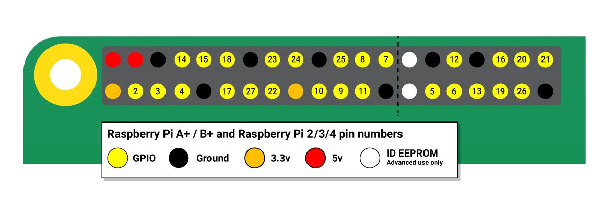

# 树莓派
树莓派4：

树莓派5：
  - 处理器：BCM2712，四核Cortex-A76核心，频率2.4GHz
  - 内存：2GB、4GB、8GB、16GB LPDDR4-4267 SDRAM 
  - 存储：0GB、16GB、32GB、64GB eMMC FLASH
  - GPU：VideoCore7 GPU，支持OpenGL ES 3.1和Vulkan 1.2
  - NPU：无

[树莓派官方GitHub](https://github.com/raspberrypi)<br>
[树莓派官方文档](https://www.raspberrypi.com/documentation/)<br>
[树莓派刷机工具](https://www.raspberrypi.com/software/)<br>
[树莓派系统镜像](https://www.raspberrypi.com/software/operating-systems/)


## 1. Raspberry Pi OS
树莓派操作系统源自Debian，约每两年发布一次，当前版本是基于Debian Bookworm，支持月35k个Debian软件包。系统全面升级和标准升级指令分别如下：
```shell
sudo apt full-upgrade # 全面升级
sudo apt upgrade      # 标准升级
```
上述命令不能将树莓派的操作系统升级至新的大版本，升级至新的大版本要借助Raspberry Pi Imager工具来刷MicroSD卡。

apt命令集 = apt-get命令集 + apt-cache命令集 + apt-config命令集，常用命令如下：
```shell
apt-cache search PACKAGENAME # 搜索软件包
apt-cache show   PACKAGENAME # 查看软件包
apt       search PACKAGENAME # 搜索软件包
apt       show   PACKAGENAME # 查看软件包
sudo apt install PACKAGENAME # 安装软件包
sudo apt remove  PACKAGENAME # 卸载软件包
sudo apt purge   PACKAGENAME # 清理软件包，包括配置文件等
sudo apt clean               # 删除软件包文件(*.deb文件)
```

不建议使用命令sudo rpi-update，因为该命令更新的软件包都是预发布的版本，而不是正式发布的版本。更新树莓派固件至最新发行版的命令如下：
```shell
sudo apt update
sudo apt install --reinstall raspi-firmware
sudo reboot 
```

树莓派操作系统发行版中自带了媒体播放器VLC（完整版带，Lite版则不带），并且它使用了<font color=red><b>硬加速</b></font>，而且支持多种格式的音频视频文件。相关命令：
```shell
wget --trust-server-names http://rptl.io/big-buck-bunny
wget --trust-server-names http://rptl.io/startup-music
# on Raspberry Pi OS
vlc big-buck-bunny-1080p.mp4
vlc  --play-and-exit big-buck-bunny-1080p.mp4
vlc  --play-and-exit --fullscreen big-buck-bunny-1080p.mp4
cvlc --play-and-exit big-buck-bunny-1080p.mp4
cvlc --play-and-exit --fullscreen big-buck-bunny-1080p.mp4
# on Raspberry Pi OS Lite
sudo apt install --no-install-recommends vlc-bin vlc-plugin-base
cvlc --play-and-exit big-buck-bunny-1080p.mp4
cvlc --play-and-exit --fullscreen big-buck-bunny-1080p.mp4
# 指定设备
aplay -L | grep sysdefault
kmsprint | grep Connector
cvlc --play-and-exit --drm-vout-display <drm-device> -A alsa --alsa-audio-device <alsa-device> big-buck-bunny-1080p.mp4
```
cvlc和vlc之间的区别：vlc默认以图形用户界面（GUI）模式启动，而cvlc则以纯命令行界面（CLI）模式运行，前者会加载图形界面，后者则不会加载图形界面，它们适合不同的应用场景。

实用工具小程序：
- [kmsprint](https://github.com/tomba/kmsxx)：用来列出接在树莓派上的显示器支持的所有显示模式，加-m列出每个显示器所支持的模式；
- vclog：打印输出运行在ARM上的Linux中的VideoCore GPU固件的日志。该命令需要以root身份运行；
- [vcgencmd](https://github.com/raspberrypi/utils/tree/master/vcgencmd)：用于输出来自VideoCore GPU固件的信息。vcgencmd commands输出其支持的所有子命令：
  - vcos：加version打印VideoCore GPU固件的版本和构建日期，加log status打印其的错误日志；
  - version：打印VideoCore GPU固件的版本和构建日期，与vcos version子命令的功能一致；
  - get_throttled：获取SoC系统中的8个开关状态（Returns the throttled state of the system）；
  - measure_temp [pmic]：测量SOC的温度，树莓派4上measure_temp pmic测量PMIC的温度；
  - measure_clock [clock]：测量系统中模块（ARM Core、GPU Core、H.264等）时钟的频率；
  - measure_volts：测量VideoCore GPU、SDRAM Core、SDRAM I/O、SDRAM PHY的电压；
  - otp_dump：打印芯片中[OTP内存](https://www.raspberrypi.com/documentation/computers/raspberry-pi.html#otp-register-and-bit-definitions)（一次性可编程存储器）中的数据（32位的数据，8~64）；
  - get_config：获取指定配置项的设置值，或指定类型（譬如int、str等）的配置项的设置值；
  - get_mem：获取ARM和GPU可寻址的内存空间。其支持子命令arm和gpu。超过1G的情况特殊；
  - codec_enabled [type]：报告指定的编解码器是否已经启用。树莓派4/400上的GPU不支持H.265；
  - mem_oom：打印VideoCore的内存空间中所发生的OOM（Out Of Memory）事件的统计信息；
  - mem_reloc_stats：打印VideoCore上可重定位内存分配器的统计信息；
  - read_ring_osc：打印环形振荡器当前的工作频率、工作电压和温度；

树莓派预装了python3，用户可以直接使用，当然也可以安装其它版本的python，用户载在使用时可以使用update-alternatives自由切换，具体切换方法如下（假设系统中安装3.8和3.10）：
```shell
# 先注册版本到替代列表，优先级数字越大优先级越高
sudo update-alternatives --install /usr/bin/python python /usr/bin/python3.8  1 # 优先级1
sudo update-alternatives --install /usr/bin/python python /usr/bin/python3.10 2 # 优先级2
# 再指定默认版本，按提示输入对应版本序号回车确认
sudo update-alternatives --config python
python --version 
```
通常情况下，用户有两种方式安装其所需要的python软件包：apt install PACKAGENAME和pip install PACKAGENAME，但是两者之间是有区别的，不建议混用，以免版本冲突。具体如下所示：
- apt的安装源为Linux发行版的官方软件仓库，其中的python软件包都是经过严格测试的，稳定性好。pip的安装源则为Python Package Index（PyPI）中的第三方Python包；
- apt安装python软件包时，会将其安装到系统目录中（如/usr/li/python3/dist-packages），需要sudo权限，属于系统级操作；
- 直接使用pip安装python软件包时，会将其安装到目录~/.local/lib/pythonX.Y/site-packages中，X.Y为当前python的版本，仅当前用户可用；
- 使用sudo pip安装python软件包时，会将其安装到目录/usr/local/lib/pythonX.Y/dist-packages中，X.Y为当前python的版本，所有用户可用；
- 当切到虚拟环境中时，应直接使用pip安装python软件包，会将其安装到目录VENV/lib/pythonX.Y/site-packages中，所有用户激活便可使用；
- apt只能安装Linux发行版官方仓库中的稳定版本，无法指定特定的版本。pip支持安装特定的版本（如pip install PACKAGENAME==1.0.0）；

但需要注意的是基于Bookworm版Debian的树莓派操作系统中，不能使用pip命令直安装python包到系统自带的python中，否则会报错。通常情况下，建议使用python虚拟环境，创建它的方法如下所示：
```shell
sudo apt update
sudo apt install python3 python3-venv
cd PROJECT_DIRECTORY    # PROJECT_DIRECTORY为项目目录
python3 -m venv ENVNAME # ENVNAME为python虚拟环境名字
source ENVNAME/bin/activate
deactivate
```
```shell
cd INSTALL_DIRECTORY    # INSTALL_DIRECTORY为安装目录
wget https://repo.anaconda.com/miniconda/Miniconda3-latest-Linux-aarch64.sh
bash Miniconda3-latest-Linux-aarch64.sh
source ~/.bashrc
# ENVNAME为python虚拟环境名字，X.Y为python的版本
conda create --name ENVNAME python=X.Y 
conda activate ENVNAME # 目录为INSTALL_DIRECTORY/envs
conda deactivate
```

树莓派上支持python程序控制GPIO外设，有现成的python软件包[gpiozero](https://gpiozero.readthedocs.io/en/latest/index.html)可用。一个简单的示例如下所示：

```python
from gpiozero import LED, Button

led = LED(17)
button = Button(2)

while True:
    button.wait_for_press()
    led.on()
    button.wait_for_release()
    led.off()
```

## FAQ
1、如何获取linux内核代码，并完成编译、配置和内核替换？